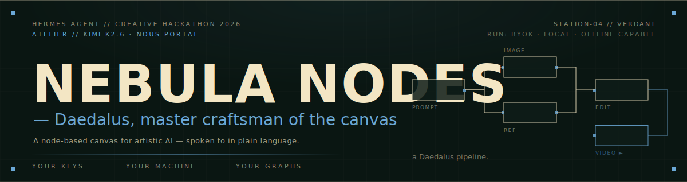
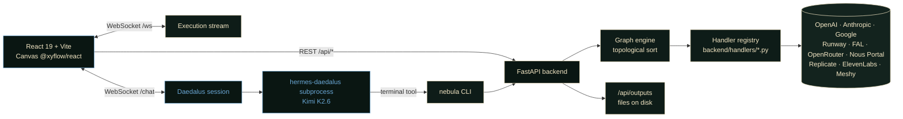

<div align="center">
  
</div>

```
┌──────────────────────────────────────────────────────────────────┐
│  STATION-04 // VERDANT          NEBULA NODES — DAEDALUS          │
│  HERMES AGENT · CREATIVE HACKATHON 2026                        ▪ │
└──────────────────────────────────────────────────────────────────┘
```

<div align="center">

https://github.com/user-attachments/assets/3a83187d-e186-4378-8a36-822b0a4055cb

<sub><em>2:07 — Daedalus on Kimi K2.6 building a creative pipeline from a plain-language prompt. <a href="https://github.com/JustinPerea/nebula-nodes/releases/download/v0.1.0-hackathon/stitched-with-music.mp4">Download the full-quality 1080p MP4</a> from the v0.1.0-hackathon release.</em></sub>

</div>

<div align="center">
  <a href="#quickstart">QUICKSTART</a> · <a href="#daedalus--hermes-agent">DAEDALUS</a> · <a href="#supported-models">MODELS</a> · <a href="#architecture">ARCHITECTURE</a> · <a href="https://github.com/JustinPerea/nebula-nodes/issues">ISSUES</a>
</div>

<div align="center">

  <a href="LICENSE"></a>
  
  
  
  <br>
  
  
  
  
  

</div>

---

> **◆ ENTRY-CLASS // HERMES AGENT CREATIVE HACKATHON 2026.** This repo is the codebase
> behind the demo video showing **Daedalus**, a Hermes Agent–powered chat agent that
> drives a node-based AI canvas in plain language. Daedalus runs on **Kimi K2.6** via
> [Hermes Agent](https://github.com/NousResearch/hermes-agent) and **Nous Portal**;
> the canvas is the visual workspace it operates on.
> Setup steps: [`docs/HERMES-SETUP.md`](docs/HERMES-SETUP.md).

> ### ▪ SUBMITTING TO &nbsp;&nbsp;//&nbsp;&nbsp; **Kimi Track** + Main Track
>
> **Primary entry: Kimi Track.** Daedalus's brain is `moonshotai/kimi-k2.6`,
> hard-coded as the default model in [`frontend/src/components/panels/ChatPanel.tsx`](frontend/src/components/panels/ChatPanel.tsx)
> and confirmable via `hermes-daedalus config get model` after setup.
> Kimi-track evidence package: [`docs/HERMES-SETUP.md` § "Kimi track evidence"](docs/HERMES-SETUP.md#kimi-track-evidence-for-hackathon-submission).
>
> Also eligible for the Main Track — the same Daedalus runtime works against any model in
> the Nous Portal catalog (300+) via the in-app model picker.

## ◆ DEMO SCRUB GUIDE &nbsp;&nbsp;//&nbsp;&nbsp; what to look for at each beat

| Time | Beat | What's happening |
|------|------|------------------|
| **0:00** | INTRO | Daedalus introduces himself; the canvas wakes up — sigil-bloom toggle FX fires when the agent picker switches `claude → daedalus` |
| **0:09** | OVERVIEW | Drag-or-chat affordance — pull a node in by hand, OR talk to Daedalus. Two front doors, same canvas. |
| **0:18** | PROMPT | Real plain-language prompt typed into the chat panel. No commands, no syntax. |
| **0:23** | V1 | Daedalus narrates each step into `content` (Kimi K2.6 narrator-fallback in action), wires the graph, runs v1 — watercolor portrait |
| **0:44** | REFERENCE | Daedalus pulls a reference image into the graph and re-prompts to match the style |
| **1:03** | V2 | Improved cut, Daedalus comments on what changed |
| **1:16** | FAN-OUT | The thesis shot — same source seeds a stylized image, a 3D mesh, AND a video, in parallel |
| **1:36** | MODELS | Library walk: every supported provider (300+ via the universal Nous/OpenRouter/Replicate/FAL nodes) |
| **2:00** | TAGLINE | "Let me be your guide to artistic creativity." |

## ◆ WHAT'S NEW IN THIS ENTRY &nbsp;&nbsp;//&nbsp;&nbsp; the hackathon contribution

The visual-canvas codebase pre-existed the hackathon (a personal BYOK project for stitching multi-provider AI pipelines). **Everything below is what was built specifically to enter Daedalus into the Hermes Agent Creative Hackathon:**

| Layer | What landed | Files |
|---|---|---|
| **Daedalus persona** | SOUL.md, skill playbook, hard rule that narrative belongs in `content` not `reasoning_content`, model-family skill cookbook | `.hermes/profiles/daedalus/SOUL.md` · `.hermes/skills/daedalus-core/SKILL.md` |
| **Hermes session bridge** | Subprocess wrapper for `hermes-daedalus chat`, verbose-mode parser, prose-stream-to-chat-bubble pipeline, log tailer with heartbeats | `backend/services/hermes_session.py` · `hermes_verbose_parser.py` |
| **Kimi K2.6 narrator-fallback** | Catches the empty-`content`+`tool_calls` failure mode and re-narrates buffered canvas actions in Daedalus's voice via a single-shot OpenRouter call | `backend/services/narrator.py` · `chat_actions.py` |
| **Nous Portal universal node** | Auth from `~/.hermes/profiles/daedalus/auth.json`, model proxy, dynamic schema-typed ports, in-app model picker (300+ models) | `backend/services/nous_auth.py` · `handlers/nous_portal.py` · `routes/nous_proxy.py` |
| **Daedalus skin** | Dual-tone (Verdant + Obsidian), Hermes design system applied to chat panel, node cards, inspector, settings — sigil-bloom transition FX | `frontend/src/styles/hermes.css` · `components/panels/ChatPanel.tsx` · `AgentLog.tsx` |
| **Workspace polish** | Chat-aware fitView padding (nodes never render behind the chat overlay), auto-grow textarea, prose live-streaming during turn | `frontend/src/components/Canvas.tsx` · `panels/ChatPanel.tsx` |
| **Standalone Hermes theme** | TDR × Marathon dashboard reskin for Hermes Agent itself (separate deliverable, ships as a `themes/daedalus/` drop-in) | `themes/daedalus/` |
| **Demo recording pipeline** | Section-by-section puppeteer driver with synchronized voiceover, zoom directives, music ducking — 9 beats stitched to 2:07 | `scripts/puppeteer-driver/` · `scripts/voiceover/` |

## ◆ THESIS &nbsp;&nbsp;//&nbsp;&nbsp; why this exists

There's a cambrian explosion of image, video, audio, and text models happening right now — every week brings a new provider with a new endpoint. Stitching them together today means writing throwaway scripts, juggling API docs, and rebuilding the same plumbing for every idea.

**Nebula Nodes** is a visual programming environment for that stitching. **Daedalus** is the chat side of it — a Hermes Agent persona, master craftsman lineage, who builds the pipeline for you when you describe what you want. Same canvas. Same outputs. Your keys.

```
┌─ DAEDALUS ──────────────────────────────────────────────────────┐
│                                                                  │
│   "Tell me what to build."                                       │
│                                                                  │
│   Talk to Daedalus. Master craftsman, labyrinth-builder — it     │
│   plans pipelines with precision, measures twice before each     │
│   cut, and remembers every lesson a bad joint taught it.         │
│                                                                  │
│   Wire the prompt, pick the right image model for the look you   │
│   want, generate references, run v1, take notes, run v2, then    │
│   fan it out to a video, a 3D pass, and a stylized still — all   │
│   in front of you, on the canvas, narrating every step.          │
│                                                                  │
│                                          ▪ moonshotai/kimi-k2.6  │
└──────────────────────────────────────────────────────────────────┘
```

Everything runs locally against your own API keys, so there is no platform markup, no data leaving your machine to a middleman, and no rate-limited hosted tier. You see the graph, you see the outputs, you own the keys.

> [!NOTE]
> **BYOK ◆ BRING YOUR OWN KEYS.** The app proxies calls from your local backend to OpenAI, Anthropic, Google, Runway, FAL, OpenRouter, Replicate, ElevenLabs, and **Nous Portal** using keys you paste into the settings panel — or, in the case of Nous Portal, the OAuth credential [Hermes Agent](https://github.com/NousResearch/hermes-agent) already manages on your machine. They never touch a Nebula-hosted server because there isn't one.

## ◆ FEATURES

```
SPEC // ATELIER
```

| | |
|---|---|
| **DAEDALUS — chat agent** | Hermes Agent persona on Kimi K2.6 — narrates as it builds, fan-outs creative pipelines, learns per-user via Hermes skill memory |
| **VISUAL CANVAS** | React Flow graph editor with typed, color-coded ports — drop, wire, run |
| **STREAMING OUTPUTS** | Token-by-token text, live video/audio previews, prose narration mid-pipeline |
| **SMART CACHING** | Unchanged subgraphs skip re-computation automatically |
| **UNIVERSAL NODES** | One node each for OpenRouter, **Nous Portal**, Replicate, FAL — reach any model on those platforms |
| **PARTIAL EXECUTION** | Execute the full graph, or just a node's upstream subgraph |
| **UNDO THAT STICKS** | 50-step history, outputs survive undo |
| **SAVE / LOAD** | Graphs serialize to JSON; outputs written to disk and served via `/api/outputs` |

## ◆ QUICKSTART

```
SPEC // CANVAS — REQUIRES Python 3.12+, Node.js 18+
```

```bash
# 1. Clone
git clone https://github.com/JustinPerea/nebula-nodes.git
cd nebula-nodes

# 2. Backend (terminal 1)
cd backend
python3 -m venv .venv && source .venv/bin/activate
pip install -r requirements.txt
uvicorn main:app --reload --port 8000

# 3. Frontend (terminal 2)
cd frontend
npm install
npm run dev

# 4. Open http://localhost:5173
```

> [!TIP]
> Drop a **Text Input** node on the canvas, wire it into a **GPT Image** node, wire that into a **Preview** node, and hit **Run**. That's the whole mental model. Or — open the chat panel, switch to **Daedalus**, and ask for what you want.

## ◆ DAEDALUS — HERMES AGENT

```
SPEC // ATELIER — DAEDALUS RUNS ON ANY HERMES-SUPPORTED PROVIDER
```

Daedalus is the chat side of the canvas — a Hermes Agent persona that builds graphs from natural-language prompts. It runs as a subprocess of [Hermes Agent](https://github.com/NousResearch/hermes-agent) on your machine. **Hermes is provider-agnostic, and Daedalus inherits whatever you set it up with.** Pick the auth path that matches what you already have.

### Pick how Daedalus reaches its brain

| Path | What you need | What you get | Best for |
|------|---------------|--------------|----------|
| **▪ Nous Portal** | A [Nous Research subscription](https://portal.nousresearch.com) | Single browser OAuth → 300+ models. Switchable mid-session via the in-app model picker (`<model> · Hermes` trigger in the chat header). | Anyone who already pays Nous, or wants the full Hermes/Kimi/DeepSeek/etc. catalog without juggling separate keys. |
| **▪ OpenRouter** | An [OpenRouter API key](https://openrouter.ai/keys) | Pay-per-use BYOK. Daedalus defaults to `moonshotai/kimi-k2.6` here. Fresh-install default. | $0 monthly baseline. The Kimi-track default. |
| **▪ Anything else Hermes supports** | Whatever credential that provider needs (Anthropic key, OpenAI key, local Ollama, etc.) | Daedalus runs on it. Hermes Agent is provider-agnostic; if you can do `hermes-daedalus login` for it, Daedalus will use it. | Already paying Anthropic / OpenAI / running local models — no new account needed. |

> [!NOTE]
> **All three paths land on the same Daedalus runtime.** The backend (`backend/services/hermes_session.py`) doesn't care which provider Hermes is wired to — it just spawns `hermes-daedalus chat …` and streams prose + canvas actions back. Switch providers any time with `hermes-daedalus model`; the chat header reflects the active model live.

### Setup

```bash
# 1. Install Hermes Agent (Nous Research) — one-time
curl -fsSL https://raw.githubusercontent.com/NousResearch/hermes-agent/main/scripts/install.sh | bash

# 2. Create the Daedalus profile + alias the wrapper the backend looks for
hermes profile create daedalus
hermes profile alias daedalus --name hermes-daedalus

# 3. Authenticate — pick ONE of the three paths above:

#    PATH A — Nous Portal (subscription, OAuth)
hermes-daedalus model              # pick "Nous Portal" → browser OAuth

#    PATH B — OpenRouter (BYO key, $0 baseline; the Kimi-track default)
hermes-daedalus login              # select 'openrouter', paste key
hermes-daedalus config set model.provider openrouter
hermes-daedalus config set model.name moonshotai/kimi-k2.6

#    PATH C — Anything else Hermes supports (Anthropic / OpenAI / Ollama / …)
hermes-daedalus login              # select the provider, paste key
hermes-daedalus config set model.provider <provider>
hermes-daedalus config set model.name <model-id>

# 4. Install Daedalus's persona + skills (from inside this repo clone)
cp .hermes/profiles/daedalus/SOUL.md ~/.hermes/profiles/daedalus/SOUL.md
mkdir -p ~/.hermes/profiles/daedalus/skills/creative
cp -R .hermes/skills/daedalus-core ~/.hermes/profiles/daedalus/skills/creative/

# 5. Smoke test
hermes-daedalus chat -q "Introduce yourself." -Q --skills daedalus-core
```

In the running app: open the chat panel, switch the agent picker to **Daedalus**, send a message. The backend spawns `hermes-daedalus chat …` per turn and streams Daedalus's prose + canvas actions back over WebSocket.

Full step-by-step setup (model-family skills, the `nebula` CLI wrapper, troubleshooting): **[`docs/HERMES-SETUP.md`](docs/HERMES-SETUP.md)**.

## ◆ KEYS

```
SPEC // BYOK — keys live on YOUR disk, never on a server we run
```

**Via the Settings panel** (recommended) — click the gear icon in the toolbar, paste your keys into the relevant fields, hit Save. Keys are masked on read; the backend stores the raw value but never logs it.

| | |
|---|---|
| **Storage** | `settings.json` at the project root, gitignored, plaintext, owned by you |
| **Read API** | `GET /api/settings` returns `***` + last 4 chars only — real key never crosses the wire |
| **Write API** | `PUT /api/settings` short-circuits on `***`-prefixed values — masked round-trip preserves the real key |
| **Egress** | Each handler hits exactly one provider URL — no analytics, no telemetry, no aggregator |
| **CORS** | `localhost`/`127.0.0.1` origin only — a malicious tab cannot read your keys |

<details>
<summary><strong>Via settings.json</strong> — manual alternative, edit the file at the project root</summary>

```json
{
  "apiKeys": {
    "OPENAI_API_KEY": "your-key-here",
    "ANTHROPIC_API_KEY": "your-key-here",
    "RUNWAY_API_KEY": "your-key-here",
    "OPENROUTER_API_KEY": "your-key-here",
    "REPLICATE_API_TOKEN": "your-key-here",
    "FAL_KEY": "your-key-here",
    "GOOGLE_API_KEY": "your-key-here",
    "ELEVENLABS_API_KEY": "your-key-here"
  }
}
```

`settings.json` is in `.gitignore` by default — it will not be committed.

</details>

## ◆ MODELS

```
SPEC // BUILT-IN NODES — first-class handlers, schema-typed ports
```

| Node | Provider | Output |
|------|----------|--------|
| GPT Image 1 / 2 | OpenAI | Image |
| DALL-E 3 | OpenAI | Image |
| GPT-4o Chat | OpenAI | Text |
| Sora 2 | OpenAI | Video |
| Claude | Anthropic | Text |
| Gemini | Google | Text |
| Imagen 4 | Google | Image |
| Veo | Google | Video |
| Runway Gen-4 Turbo | Runway | Video |
| Kling v2.1 | FAL | Video |
| FLUX 1.1 Ultra | FAL | Image |
| MiniMax | MiniMax | Video |
| Higgsfield | Higgsfield | Video |
| Meshy | Meshy | 3D |
| Grok Video | xAI | Video |
| ElevenLabs TTS | ElevenLabs | Audio |
| Text / Image Input | Utility | — |
| Preview | Utility | — |

```
SPEC // UNIVERSAL NODES — one node, every model on the platform
```

| Node | Platform | What it gives you |
|------|----------|-------------------|
| **OPENROUTER** | OpenRouter | Any model in the OpenRouter catalog; schema fetched at configuration time |
| **◆ NOUS PORTAL** | Nous Portal | Any model in the Nous Portal catalog (300+); auth via Hermes Agent OAuth — no API key field |
| **REPLICATE** | Replicate | Any versioned model on Replicate; ports built from the model's JSON schema |
| **FAL** | FAL | Any FAL endpoint via the submit/poll async pattern |

## ◆ ARCHITECTURE



- **FRONTEND** — React 19 + Vite SPA. `@xyflow/react` powers the canvas. [Zustand](https://github.com/pmndrs/zustand) holds all graph and UI state, with `node.data` as the single source of truth for params, outputs, and execution status.
- **BACKEND** — FastAPI. REST endpoints for execution and a WebSocket at `/ws` that streams per-node events (started, progress, output, error) back to the UI in real time.
- **EXECUTION ENGINE** — topologically sorts the graph, dispatches handlers in dependency order, passes outputs forward through the edge graph, and short-circuits when a subgraph's inputs haven't changed since the last run.
- **HANDLERS** — one function per provider in `backend/handlers/` (e.g., `openai_image.py`, `runway.py`, `fal_universal.py`). Each handler receives typed params, returns a typed output, and is unit-tested in isolation.
- **DAEDALUS BRIDGE** — `backend/services/hermes_session.py` wraps the `hermes-daedalus chat` subprocess per turn, parses Hermes verbose-mode events, narrates canvas actions live to the chat panel via WebSocket, and falls back to a Kimi K2.6 narrator (`backend/services/narrator.py`) when the model emits empty `content` alongside `tool_calls`.

## ◆ PROJECT LAYOUT

```
nebula-nodes/
├─ backend/                FastAPI app
│  ├─ handlers/            one file per provider
│  ├─ execution/           topological graph runner + caching
│  ├─ routes/              REST + WS + provider proxies
│  ├─ services/
│  │  ├─ hermes_session.py Daedalus subprocess bridge
│  │  ├─ narrator.py       Kimi K2.6 fallback narrator
│  │  ├─ chat_actions.py   per-turn action buffer
│  │  └─ nous_auth.py      Nous Portal OAuth from ~/.hermes/
│  └─ cli/                 scriptable pipelines (nebula CLI)
├─ frontend/               React 19 + Vite canvas UI
│  ├─ src/components/      canvas, nodes, edges, panels
│  └─ src/store/           Zustand graph + UI state
├─ .hermes/
│  ├─ profiles/daedalus/   SOUL.md — Daedalus persona contract
│  └─ skills/daedalus-core/ SKILL.md — playbook + cookbook
├─ themes/daedalus/        Hermes Agent dashboard theme (TDR × Marathon)
├─ docs/                   HERMES-SETUP.md, model reference, plans
└─ scripts/                demo recording pipeline + dev utilities
```

## ◆ CONTRIBUTING

Issues and pull requests are welcome. Before opening a PR, please run the frontend and backend test suites:

```bash
# backend
cd backend && pytest

# frontend
cd frontend && npm test
```

If you are adding a new model, the smallest useful contribution is a single handler in `backend/handlers/` plus a node definition in `frontend/src/components/nodes/`. Existing nodes are good templates — copy the closest match and adjust.

If you are extending **Daedalus**, the playbook lives at `.hermes/skills/daedalus-core/SKILL.md`. The persona contract is `.hermes/profiles/daedalus/SOUL.md`. Both are copied into the user's Hermes profile during setup — see [`docs/HERMES-SETUP.md`](docs/HERMES-SETUP.md).

## ◆ LIMITATIONS &nbsp;&nbsp;//&nbsp;&nbsp; known gaps

- **Kimi K2.6 verbose-mode quirk.** The model occasionally emits empty `content` alongside `tool_calls` even with the SKILL.md hard rule asserted. The narrator-fallback (`backend/services/narrator.py`) catches this and re-narrates from the buffered canvas actions, so the user always sees a chat bubble — but a clean upstream fix would be preferable. This is the failure mode the hackathon entry most directly addresses.
- **Hermes verbose parser is fragile to format drift.** If Nous Research changes the verbose-mode output format, `hermes_verbose_parser.py` will need updating. Pinned to the format observed in Hermes ≥ v0.10.
- **Mac app deferred.** The Mac-app v1 scope is parked until the OSS web version reaches a "good spot" (ref: project memory). Web-only for now.
- **Not every provider is dual-route.** Some handlers (Higgsfield, Grok Video, MiniMax) are direct-only — they don't have a FAL fallback yet. If the direct API is down, those nodes are too.
- **Demo recording pipeline is opinionated.** `scripts/puppeteer-driver/` assumes 1920×1080 @ DPR=2 capture, ffmpeg/x264, and ElevenLabs for voice/SFX/music. Reasonable defaults but not yet parameterized.

## ◆ ACKNOWLEDGMENTS &nbsp;&nbsp;//&nbsp;&nbsp; standing on giants

- **[Hermes Agent](https://github.com/NousResearch/hermes-agent)** — Nous Research's open-source agent runtime. Daedalus is a profile + skill on top of it. The whole entry exists because Hermes Agent does.
- **[Kimi K2.6](https://moonshotai.github.io/Kimi-K2/)** — Moonshot AI. Daedalus's brain on the Kimi track. Routes via OpenRouter or Nous Portal.
- **[Nous Portal](https://portal.nousresearch.com)** — single-OAuth gateway to 300+ models. Powers the universal Nous node and the in-app model picker.
- **Provider APIs** — OpenAI, Anthropic, Google (Gemini / Imagen / Veo), Runway, FAL, OpenRouter, Replicate, ElevenLabs, MiniMax, Higgsfield, Meshy, Black Forest Labs, ByteDance, xAI, Recraft, Ideogram. BYOK against each.
- **Demo voice + music** — both generated with ElevenLabs (voice = Brian, music = the v1 music API). Voiceover scripts live in `scripts/voiceover/`.
- **Open-source frontend stack** — [React Flow / @xyflow](https://github.com/xyflow/xyflow), [Zustand](https://github.com/pmndrs/zustand), [Vite](https://vitejs.dev), [FastAPI](https://fastapi.tiangolo.com).
- **Theme lineage** — the `themes/daedalus/` Hermes dashboard skin is a tribute to [The Designers Republic](https://thedesignersrepublic.com) × [Kurppa Hosk's Marathon (Bungie 2026)](https://www.kurppahosk.com/) brand system.

## ◆ LICENSE

[AGPL-3.0](LICENSE). You may use, modify, and self-host Nebula Nodes freely. If you distribute a modified version — including running it as a network service — you must make your source available under the same license.

---

```
┌──────────────────────────────────────────────────────────────────┐
│  ▪ DAEDALUS — ATELIER VERDANT              MEASURE TWICE, CUT ONCE │
│  STATION-04                                  © 2026 JUSTIN PEREA  │
└──────────────────────────────────────────────────────────────────┘
```
