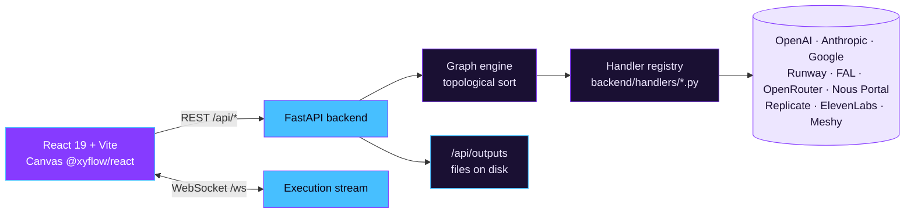

<div align="center">
  

  <p><strong>Visual AI pipelines. Your keys. Your machine.</strong></p>
  <p>Drop nodes onto a canvas, wire them up, run a graph. Images flow into video models, text flows into image models, audio emerges from LLMs — all computed through your own API accounts on your own hardware.</p>

  <p>
    <a href="#quick-start">Quick Start</a> ·
    <a href="#supported-models">Models</a> ·
    <a href="#architecture">Architecture</a> ·
    <a href="https://github.com/JustinPerea/nebula-nodes/issues">Report Bug</a>
  </p>

  <p>
    <a href="LICENSE"></a>
    
    
    
    
    
  </p>
</div>

---

<!--
  README-ASSET-TODO: Hero demo visual needed

  What to capture: A short screen recording of the Nebula Nodes canvas with a
  small pipeline running — e.g. a Text Input → GPT Image → Kling v2.1 → Preview
  chain, with wires connecting and the video preview appearing at the end.

  Recommended format: GIF (<15s, <5MB) — optimize with gifski
  Recommended size: ~1200px wide
  Tools: Kap (macOS), ScreenToGif (Windows), Peek (Linux), then gifski for size
  Save to: docs/assets/demo.gif

  Then replace this comment with:
    <div align="center">
      
    </div>
-->

## Why Nebula Nodes

There's a cambrian explosion of image, video, audio, and text models happening right now — every week brings a new provider with a new endpoint. Stitching them together today means writing throwaway scripts, juggling API docs, and rebuilding the same plumbing for every idea.

Nebula Nodes is a **visual programming environment** for that stitching. Everything runs locally against your own API keys, so there is no platform markup, no data leaving your machine to a middleman, and no rate-limited hosted tier. You see the graph, you see the outputs, you own the keys.

> [!NOTE]
> Nebula Nodes is **BYOK (bring your own keys)** by design. The app proxies calls from your local backend to OpenAI, Anthropic, Google, Runway, FAL, OpenRouter, Replicate, ElevenLabs, and **Nous Portal** using keys you paste into the settings panel — or, in the case of Nous Portal, the OAuth credential the [Hermes Agent](https://hermes-agent.nousresearch.com) CLI already manages on your machine. They never touch a Nebula-hosted server because there isn't one.

## Features

| | |
|---|---|
| **Visual canvas** | React Flow graph editor with typed, color-coded ports |
| **Streaming outputs** | Token-by-token text, live video/audio previews |
| **Smart caching** | Unchanged subgraphs skip re-computation automatically |
| **Universal nodes** | One node each for OpenRouter, Nous Portal, Replicate, and FAL — reach any model on those platforms |
| **Run what you need** | Execute the full graph, or just a node's upstream subgraph |
| **Undo that sticks** | 50-step history, and outputs survive undo |
| **Copy / paste / duplicate** | UUIDs regenerate so duplicates are first-class nodes, not aliases |
| **Save / load graphs** | Graphs serialize to JSON; outputs written to disk and served via `/api/outputs` |

## Quick Start

**Requirements:** Python 3.12+, Node.js 18+

```bash
# 1. Clone
git clone https://github.com/JustinPerea/nebula-nodes.git
cd nebula-nodes

# 2. Backend (terminal 1)
cd backend
pip install -r requirements.txt
uvicorn main:app --reload --port 8000

# 3. Frontend (terminal 2)
cd frontend
npm install
npm run dev

# 4. Open http://localhost:5173
```

> [!TIP]
> Drop a **Text Input** node on the canvas, wire it into a **GPT Image** node, wire that into a **Preview** node, and hit **Run**. That's the whole mental model.

## Adding API Keys

**Via the Settings panel** (recommended) — click the gear icon in the toolbar, paste your keys into the relevant fields, hit Save. Keys are masked on read; the backend stores the raw value but never logs it.

<details>
<summary><strong>Via settings.json</strong> — manual alternative, edit the file at the project root</summary>

```json
{
  "apiKeys": {
    "OPENAI_API_KEY": "your-key-here",
    "ANTHROPIC_API_KEY": "your-key-here",
    "RUNWAY_API_KEY": "your-key-here",
    "OPENROUTER_API_KEY": "your-key-here",
    "REPLICATE_API_TOKEN": "your-key-here",
    "FAL_KEY": "your-key-here",
    "GOOGLE_API_KEY": "your-key-here",
    "ELEVENLABS_API_KEY": "your-key-here"
  }
}
```

`settings.json` is in `.gitignore` by default — it will not be committed.

</details>

## Supported Models

### Built-in Nodes

| Node | Provider | Output |
|------|----------|--------|
| GPT Image 1 / 2 | OpenAI | Image |
| DALL-E 3 | OpenAI | Image |
| GPT-4o Chat | OpenAI | Text |
| Sora 2 | OpenAI | Video |
| Claude | Anthropic | Text |
| Gemini | Google | Text |
| Imagen 4 | Google | Image |
| Veo | Google | Video |
| Runway Gen-4 Turbo | Runway | Video |
| Kling v2.1 | FAL | Video |
| FLUX 1.1 Ultra | FAL | Image |
| MiniMax | MiniMax | Video |
| Higgsfield | Higgsfield | Video |
| Meshy | Meshy | 3D |
| Grok Video | xAI | Video |
| ElevenLabs TTS | ElevenLabs | Audio |
| Text / Image Input | Utility | — |
| Preview | Utility | — |

### Universal Nodes

| Node | Platform | What it gives you |
|------|----------|-------------------|
| **OpenRouter** | OpenRouter | Any model in the OpenRouter catalog; schema fetched at configuration time |
| **Nous Portal** | Nous Portal | Any model in the Nous Portal catalog (300+); auth via the Hermes Agent CLI's OAuth (no API key field) |
| **Replicate** | Replicate | Any versioned model on Replicate; ports built from the model's JSON schema |
| **FAL** | FAL | Any FAL endpoint via the submit/poll async pattern |

## Architecture



- **Frontend** — React 19 + Vite SPA. `@xyflow/react` powers the canvas. [Zustand](https://github.com/pmndrs/zustand) holds all graph and UI state, with `node.data` as the single source of truth for params, outputs, and execution status.
- **Backend** — FastAPI. REST endpoints for execution and a WebSocket at `/ws` that streams per-node events (started, progress, output, error) back to the UI in real time.
- **Execution engine** — topologically sorts the graph, dispatches handlers in dependency order, passes outputs forward through the edge graph, and short-circuits when a subgraph's inputs haven't changed since the last run.
- **Handlers** — one function per provider in `backend/handlers/` (e.g., `openai_image.py`, `runway.py`, `fal_universal.py`). Each handler receives typed params, returns a typed output, and is unit-tested in isolation.
- **Proxy routes** — `/api/openrouter/*`, `/api/replicate/*`, `/api/fal/*` let the frontend browse available models and fetch schemas without shipping API keys to the browser.

## Project Layout

```
nebula-nodes/
├── backend/           FastAPI app
│   ├── handlers/      one file per provider
│   ├── execution/     topological graph runner + caching
│   ├── routes/        REST + WS + provider proxies
│   └── cli/           scriptable pipelines (nebula CLI)
├── frontend/          React 19 + Vite canvas UI
│   ├── src/components canvas, nodes, edges, panels
│   └── src/store      Zustand graph + UI state
├── docs/              model reference, FAL schemas, research notes
└── scripts/           dev utilities
```

## Contributing

Issues and pull requests are welcome. Before opening a PR, please run the frontend and backend test suites:

```bash
# backend
cd backend && pytest

# frontend
cd frontend && npm test
```

If you are adding a new model, the smallest useful contribution is a single handler in `backend/handlers/` plus a node definition in `frontend/src/components/nodes/`. Existing nodes are good templates — copy the closest match and adjust.

## License

[AGPL-3.0](LICENSE). You may use, modify, and self-host Nebula Nodes freely. If you distribute a modified version — including running it as a network service — you must make your source available under the same license.
