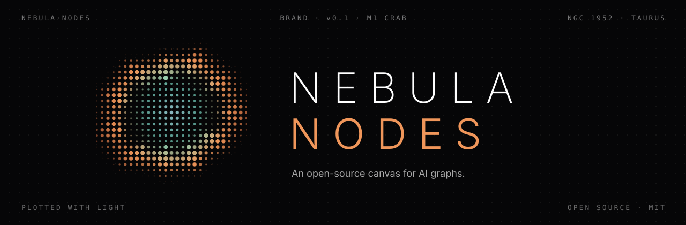
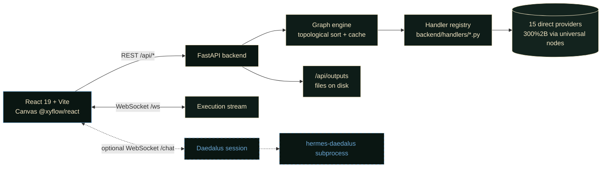

<div align="center">
  
</div>

```
┌──────────────────────────────────────────────────────────────────┐
│  NEBULA NODES                                                    │
│  A NODE-GRAPH CANVAS FOR AI · IMAGE · VIDEO · 3D · AUDIO · TEXT │
└──────────────────────────────────────────────────────────────────┘
```

<div align="center">

https://github.com/user-attachments/assets/3a83187d-e186-4378-8a36-822b0a4055cb

<sub><em>2:07 — the optional Daedalus chat agent building a creative pipeline from a plain-language prompt. <a href="https://github.com/JustinPerea/nebula-nodes/releases/download/v0.1.0-hackathon/stitched-with-music.mp4">Download the full-quality 1080p MP4</a>.</em></sub>

</div>

<div align="center">
  <a href="#-quickstart">QUICKSTART</a> · <a href="#-catalog">CATALOG</a> · <a href="#-universal-nodes">UNIVERSAL NODES</a> · <a href="#-agent--daedalus">AGENT</a> · <a href="#-architecture">ARCHITECTURE</a> · <a href="#-quality--audit-discipline">QUALITY</a>
</div>

<div align="center">

  <a href="LICENSE"></a>
  
  
  
  <br>
  
  
  
  
  

</div>

---

## ◆ THESIS &nbsp;&nbsp;//&nbsp;&nbsp; why this exists

There's a cambrian explosion of image, video, 3D, audio, and text models happening — every week brings a new provider with a new endpoint. Stitching them together today means writing throwaway scripts, juggling API docs, and rebuilding the same plumbing for every idea.

**Nebula Nodes is the visual programming environment for that stitching.** Drop nodes, wire them up, hit Run. 102 built-in nodes across 15 providers, plus four **universal nodes** that proxy 300+ more models on OpenRouter, Nous Portal, Replicate, and FAL. Smart caching skips unchanged subgraphs. Streaming nodes show text / video / audio / SVG previews live as they generate.

Everything runs locally against your own API keys. No platform markup. No data leaving your machine to a middleman. No rate-limited hosted tier. You see the graph, you see the outputs, you own the keys.

> [!NOTE]
> **BYOK ◆ BRING YOUR OWN KEYS.** The app proxies calls from your local backend to OpenAI, Anthropic, Google, Runway, FAL, OpenRouter, Replicate, ElevenLabs, MiniMax, Meshy, Quiver, xAI, Higgsfield, and Nous Portal using keys you paste into the settings panel. They never touch a Nebula-hosted server because there isn't one.

## ◆ FEATURES

```
SPEC // CANVAS
```

| | |
|---|---|
| **102-NODE CATALOG** | Every major provider as a first-class node. Image, video, 3D, audio, and text generation across 15 providers — see [CATALOG](#-catalog) for the breakdown. |
| **UNIVERSAL NODES** | One node each for OpenRouter, Nous Portal, Replicate, and FAL. The universal node pattern means a single node reaches every model on that platform — 300+ models total, no per-model wrapper needed. |
| **SMART EXECUTION** | Topological graph sort, parallel where independent, sequential where dependent. Unchanged subgraphs skip re-computation automatically — if you change a prompt downstream, only the affected nodes re-run. |
| **STREAMING OUTPUTS** | Token-by-token text via WebSocket, live frame previews for video and audio nodes, SSE streaming for Quiver SVG generation. The canvas updates in real time as outputs arrive. |
| **PARTIAL EXECUTION** | Run the full graph, or just the upstream subgraph of any single node. Fast iteration on the bit you care about. |
| **TYPED PORTS** | Every port carries a type (Image, Video, Text, Audio, Mesh, SVG, Array, Any). Wrong wires fail at design time, not runtime. Color-coded for visual rhythm. |
| **UNDO THAT STICKS** | 50-step history. Outputs survive undo, so experiment freely. |
| **SAVE / LOAD** | Graphs serialize to JSON. Outputs written to disk and served via `/api/outputs`. Reproducible runs. |
| **DAEDALUS AGENT** | Optional Hermes Agent chat persona that builds graphs from plain language. Sees the live canvas; iterates with you. See [AGENT](#-agent--daedalus). |
| **AUDIT DISCIPLINE** | Every API-backed node is verified against canonical provider docs. 632 backend tests. Live-smoke gate for high-risk handler paths. See [QUALITY](#-quality--audit-discipline). |

## ◆ CATALOG

```
SPEC // 102 NODES · 15 PROVIDERS · 8 CATEGORIES
```

Full per-node reference (params, endpoints, exec patterns, audit status) lives in [`docs/MODEL_REFERENCE.md`](docs/MODEL_REFERENCE.md), generated from the registry.

| Category | Count | Highlights |
|---|---:|---|
| **Video generation** | 28 | Veo 3 / 3.1, Runway Gen-4 Turbo / Aleph / Act-Two, Sora 2 (direct + FAL), Kling v2.1 / v3 / Omni 3, Wan 2.6 (T2V / I2V / R2V), Luma Ray 2, LTX 2 / 2.3, Seedance 1.5 / 2, MiniMax Hailuo, Higgsfield, Grok Imagine, Pixverse |
| **Image generation** | 24 | GPT Image 1 / 2, DALL-E 3, Imagen 4, FLUX 1.1 Ultra / Schnell / Dev / Pro, Nano Banana (Gemini 3 Pro Image), Recraft V4, Ideogram V3, Seedream 5, Quiver Arrow vector generation |
| **Utility** | 16 | Text / Image / Audio / Video inputs, Combine Text, Frame Extractor, Iterator (Image / Text), Array Builder / Selector, Image Compare, Reroute, Sticky Note, Style Reference, SVG Rasterize |
| **Audio generation** | 13 | ElevenLabs TTS / SFX / STS / Isolation / Dubbing, Lyria 3, OpenAI TTS / Whisper, Runway TTS / STS / Dubbing |
| **3D generation** | 10 | Meshy Text/Image to 3D (direct + via FAL), Meshy Multi-Image / Retexture / Rigging / Animate / Remesh / 3D Print, Hunyuan3D Text/Image to 3D |
| **Universal** | 4 | OpenRouter, **Nous Portal**, Replicate, FAL — each reaches its full catalog. See [UNIVERSAL NODES](#-universal-nodes). |
| **Transform** | 4 | Quiver Arrow Vectorize (raster → SVG), Remove Background, Seedvr2 Upscale, Style Reference |
| **Text generation** | 3 | Claude, GPT-4o Chat, Gemini |

### A few worth calling out

- **Quiver Arrow** (gen + vectorize) — text-or-image → SVG with SSE streaming. SVG previews fill in live during generation. [`/lab/nebula-quiver`](https://justinperea.com/lab/nebula-quiver) is the public demo.
- **Style Reference** — local utility node that pulls a style descriptor from any reference image, no API call. Pairs into prompts as a style override.
- **Seedance 2 family** — the full T2V / I2V / R2V / Fast variants, all dual-route (direct + via FAL).
- **Nous Portal universal** — single OAuth via Hermes Agent reaches 300+ models. No per-model API key.

## ◆ UNIVERSAL NODES

```
SPEC // ONE NODE · EVERY MODEL ON THE PLATFORM
```

Most nodes wrap one specific model. Universal nodes wrap a *platform's entire catalog*. Drop a universal node, pick a model from the in-app picker, and the inspector populates with that model's exact parameter schema — fetched at configuration time.

| Node | Platform | What it gives you | Auth |
|------|----------|-------------------|------|
| **OPENROUTER** | OpenRouter | Any model in the OpenRouter catalog; schema fetched at config time | `OPENROUTER_API_KEY` |
| **◆ NOUS PORTAL** | Nous Portal | 300+ models including Kimi K2.6, DeepSeek, Hermes 4, Llama 4. Single OAuth via Hermes Agent — no API key field. | OAuth (via [Hermes Agent](https://github.com/NousResearch/hermes-agent)) |
| **REPLICATE** | Replicate | Any versioned model on Replicate; ports built dynamically from the model's JSON schema | `REPLICATE_API_TOKEN` |
| **FAL** | FAL | Any FAL endpoint via the submit/poll async pattern; covers anything not already in the static catalog | `FAL_KEY` |

The universal node pattern is the multiplier — the static catalog is 102 nodes, but the *reachable model count* is several hundred more. Every time OpenRouter / Nous Portal / Replicate / FAL adds a model, it's already supported.

## ◆ AGENT &nbsp;&nbsp;//&nbsp;&nbsp; DAEDALUS

```
SPEC // OPTIONAL HERMES AGENT CHAT PERSONA
```

**Daedalus** is an optional chat agent that builds graphs from natural language. He runs as a subprocess of [Hermes Agent](https://github.com/NousResearch/hermes-agent) and can be powered by any model Hermes supports — Kimi K2.6 (default), DeepSeek, Hermes 4, Anthropic, OpenAI, local Ollama, anything with an `hermes-daedalus login` path.

Drop a node yourself, OR ask Daedalus to build something. Same canvas. Drag and chat are dual front doors.

Skip this section if you don't want a chat agent — the canvas works fine without it.

### Pick how Daedalus reaches its brain

| Path | What you need | Best for |
|------|---------------|----------|
| **Nous Portal** | A [Nous Research subscription](https://portal.nousresearch.com) | Already paying Nous; want the full Hermes/Kimi/DeepSeek catalog without juggling separate keys. |
| **OpenRouter** | An [OpenRouter API key](https://openrouter.ai/keys) | $0 monthly baseline; pay-per-use BYOK. |
| **Anything else** | Whatever credential Hermes supports (Anthropic key, OpenAI key, local Ollama, etc.) | Already paying Anthropic / OpenAI / running local models — no new account needed. |

### Setup

```bash
# 1. Install Hermes Agent (Nous Research) — one-time
curl -fsSL https://raw.githubusercontent.com/NousResearch/hermes-agent/main/scripts/install.sh | bash

# 2. Create the Daedalus profile + alias
hermes profile create daedalus
hermes profile alias daedalus --name hermes-daedalus

# 3. Authenticate — pick one path:
hermes-daedalus model              # Nous Portal (browser OAuth)
hermes-daedalus login              # OpenRouter / Anthropic / etc. (paste key)

# 4. Install Daedalus's persona + skills (from inside this repo)
cp .hermes/profiles/daedalus/SOUL.md ~/.hermes/profiles/daedalus/SOUL.md
mkdir -p ~/.hermes/profiles/daedalus/skills/creative
cp -R .hermes/skills/daedalus-core ~/.hermes/profiles/daedalus/skills/creative/

# 5. Smoke test
hermes-daedalus chat -q "Introduce yourself." -Q --skills daedalus-core
```

In the running app: open the chat panel, switch the agent picker to **Daedalus**, send a message. The backend spawns `hermes-daedalus chat …` per turn and streams Daedalus's prose + canvas actions back over WebSocket.

Full step-by-step: **[`docs/HERMES-SETUP.md`](docs/HERMES-SETUP.md)**.

> Daedalus and the demo video at the top of this README were built for the **Hermes Agent Creative Hackathon 2026**. The persona + skill cookbook + narrator-fallback + universal Nous node + canvas polish are documented in [`docs/HERMES-SETUP.md`](docs/HERMES-SETUP.md) and tagged at release [`v0.1.0-hackathon`](https://github.com/JustinPerea/nebula-nodes/releases/tag/v0.1.0-hackathon).

## ◆ QUALITY &nbsp;&nbsp;//&nbsp;&nbsp; AUDIT DISCIPLINE

```
SPEC // CONTRACT-VERIFIED HANDLERS
```

Every API-backed node has a contract that gets enforced at multiple layers:

- **Structural audit per provider family.** Each handler is verified against the canonical provider docs (or the official SDK source) and recorded under [`docs/model-providers/<provider>/`](docs/model-providers/). Notes carry `verified:` and `stale_after_days:` frontmatter — a 14-day refresh cycle for fast-moving providers, 30 for stable.
- **632 backend tests.** Run with `cd backend && python -m pytest`. Body-shape tests pin every direct-provider handler's request envelope against the documented spec.
- **Generated MODEL_REFERENCE.md.** [`docs/MODEL_REFERENCE.md`](docs/MODEL_REFERENCE.md) is generated from `backend/data/node_definitions.json`. `scripts/check-node-contracts.mjs --check` fails CI on drift.
- **Live-smoke gate.** Structural tests can pin *wrong* behavior. A separate live-smoke gate verifies request/response shapes against the real API. Live-smoke has already caught: PCM-as-WAV header bug, Google `responseFormat` enum mismatch, FAL `duration` integer-vs-string, Runway ratio enum reverted from SDK schema to live API value.
- **One-shot smoke scripts.** Reusable per-family smoke scripts under [`backend/scripts/`](backend/scripts/) — e.g. `smoke_elevenlabs_sts.py` exercises the multipart `voice_settings` JSON path end-to-end.

Status as of 2026-05-20: structural audit complete for all 87 API-backed handlers; live-smoke verified for 9 families. Remaining live-smoke targets and per-family progress live in [`docs/superpowers/plans/2026-05-16-node-input-api-contract-hardening.md`](docs/superpowers/plans/2026-05-16-node-input-api-contract-hardening.md).

## ◆ QUICKSTART

```
SPEC // REQUIRES Python 3.12+, Node.js 18+
```

```bash
# 1. Clone
git clone https://github.com/JustinPerea/nebula-nodes.git
cd nebula-nodes

# 2. Backend (terminal 1)
cd backend
python3 -m venv .venv && source .venv/bin/activate
pip install -r requirements.txt
uvicorn main:app --reload --port 8000

# 3. Frontend (terminal 2)
cd frontend
npm install
npm run dev

# 4. Open http://localhost:5173
```

> [!NOTE]
> Chrome-family browsers are the current verified target for drag-to-create. Manual QA on 2026-05-09 passed in Comet/Chrome-family browsers; Safari did not drag library nodes reliably in that pass.

> [!TIP]
> Drop a **Text Input** node, wire it into a **GPT Image** node, wire that into a **Preview** node, and hit **Run**. That's the whole mental model. Add a **Style Reference** in front of GPT Image for one-shot style transfer; swap the GPT Image node for a **Quiver Arrow Generate** to get SVG output instead.

## ◆ KEYS

```
SPEC // BYOK — KEYS LIVE ON YOUR DISK
```

**Via the Settings panel** (recommended) — click the gear icon, paste your keys, hit Save. Keys are masked on read; the backend stores the raw value but never logs it.

| | |
|---|---|
| **Storage** | `settings.json` at the project root, gitignored, plaintext, owned by you |
| **Read API** | `GET /api/settings` returns `***` + last 4 chars only — real key never crosses the wire |
| **Write API** | `PUT /api/settings` short-circuits on `***`-prefixed values — masked round-trip preserves the real key |
| **Egress** | Each handler hits exactly one provider URL — no analytics, no telemetry, no aggregator |
| **CORS** | `localhost` / `127.0.0.1` origin only — a malicious tab cannot read your keys |

<details>
<summary><strong>Via settings.json</strong> — manual alternative, edit at the project root</summary>

```json
{
  "apiKeys": {
    "OPENAI_API_KEY": "your-key-here",
    "ANTHROPIC_API_KEY": "your-key-here",
    "GOOGLE_API_KEY": "your-key-here",
    "RUNWAY_API_KEY": "your-key-here",
    "FAL_KEY": "your-key-here",
    "OPENROUTER_API_KEY": "your-key-here",
    "REPLICATE_API_TOKEN": "your-key-here",
    "ELEVENLABS_API_KEY": "your-key-here",
    "MESHY_API_KEY": "your-key-here",
    "QUIVER_API_KEY": "your-key-here",
    "MINIMAX_API_KEY": "your-key-here",
    "HIGGSFIELD_API_KEY": "your-key-here",
    "XAI_API_KEY": "your-key-here"
  }
}
```

`settings.json` is in `.gitignore` by default — it will not be committed.

</details>

## ◆ ARCHITECTURE


```mermaid
graph LR
    UI[React 19 + Vite<br/>Canvas @xyflow/react] -->|REST /api/*| API[FastAPI backend]
    UI <-->|WebSocket /ws| WS[Execution stream]
    API --> ENGINE[Graph engine<br/>topological sort + cache]
    ENGINE --> HANDLERS[Handler registry<br/>backend/handlers/*.py]
    HANDLERS --> PROVIDERS[(15 direct providers<br/>300%2B via universal nodes)]
    API --> OUT["/api/outputs<br/>files on disk"]
    UI <-.->|optional WebSocket /chat| CHAT[Daedalus session]
    CHAT -.-> HERMES[hermes-daedalus subprocess]

    style UI fill:#0a1612,color:#f3e6c4,stroke:#6ba8d6
    style API fill:#0a1612,color:#f3e6c4,stroke:#f3e6c4
    style ENGINE fill:#0e1c18,color:#f3e6c4,stroke:#f3e6c4
    style HANDLERS fill:#0e1c18,color:#f3e6c4,stroke:#f3e6c4
    style PROVIDERS fill:#13231e,color:#f3e6c4,stroke:#f3e6c4
    style OUT fill:#0e1c18,color:#f3e6c4,stroke:#f3e6c4
    style WS fill:#0e1c18,color:#f3e6c4,stroke:#f3e6c4
    style CHAT fill:#0a1612,color:#6ba8d6,stroke:#6ba8d6,stroke-dasharray: 5 5
    style HERMES fill:#0a1612,color:#6ba8d6,stroke:#6ba8d6,stroke-dasharray: 5 5
```

- **FRONTEND** — React 19 + Vite SPA. `@xyflow/react` powers the canvas. [Zustand](https://github.com/pmndrs/zustand) holds all graph and UI state, with `node.data` as the single source of truth for params, outputs, and execution status.
- **BACKEND** — FastAPI. REST endpoints for execution and a WebSocket at `/ws` that streams per-node events (started, progress, partial-image, partial-svg, output, error) back to the UI in real time.
- **EXECUTION ENGINE** — topologically sorts the graph, dispatches handlers in dependency order, passes outputs forward through the edge graph, and short-circuits when a subgraph's inputs haven't changed since the last run.
- **HANDLERS** — one function per provider in [`backend/handlers/`](backend/handlers/) (e.g., `openai_image.py`, `runway.py`, `quiver.py`, `fal_universal.py`). Each handler receives typed params, returns a typed output, and is structurally + (where verified) live-smoke tested.
- **DAEDALUS BRIDGE (optional)** — `backend/services/hermes_session.py` wraps the `hermes-daedalus chat` subprocess per turn, parses Hermes verbose-mode events, narrates canvas actions live to the chat panel via WebSocket, and falls back to a narrator (`backend/services/narrator.py`) when the model emits empty `content` alongside `tool_calls`.

## ◆ PROJECT LAYOUT

```
nebula-nodes/
├─ backend/                FastAPI app
│  ├─ handlers/            one file per provider (openai, runway, fal, quiver, …)
│  ├─ execution/           topological graph runner + caching
│  ├─ routes/              REST + WS + provider proxies
│  ├─ scripts/             one-off smoke scripts (live-smoke runners)
│  ├─ services/
│  │  ├─ hermes_session.py Daedalus subprocess bridge
│  │  ├─ narrator.py       Hermes narrator-fallback
│  │  ├─ chat_actions.py   per-turn action buffer
│  │  └─ nous_auth.py      Nous Portal OAuth from ~/.hermes/
│  └─ cli/                 scriptable pipelines (nebula CLI)
├─ frontend/               React 19 + Vite canvas UI
│  ├─ src/components/      canvas, nodes, edges, panels
│  └─ src/store/           Zustand graph + UI state
├─ .hermes/
│  ├─ profiles/daedalus/   SOUL.md — persona contract
│  └─ skills/daedalus-core/ SKILL.md — playbook + cookbook
├─ themes/daedalus/        Hermes Agent dashboard theme (TDR × Marathon)
├─ docs/
│  ├─ MODEL_REFERENCE.md   generated catalog (do not edit by hand)
│  ├─ model-providers/     per-family audit notes
│  └─ superpowers/plans/   master plan + per-phase plans
└─ scripts/                demo recording pipeline + check-node-contracts + generate-model-reference
```

## ◆ CONTRIBUTING

Issues and pull requests are welcome. Before opening a PR, please run the test suites:

```bash
# backend
cd backend && python -m pytest

# frontend
cd frontend && npm run lint && npm run build

# node contract checks (runs MODEL_REFERENCE drift check too)
node scripts/check-node-contracts.mjs
```

If you are adding a new model, the smallest useful contribution is a single handler in `backend/handlers/` plus a node definition in `backend/data/node_definitions.json` and its mirror in `frontend/src/constants/nodeDefinitions.ts`. Add a structural audit note under `docs/model-providers/<provider>/`. Existing nodes are good templates — copy the closest match and adjust.

If you are extending **Daedalus**, the playbook lives at `.hermes/skills/daedalus-core/SKILL.md`. The persona contract is `.hermes/profiles/daedalus/SOUL.md`. Both are copied into the user's Hermes profile during setup.

## ◆ LIMITATIONS &nbsp;&nbsp;//&nbsp;&nbsp; known gaps

- **Live-smoke gate is partial.** Structural audits are complete for all 87 API-backed handlers, but live-smoke verification has only been run on 9 families. The remaining list (Meshy direct, Hunyuan3D, MiniMax I2V, Higgsfield, xAI Grok, etc.) is tracked in the master plan. Live-smoke has a track record of catching structural-test blind spots.
- **Mac app deferred.** A native Mac wrapper is parked until the web version reaches a "good spot." Web-only for now.
- **Not every provider is dual-route.** Some handlers (MiniMax direct, Higgsfield, Grok Video) are direct-only — they don't have a FAL fallback yet. If the direct API is down, those nodes are too.
- **Chrome-family browsers verified.** Drag-to-create has not yet been validated in Safari.
- **Daedalus is optional.** The canvas works fine without Hermes Agent installed, but the chat panel will show a "Daedalus offline" state until Hermes is set up.

## ◆ ACKNOWLEDGMENTS &nbsp;&nbsp;//&nbsp;&nbsp; standing on giants

- **Provider APIs** — OpenAI, Anthropic, Google (Gemini / Imagen / Veo / Lyria), Runway, FAL, OpenRouter, Replicate, ElevenLabs, MiniMax, Higgsfield, Meshy, Quiver, Hunyuan, Black Forest Labs, ByteDance, xAI, Recraft, Ideogram. BYOK against each.
- **[Hermes Agent](https://github.com/NousResearch/hermes-agent)** — Nous Research's open-source agent runtime. Daedalus is a profile + skill on top of it.
- **[Nous Portal](https://portal.nousresearch.com)** — single-OAuth gateway to 300+ models. Powers the universal Nous node and the in-app model picker.
- **[Kimi K2.6](https://moonshotai.github.io/Kimi-K2/)** — Moonshot AI. Daedalus's default brain when routed via OpenRouter or Nous Portal.
- **Open-source frontend stack** — [React Flow / @xyflow](https://github.com/xyflow/xyflow), [Zustand](https://github.com/pmndrs/zustand), [Vite](https://vitejs.dev), [FastAPI](https://fastapi.tiangolo.com).
- **Theme lineage** — the `themes/daedalus/` Hermes dashboard skin is a tribute to [The Designers Republic](https://thedesignersrepublic.com) × [Kurppa Hosk's Marathon (Bungie 2026)](https://www.kurppahosk.com/) brand system.
- **Demo voice + music** — both generated in-app with ElevenLabs (voice = Brian, music = the v1 music API).

## ◆ LICENSE

[AGPL-3.0](LICENSE). You may use, modify, and self-host Nebula Nodes freely. If you distribute a modified version — including running it as a network service — you must make your source available under the same license.

---

```
┌──────────────────────────────────────────────────────────────────┐
│  NEBULA NODES                              BYOK · LOCAL · TYPED   │
│                                              © 2026 JUSTIN PEREA  │
└──────────────────────────────────────────────────────────────────┘
```
