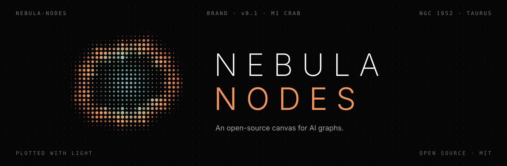
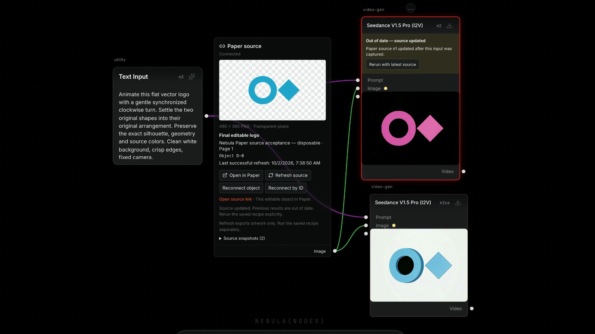

<div align="center">
  
</div>

# Nebula Nodes

**A local AI creation studio. Connect models, media, and editable artwork on one canvas.**

Drop nodes, connect their inputs and outputs, and run a creative pipeline using your own provider keys. Generate images, video, audio, text, 3D assets, and worlds; keep the graph and its outputs on your machine.

[Quickstart](#quickstart) · [Recently added](#recently-added) · [Documentation](#documentation) · [Contributing](CONTRIBUTING.md)

## Recently added

### Projects home

Start at **Projects** to create a blank canvas or reopen recent work. Projects autosave their canvas, outputs, run history and Creator Studio draft locally. Use the home button in any workspace to return to the project list. Rename or delete a project from its card; deleting asks first and leaves generated files in your outputs folder. Existing canvases are preserved as **Recovered canvas**.

### Krea models and workspace

Connect your Krea account in Settings or use a Krea API token for **108 Krea models: 34 image, 41 video, 5 audio, 18 enhance and 10 3D**, including GPT Image 2, Nano Banana, Veo, Kling, Seedance, ElevenLabs Music, Topaz and Magnific. Choose **Krea** in Create's provider filter or search the node library. Saved recipes keep their account/API-token choice. Workspace nodes cover the rest of Krea: styles and moodboards, 3D export, job history, node apps, Krea Files, Krea Nodes, the Krea Agent, desktop apps and usage ([what each supports](docs/model-providers/krea/krea-workspace.md)). [Connect Krea with MCP](docs/KREA-MCP.md) · [Model workflows](docs/api-guides/krea.md).

### Paper Source

Link an editable logo or asset from **[Paper](https://paper.design)** to a canvas node and use its exported artwork downstream. **Open in Paper** takes you back to the original; edit it, return to Nebula, and **Refresh source** to capture the new artwork.

When the artwork changes, refresh marks previous results **out of date**. Choose **Rerun with latest source** to run the saved recipe again. Your connections, earlier snapshots, and run history stay intact. **Refresh alone never triggers generation.**

<div align="center">
  
</div>

Requires Paper Desktop running on the same computer as the Nebula backend, signed in to your own Paper account. [Paper setup and workflow](docs/PAPER-SOURCE.md) · [Watch the 40-second demo](videos/paper-linked-source/renders/paper-linked-source-demo.mp4)

## What you can do

- **Build visual pipelines** with typed ports for images, video, audio, text, SVG, 3D, and reusable references.
- **Choose provider nodes or universal nodes** for FAL, Replicate, OpenRouter, and Nous Portal. Browse the [node catalog](docs/MODEL_REFERENCE.md) and [provider guides](docs/api-guides/README.md).
- **Iterate on part of a graph** with partial execution, caching, and streaming previews.
- **Work across Canvas, Create, Cinema, Character, and Moodboard**, then assemble clips in the Video or Remotion editor.
- **Keep your work** with saved JSON graphs, local media outputs, and run history.
- **Build with an agent** using your local Claude Code or Codex login. Choose the model and thinking effort in Chat. [Chat setup](docs/CHAT-SETUP.md).
- **Watch agents work live.** Each agent that edits the canvas gets its own named cursor that glides to the node it touches, pulls wires port to port and narrates in one line. Agents read the canvas with `nebula look` instead of taking screenshots, and `nebula watch` tells them when you change something. Pin a short note to a node ("warmer", "redo this one") and agents see it in `nebula look` and answer it on the pin. Before a paid run or a bigger change, agents can propose it instead: you see ghost nodes and dashed wires, drag them where you want, and Accept or Reject. [Agent cursors](docs/MCP-SETUP.md#agent-cursors-nebula-look-and-nebula-watch), [pins](docs/MCP-SETUP.md#pins), [proposals](docs/MCP-SETUP.md#proposals).

## Quickstart

Use **Python 3.12** and **Node.js 24**. Install **FFmpeg** (`ffmpeg` and `ffprobe` on your PATH) for video processing and QC.

```bash
git clone https://github.com/JustinPerea/nebula-nodes.git
cd nebula-nodes
```

**Terminal 1 — backend**, from the repository root:

```bash
python3.12 -m venv backend/.venv
backend/.venv/bin/python -m pip install -r backend/requirements.txt
backend/.venv/bin/python -m uvicorn main:app --app-dir backend --reload --reload-dir backend --host 127.0.0.1 --port 8000
```

**Terminal 2 — frontend**, from the repository root:

```bash
npm --prefix frontend ci
npm --prefix frontend run dev -- --host 127.0.0.1 --port 5173
```

Open **[127.0.0.1:5173](http://127.0.0.1:5173)**, then add the provider keys you need in **Settings**. Provider usage is billed to your accounts. Browser mode stores keys in the gitignored, plaintext `settings.json`; the macOS desktop app uses Keychain encryption.

Try a **Text Input → GPT Image 2 → Preview** graph and hit **Run**. Generated files go to `output/` by default; change the location in Settings.

Prefer a desktop window? See the [Electron setup guide](desktop/README.md). Agent chat and Paper are optional; configure them when you need them.

## Documentation

| Guide | What it covers |
| --- | --- |
| [Paper Source](docs/PAPER-SOURCE.md) | Link artwork, edit, refresh, and rerun |
| [Node catalog](docs/MODEL_REFERENCE.md) | Nodes, parameters, ports, and endpoints |
| [Provider guides](docs/api-guides/README.md) | Example pipelines and API coverage |
| [Desktop app](desktop/README.md) | Launch, local backend, migration, and Keychain |
| [Daedalus agent](docs/HERMES-SETUP.md) | Hermes and Daedalus setup |
| [External-agent MCP](docs/MCP-SETUP.md) | Canvas selection, `look_at_canvas`, agent cursors, `wait_for_canvas_change`, `resolve_pin` and proposals (`propose_change`, `get_proposal`, `withdraw_proposal`) |
| [Provider contracts](docs/contracts/README.md) | Maintained API contracts and verification |
| [Contributing](CONTRIBUTING.md) | Development checks and adding nodes |

<details>
<summary>Watch an agent build a pipeline</summary>

https://github.com/user-attachments/assets/3a83187d-e186-4378-8a36-822b0a4055cb

The optional Daedalus agent builds a creative pipeline from a plain-language prompt. [Download the demo](https://github.com/JustinPerea/nebula-nodes/releases/download/v0.1.0-hackathon/stitched-with-music.mp4).

</details>

## Contributing and support

[Issues](https://github.com/JustinPerea/nebula-nodes/issues) and pull requests are welcome. Read the [contribution guide](CONTRIBUTING.md) before adding a node or changing a provider integration.

Built with React Flow, FastAPI, and an optional [Hermes Agent](https://github.com/NousResearch/hermes-agent) integration. Licensed under [AGPL-3.0](LICENSE).
