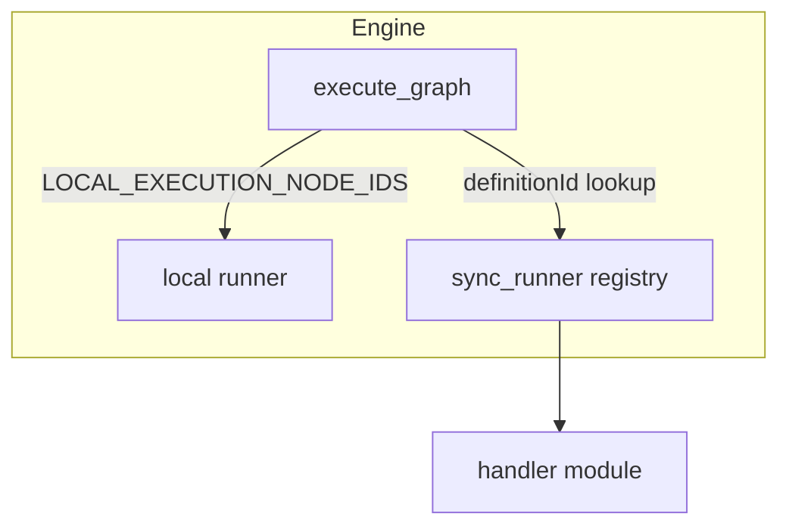

# Handler patterns (Volume 2)

How the web reference engine runs API-backed nodes. Ports implement one of these patterns; Volume 3 docs describe provider-specific HTTP mapping.

**Oracle:** `backend/execution/engine.py`, `backend/execution/sync_runner.py`, `backend/handlers/*.py`

---

## 1. Pattern overview



| Pattern | Registry `executionPattern` | HTTP | Progress |
|---------|----------------------------|------|----------|
| **Local** | any (utility nodes) | none | none |
| **Sync** | `sync` | 1 request → full body | optional |
| **Stream** | `stream` | 1 request → SSE | `stream_delta`, `stream_partial_image`, `stream_partial_svg` |
| **Async-poll** | `async-poll` | submit → poll → result GET | `progress` |

---

## 2. Local pattern

**Nodes:** `text-input`, `image-input`, `router`, `preview`, … (see `LOCAL_EXECUTION_NODE_IDS`).

- No `envKeyName` / no handler in async registry
- Logic in `engine.py` — returns outputs from `node.params` or light transforms
- No WebSocket stream events

Ports must still match Volume 1 schema for graph validation.

---

## 3. Sync pattern

**Examples:** `nano-banana`, `imagen-4-generate`, `openai-tts`, `gpt-image-1-generate` (non-stream path).

### Flow

1. `QueuedEvent` → `ExecutingEvent`
2. Handler builds request from `inputs` + `node.params`
3. Single HTTP call (or provider SDK)
4. Parse response → `PortValueDict` map
5. `ExecutedEvent` with outputs

### Output media

| Media | Typical `value` |
|-------|-----------------|
| Image | Local file path (saved from base64) or remote URL |
| Audio / Video | File path or URL |
| Text | String |
| Mesh | URL to `.glb` |

### Errors

Missing required port or API key → `ValueError` before HTTP (message names port or `envKeyName`).

HTTP failure → `RuntimeError` with status + body snippet.

---

## 4. Stream pattern

**Examples:** `gpt-image-2-generate`, `gemini-chat`, `gpt-image-2-fal-generate`.

### Requirements

- Handler registered in **async** registry (`get_handler_registry(emit=...)`)
- **`emit` callback required** for stream handlers — FAL gpt-image-2 routes incorrectly if `emit` is null

### Subtypes

| Stream kind | Events | Providers |
|-------------|--------|-----------|
| **Token stream** | `StreamDeltaEvent` | OpenAI chat, Gemini chat |
| **Image SSE** | `StreamPartialImageEvent` | OpenAI images, FAL `openai/gpt-image-2*` |
| **SVG SSE** | `StreamPartialSvgEvent` | Quiver / vector streams |

### Image stream flow (`stream_execute_image`)

1. POST with `Accept: text/event-stream`
2. Parse SSE lines → partial + final base64
3. Save files under run dir (`{nodeId}_partial_{i}`, `{nodeId}_final`)
4. Emit `StreamPartialImageEvent` per partial
5. Return final path string to handler → `image` port

### OpenAI image SSE

Uses `event:` lines:

- `image_generation.partial_image` / `image_generation.completed` (generate)
- `image_edit.partial_image` / `image_edit.completed` (edit)

### FAL image SSE

Uses JSON in `data:` (no `event:`):

- `type: "image.partial"` / `"image.completed"`
- Payload: `{ "image": { "b64_json", "partial_index"? } }`

See [examples/gpt-image-2-fal.md](./examples/gpt-image-2-fal.md).

### Stream end

`data: [DONE]` or connection close. Missing final image event → `RuntimeError`.

---

## 5. Async-poll pattern

**Examples:** Most FAL nodes, `veo-3`, Runway, Kling.

### Flow

1. POST submit → `{ request_id, status_url, response_url }`
2. Loop: GET `status_url` every ~2s, emit `ProgressEvent` (0–0.99)
3. On `COMPLETED`, GET `response_url`
4. Parse with provider-specific output mapper (`_parse_fal_output`, etc.)

### Cancellation

On asyncio cancel, FAL handlers fire best-effort PUT to `cancel_url` (detached task).

### Timeout

Default max polls ~300 (~10 min) unless handler overrides.

---

## 6. Execution events (Volume 5 preview)

All events: `backend/models/events.py`

| Event | When |
|-------|------|
| `queued` | Node entered ready queue |
| `executing` | Handler started |
| `progress` | Async-poll heartbeat |
| `stream_delta` | Token stream chunk |
| `stream_partial_image` | Image preview frame |
| `stream_partial_svg` | SVG preview |
| `executed` | Success + output map |
| `error` | Failure |
| `validation_error` | Pre-run port validation |
| `graph_complete` | Full graph done |

Ports should not assume events they do not emit (e.g. sync nodes never send `stream_partial_image`).

---

## 7. Handler registration

| Registry | When | `emit` |
|----------|------|--------|
| Sync map | `emit is None` | ignored |
| Async map | WebSocket execution | required for stream |

Wrapper pattern (injects defaults):

```python
async def _gpt_image_2_fal_generate_handler(node, inputs, api_keys):
    node.params.setdefault("endpoint_id", "openai/gpt-image-2")
    return await handle_fal_universal(node, inputs, api_keys, emit=emit)
```

---

## 8. Parity fixtures

Golden files under `contracts/fixtures/` — web pytest is oracle; Swift/TS ports load same bytes.

| Pattern | Fixture location |
|---------|------------------|
| OpenAI image stream | `contracts/fixtures/handlers/openai/` |
| FAL image stream | `contracts/fixtures/handlers/fal/` |

---

## 9. Exemplars by pattern

| Pattern | Exemplar |
|---------|----------|
| Stream (OpenAI image) | [examples/gpt-image-2.md](./examples/gpt-image-2.md) |
| Stream (FAL passthrough) | [examples/gpt-image-2-fal.md](./examples/gpt-image-2-fal.md) |
| Sync (Google image) | [examples/nano-banana.md](./examples/nano-banana.md) |
| Stream (Google chat) | [examples/gemini-chat.md](./examples/gemini-chat.md) |
| Async-poll (FAL) | [examples/nano-banana-fal.md](./examples/nano-banana-fal.md), [examples/gpt-image-1-5.md](./examples/gpt-image-1-5.md) |
| Async-poll (Google) | [examples/veo-3.md](./examples/veo-3.md), [examples/gemini-omni-flash.md](./examples/gemini-omni-flash.md) |

---

## Changelog

| Date | Change |
|------|--------|
| 2026-07-01 | Initial handler patterns |
