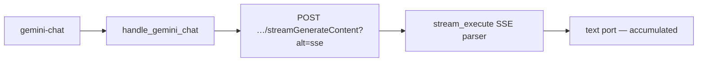

# Contract exemplar: Gemini Chat (`gemini-chat`)

Template for porting agents. **Stream** multimodal chat via `streamGenerateContent?alt=sse` — different pattern from sync nodes like [nano-banana](./nano-banana.md).

**In scope:** single node `gemini-chat` (text + optional vision images).

**Out of scope:** image generation nodes → [nano-banana.md](./nano-banana.md). Other Google nodes → [../03-handler-families/google.md](../03-handler-families/google.md) exemplar index.

---

## References & pricing

Re-check official links when `pricing_verified` is older than `stale_after_days`.

### Official references

| Resource | URL |
|----------|-----|
| Text generation guide | https://ai.google.dev/gemini-api/docs/text-generation |
| Models overview | https://ai.google.dev/gemini-api/docs/models |
| API — `streamGenerateContent` | https://ai.google.dev/api/generate-content |
| Thinking / reasoning config | https://ai.google.dev/gemini-api/docs/thinking |
| Structured output (JSON) | https://ai.google.dev/gemini-api/docs/json-mode |
| Pricing | https://ai.google.dev/gemini-api/docs/pricing |

### Nebula references

| Resource | Path |
|----------|------|
| Family rules | [../03-handler-families/google.md](../03-handler-families/google.md) |
| Handler oracle | `backend/handlers/google_gemini.py` |
| Stream runner | `backend/execution/stream_runner.py` |

### Pricing (Google Gemini API, paid tier)

Rates from [official pricing](https://ai.google.dev/gemini-api/docs/pricing) as of `pricing_verified`. Text models bill **input + output tokens** (vision images add input image tokens).

| Model (registry id) | Typical use |
|---------------------|-------------|
| `gemini-3.5-flash` | Default — fast chat |
| `gemini-3.1-pro-preview` | Higher quality reasoning |
| `gemini-2.5-pro` / `gemini-2.5-flash` | Legacy 2.5 family |

**Nebula params that move the bill**

| Param | Effect |
|-------|--------|
| `model` | Switches rate card |
| `max_tokens` | Caps `maxOutputTokens` (output ceiling) |
| `images` port | Each reference adds **input** image tokens |
| `thinkingLevel` / `thinkingBudget` | Thinking tokens on supported models |
| `response_format: application/json` | Same token math; may increase output length |

Draft iterations: use `gemini-3.5-flash` with lower `max_tokens` before Pro models.

---

## 1. How to use this file

| Step | Action |
|------|--------|
| 1 | Read [01-node-schema.md](../01-node-schema.md) + [02-handler-patterns.md](../02-handler-patterns.md) §4 stream |
| 2 | Implement Vol 1 from §2 |
| 3 | Implement stream HTTP mapping §4–§5 |
| 4 | Match `test_google_request_body_matches_fixture[gemini-chat-generate-request.json]` |
| 5 | Wire `stream_execute` SSE accumulation to `text` port |

---

## 2. Node contract (Vol 1)

| Field | Value |
|-------|-------|
| `id` | `gemini-chat` |
| `displayName` | Gemini |
| `category` | `text-gen` |
| `apiProvider` | `google` |
| `apiEndpoint` | `/v1beta/models/{model}:streamGenerateContent` |
| `envKeyName` | `GOOGLE_API_KEY` |
| `executionPattern` | `stream` |

**Input ports**

| `id` | `dataType` | `required` | `multiple` |
|------|------------|------------|------------|
| `messages` | `Text` | yes | no |
| `images` | `Image` | no | yes |

**Output ports**

| `id` | `dataType` | Notes |
|------|------------|-------|
| `text` | `Text` | Accumulated SSE deltas |

**Params**

| `key` | `type` | `default` | Values |
|-------|--------|-----------|--------|
| `model` | enum | `gemini-3.5-flash` | `gemini-3.5-flash`, `gemini-3.1-pro-preview`, `gemini-3-flash-preview`, `gemini-3.1-flash-lite`, `gemini-2.5-pro`, `gemini-2.5-flash`, `gemini-2.5-flash-lite` |
| `max_tokens` | integer | `8192` | 1–65535 → `maxOutputTokens` |
| `temperature` | float | `1` | 0–2 |
| `system` | textarea | `""` | → `systemInstruction.parts[].text` |
| `thinkingLevel` | enum | `""` | Gemini 3.x only: `minimal`, `low`, `medium`, `high` → `thinkingConfig.thinkingLevel` |
| `thinkingBudget` | integer | unset | Gemini 2.5 only → `thinkingConfig.thinkingBudget` |
| `top_p` | float | unset | **Not forwarded** by handler today |
| `top_k` | integer | unset | **Not forwarded** by handler today |
| `stop_sequences` | string | unset | **Not forwarded** by handler today |
| `response_format` | enum | `text/plain` | `application/json` → `responseMimeType` |

**Handler-pinned**

| Field | Value |
|-------|-------|
| `contents[].role` | `"user"` always |
| SSE `delta_path` | `candidates.0.content.parts.0.text` |
| `thinkingLevel` vs `thinkingBudget` | **Mutually exclusive** — API 400 if both sent |

---

## 3. Handler pattern (Vol 2)

| Property | Value |
|----------|-------|
| Pattern | **stream** — SSE via `stream_execute` |
| Handler | `handle_gemini_chat` in `google_gemini.py` |
| Registry | `get_handler_registry()["gemini-chat"]` |
| URL | `POST …/models/{model}:streamGenerateContent?alt=sse` |
| Timeout | 60s |
| Stream events | Gemini SSE has **no event-type lines** — raw JSON chunks |



---

## 4. HTTP mapping (Vol 3)

### Request

```http
POST https://generativelanguage.googleapis.com/v1beta/models/{model}:streamGenerateContent?alt=sse
x-goog-api-key: <GOOGLE_API_KEY>
Content-Type: application/json
```

`{model}` from `node.params.model` (registry enum).

### Body (oracle shape)

```json
{
  "contents": [
    {
      "role": "user",
      "parts": [
        { "text": "<messages port>" },
        { "inline_data": { "mime_type": "image/png", "data": "<base64>" } }
      ]
    }
  ],
  "systemInstruction": { "parts": [{ "text": "…" }] },
  "generationConfig": {
    "temperature": 1,
    "maxOutputTokens": 8192,
    "responseMimeType": "application/json",
    "thinkingConfig": { "thinkingLevel": "high" }
  }
}
```

**Forwarding rules**

| Source | Rule |
|--------|------|
| `messages` port | First part: `{ "text": "..." }` |
| `images` port | Additional parts after text |
| Local image path | `inline_data` with `mime_type` + base64 `data` |
| HTTP(S) URL | `file_data.file_uri` |
| `data:` URI | Split header → `inline_data` |
| `temperature` param | `generationConfig.temperature` if set |
| `max_tokens` param | `generationConfig.maxOutputTokens` if truthy |
| `response_format` param | `generationConfig.responseMimeType` when ≠ `text/plain` |
| `system` param | Top-level `systemInstruction` when non-empty |
| `thinkingLevel` param | `generationConfig.thinkingConfig.thinkingLevel` when set (3.x models) |
| `thinkingBudget` param | `generationConfig.thinkingConfig.thinkingBudget` when set (2.5 models) — only if `thinkingLevel` absent |
| `top_p`, `top_k`, `stop_sequences` | **Omitted** — in registry UI but not forwarded |

### Response parsing

SSE chunks parsed by `stream_execute` with `delta_path="candidates.0.content.parts.0.text"`. Full accumulated string returned on `text` port.

HTTP ≠ 200 → surfaced by stream runner as `RuntimeError`.

---

## 5. SSE / output / events

| Property | Value |
|----------|-------|
| Transport | Server-Sent Events (`?alt=sse`) |
| Event filter | `event_type_filter=None` — no typed events |
| Delta extraction | `candidates.0.content.parts.0.text` per chunk |
| WebSocket partials | **none** — text accumulates silently until complete |
| Final output | `{ "text": { "type": "Text", "value": "<full string>" } }` |

Vision images appended as extra `parts` after the message text (order: text first, then images).

---

## 6. Edge cases

| Condition | Behavior |
|-----------|----------|
| Missing `messages` | `ValueError("Messages input is required for Gemini chat")` |
| Missing `GOOGLE_API_KEY` | `ValueError("GOOGLE_API_KEY is required")` |
| Both `thinkingLevel` and `thinkingBudget` set | API 400 — handler sends only one branch |
| Local image path missing | Skipped silently (no part added) |
| `response_format: application/json` | Sets `responseMimeType`; model must support JSON mode |
| Multi-turn chat history | Not exposed — single `messages` string today |

---

## 7. Parity oracle

**Test:** `backend/tests/test_google_contract_fixtures.py::test_google_request_body_matches_fixture[gemini-chat-generate-request.json]`

**Fixture:** `contracts/fixtures/handlers/google/gemini-chat-generate-request.json`

| Test | Asserts |
|------|---------|
| `test_gemini_streams_text_and_returns_accumulated` | SSE accumulation |
| `test_gemini_chat_sse_fixture_accumulates_text` | Golden SSE oracle |

**SSE fixture:** `contracts/fixtures/handlers/google/gemini-chat-sse.txt`
| `test_gemini_chat_json_sets_response_mime_type` | `responseMimeType` for JSON |
| `test_gemini_request_body_structure` | Body shape |

Assertions on fixture body:

- `generationConfig.temperature == 0.7`
- `generationConfig.maxOutputTokens == 2048`

---

## 8. Minimal graph (Vol 4)

```json
{
  "nodes": [
    {
      "id": "n1",
      "definitionId": "text-input",
      "params": { "text": "Explain quantum entanglement in one paragraph." },
      "outputs": {}
    },
    {
      "id": "n2",
      "definitionId": "gemini-chat",
      "params": {
        "model": "gemini-3.5-flash",
        "max_tokens": 1024,
        "temperature": 0.7
      },
      "outputs": {}
    }
  ],
  "edges": [
    {
      "source": "n1",
      "sourceHandle": "text",
      "target": "n2",
      "targetHandle": "messages"
    }
  ]
}
```

Vision: connect upstream `image` port(s) → `images` (multi). System prompt via `system` param, not a port.

---

## 9. vs Nano Banana (porting note)

| | Gemini Chat | Nano Banana |
|--|-------------|-------------|
| Pattern | stream | sync |
| Endpoint | `streamGenerateContent` | `generateContent` |
| Primary output | `text` | `image` (+ optional `text`) |
| Modalities pin | none | `["IMAGE", "TEXT"]` |
| Previews | SSE text deltas (no WS partial images) | none |

---

## 10. Parameter matrix (official API vs Nebula)

| Parameter | Official `generateContent` / stream | Nebula |
|-----------|-------------------------------------|--------|
| `contents` | ✓ | port-driven (`messages` + `images`) |
| `systemInstruction` | ✓ | `system` param |
| `generationConfig.temperature` | ✓ | param |
| `generationConfig.maxOutputTokens` | ✓ | `max_tokens` param |
| `generationConfig.topP` | ✓ | **not forwarded** |
| `generationConfig.topK` | ✓ | **not forwarded** |
| `generationConfig.stopSequences` | ✓ | **not forwarded** |
| `generationConfig.responseMimeType` | ✓ | `response_format` param |
| `generationConfig.thinkingConfig` | ✓ | `thinkingLevel` or `thinkingBudget` |
| `tools` / `toolConfig` | ✓ | omitted |
| Multi-turn `role` history | ✓ | single user turn only |

Official reference: [Generate content](https://ai.google.dev/api/generate-content).

---

## 11. Porting checklist

- [ ] `NodeDefinition` matches §2
- [ ] POST `streamGenerateContent?alt=sse` with `x-goog-api-key` header
- [ ] Build `contents[].parts` from `messages` + optional `images`
- [ ] Forward `systemInstruction`, `generationConfig` per §4 rules
- [ ] Enforce `thinkingLevel` XOR `thinkingBudget`
- [ ] SSE parser accumulates `candidates.0.content.parts.0.text`
- [ ] Return `{ type: "Text", value: accumulated }` on `text` port
- [ ] Match error strings from §6
- [ ] Unit test loads fixture JSON body shape

---

## Changelog

| Date | Change |
|------|--------|
| 2026-07-01 | Initial exemplar (partial) |
| 2026-07-01 | Gold upgrade — full Vol 1–4, pricing, parameter matrix |
