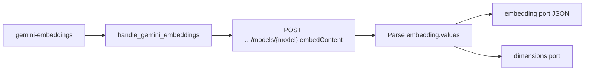

# Contract exemplar: Gemini Embeddings (`gemini-embeddings`)

Template for porting agents. **Sync** text embeddings via `:embedContent`.

**In scope:** single node `gemini-embeddings` (text + multimodal embedding models).

**Out of scope:** chat / generation nodes → [gemini-chat.md](./gemini-chat.md). Other utility nodes → [../03-handler-families/google.md](../03-handler-families/google.md).

---

## References & pricing

Re-check official links when `pricing_verified` is older than `stale_after_days`.

### Official references

| Resource | URL |
|----------|-----|
| Embeddings guide | https://ai.google.dev/gemini-api/docs/embeddings |
| API — `embedContent` | https://ai.google.dev/api/embeddings |
| Pricing | https://ai.google.dev/gemini-api/docs/pricing |

### Nebula references

| Resource | Path |
|----------|------|
| Family rules | [../03-handler-families/google.md](../03-handler-families/google.md) |
| Handler oracle | `backend/handlers/google_gemini.py` |

### Pricing (Google Embeddings API, paid tier)

Rates from [official pricing](https://ai.google.dev/gemini-api/docs/pricing) as of `pricing_verified`. Embeddings bill **input tokens** (text length).

| Model (registry id) | Notes |
|---------------------|-------|
| `gemini-embedding-001` | Default text embeddings |
| `gemini-embedding-2-preview` | Multimodal (registry option; handler text-only today) |

**Nebula params that move the bill**

| Param | Effect |
|-------|--------|
| `model` | Switches rate card |
| `text` port length | Input token count |
| `outputDimensionality` | Matryoshka truncation — same input tokens |

---

## 1. How to use this file

| Step | Action |
|------|--------|
| 1 | Read [01-node-schema.md](../01-node-schema.md) + [02-handler-patterns.md](../02-handler-patterns.md) §3 sync |
| 2 | Implement Vol 1 from §2 |
| 3 | Implement sync HTTP mapping §4 |
| 4 | Match `test_google_request_body_matches_fixture[gemini-embeddings-request.json]` |
| 5 | Use camelCase `outputDimensionality` in request body |

---

## 2. Node contract (Vol 1)

| Field | Value |
|-------|-------|
| `id` | `gemini-embeddings` |
| `displayName` | Gemini Embeddings |
| `category` | `utility` |
| `apiProvider` | `google` |
| `apiEndpoint` | `/v1beta/models/{model}:embedContent` |
| `envKeyName` | `GOOGLE_API_KEY` |
| `executionPattern` | `sync` |

**Input ports**

| `id` | `dataType` | `required` | `multiple` |
|------|------------|------------|------------|
| `text` | `Text` | yes | no |

**Output ports**

| `id` | `dataType` | Notes |
|------|------------|-------|
| `embedding` | `Text` | JSON array string of floats |
| `dimensions` | `Text` | Integer string (vector length) |

**Params**

| `key` | `type` | `default` | Values |
|-------|--------|-----------|--------|
| `model` | enum | `gemini-embedding-001` | `gemini-embedding-001`, `gemini-embedding-2-preview` |
| `taskType` | enum | `SEMANTIC_SIMILARITY` | `SEMANTIC_SIMILARITY`, `RETRIEVAL_QUERY`, `RETRIEVAL_DOCUMENT`, `CLASSIFICATION`, `CLUSTERING`, `CODE_RETRIEVAL_QUERY`, `QUESTION_ANSWERING`, `FACT_VERIFICATION` |
| `outputDimensionality` | enum | `768` | `768`, `1536`, `3072` → **`outputDimensionality`** (camelCase) |

**Handler-pinned**

| Field | Value |
|-------|-------|
| Body `model` field | `"models/{model_id}"` prefix required |
| Vector serialization | `json.dumps(values)` on `embedding` port |

---

## 3. Handler pattern (Vol 2)

| Property | Value |
|----------|-------|
| Pattern | **sync** — one POST, full JSON response |
| Handler | `handle_gemini_embeddings` in `google_gemini.py` |
| Registry | `sync_runner.SYNC_HANDLERS["gemini-embeddings"]` |
| Timeout | 60s |
| Stream events | **none** |



---

## 4. HTTP mapping (Vol 3)

### Request

```http
POST https://generativelanguage.googleapis.com/v1beta/models/{model}:embedContent
x-goog-api-key: <GOOGLE_API_KEY>
Content-Type: application/json
```

### Body (oracle shape)

```json
{
  "model": "models/gemini-embedding-001",
  "content": { "parts": [{ "text": "<text port>" }] },
  "taskType": "SEMANTIC_SIMILARITY",
  "outputDimensionality": 768
}
```

**Forwarding rules**

| Source | Rule |
|--------|------|
| `text` port | `content.parts[0].text` |
| `model` param | URL path **and** body `model: "models/{id}"` |
| `taskType` param | Top-level `taskType` when set |
| `outputDimensionality` param | Top-level `outputDimensionality` as **integer** (camelCase key) |
| Batch embed | **Not exposed** — single text per call |

### Response parsing

```json
{
  "embedding": { "values": [0.012, -0.034, …] }
}
```

| Field | Port |
|------|------|
| `embedding.values` | `embedding` — `json.dumps(values)` |
| `len(values)` | `dimensions` — `str(len)` |

HTTP ≠ 200 → `RuntimeError(f"Gemini Embeddings API error {status}: {body}")`.

---

## 5. SSE / output / events

Not applicable — sync JSON only.

Final port output:

```json
{
  "embedding": { "type": "Text", "value": "[0.012, -0.034, …]" },
  "dimensions": { "type": "Text", "value": "768" }
}
```

---

## 6. Edge cases

| Condition | Behavior |
|-----------|----------|
| Missing `text` | `ValueError("Text input is required for embeddings")` |
| Missing `GOOGLE_API_KEY` | `ValueError("GOOGLE_API_KEY is required")` |
| `outputDimensionality` key casing | Must be camelCase — snake_case rejected by API |
| `gemini-embedding-2-preview` | In registry; handler still text-only via `text` port |
| Empty embedding | Unlikely — would yield `"[]"` and `"0"` dimensions |

---

## 7. Parity oracle

**Test:** `backend/tests/test_google_contract_fixtures.py::test_google_request_body_matches_fixture[gemini-embeddings-request.json]`

**Fixture:** `contracts/fixtures/handlers/google/gemini-embeddings-request.json`

| Test | Asserts |
|------|---------|
| `test_gemini_embeddings_returns_vector` | Vector JSON on `embedding` port |
| `test_gemini_embeddings_output_dimensionality_camelcase` | `outputDimensionality` key in body |

Assertions on fixture body:

- `model == "models/gemini-embedding-001"`
- `outputDimensionality == 768`

---

## 8. Minimal graph (Vol 4)

```json
{
  "nodes": [
    {
      "id": "n1",
      "definitionId": "text-input",
      "params": { "text": "The quick brown fox jumps over the lazy dog." },
      "outputs": {}
    },
    {
      "id": "n2",
      "definitionId": "gemini-embeddings",
      "params": {
        "model": "gemini-embedding-001",
        "taskType": "SEMANTIC_SIMILARITY",
        "outputDimensionality": "768"
      },
      "outputs": {}
    }
  ],
  "edges": [
    {
      "source": "n1",
      "sourceHandle": "text",
      "target": "n2",
      "targetHandle": "text"
    }
  ]
}
```

Downstream similarity: parse `embedding` port JSON and compute cosine distance in a utility node.

---

## 9. vs OpenAI embeddings (porting note)

| | Gemini Embeddings | Typical OpenAI embed |
|--|-------------------|-------------------|
| Endpoint | `:embedContent` | `/v1/embeddings` |
| Model in body | `"models/{id}"` required | `"model": "text-embedding-3-small"` |
| Task type | `taskType` enum exposed | often omitted |
| Dimensions | Matryoshka via `outputDimensionality` | `dimensions` param |
| Output type | `Text` (JSON string) | varies by integration |

---

## 10. Parameter matrix (official API vs Nebula)

| Parameter | Official `embedContent` | Nebula |
|-----------|-------------------------|--------|
| `model` | ✓ | param (URL + body) |
| `content` | ✓ | `text` port |
| `taskType` | ✓ | param |
| `outputDimensionality` | ✓ | param (camelCase) |
| `title` (for documents) | ✓ | **not exposed** |
| `batchEmbedContents` | separate RPC | **not exposed** |
| Image / multimodal input | embedding-2 | **not exposed** (text port only) |

Official reference: [Embeddings](https://ai.google.dev/gemini-api/docs/embeddings).

---

## 11. Porting checklist

- [ ] `NodeDefinition` matches §2
- [ ] POST `:embedContent` with `x-goog-api-key` header
- [ ] Body includes `model: "models/{id}"` **and** URL uses same id
- [ ] Forward `taskType`, `outputDimensionality` (camelCase) when set
- [ ] Parse `embedding.values` → JSON-stringify → `embedding` port
- [ ] Return `dimensions` as stringified length
- [ ] Match error strings from §6
- [ ] Unit test loads fixture JSON body shape

---

## Changelog

| Date | Change |
|------|--------|
| 2026-07-01 | Initial exemplar (partial) |
| 2026-07-01 | Gold upgrade — full Vol 1–4, pricing, parameter matrix |
