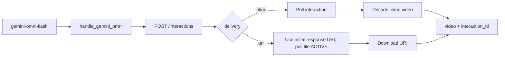

# Contract exemplar: Gemini Omni Flash (`gemini-omni-flash`)

Template for porting agents. Conversational video via the **Interactions API**, using synchronous creation for URI delivery and background polling for inline delivery. This is not Veo's `predictLongRunning` flow.

Shipped 2026-06-30. Model id pinned: `gemini-omni-flash-preview`.

**In scope:** single node `gemini-omni-flash` (T2V, I2V, reference-to-video, edit chain).

**Out of scope:** Veo extension / last-frame interpolation → [veo-3.md](./veo-3.md).

---

## References & pricing

Re-check official links when `pricing_verified` is older than `stale_after_days`.

### Official references

| Resource | URL |
|----------|-----|
| Omni guide | https://ai.google.dev/gemini-api/docs/omni |
| Video overview | https://ai.google.dev/gemini-api/docs/video |
| Interactions API | https://ai.google.dev/api/interactions |
| Pricing | https://ai.google.dev/gemini-api/docs/pricing |
| Launch blog | https://blog.google/innovation-and-ai/models-and-research/gemini-models/gemini-omni-flash-nano-banana-2-lite/ |

### Nebula references

| Resource | Path |
|----------|------|
| Family rules | [../03-handler-families/google.md](../03-handler-families/google.md) |
| Handler oracle | `backend/handlers/gemini_omni.py` |

### Pricing (indicative)

~**$0.10 / second** of generated video (same tier as Veo 3.1 Fast per [Google blog](https://blog.google/innovation-and-ai/models-and-research/gemini-models/gemini-omni-flash-nano-banana-2-lite/)). Re-check [official pricing](https://ai.google.dev/gemini-api/docs/pricing) before production cost estimates.

**Nebula params that move the bill**

| Param | Effect |
|-------|--------|
| Output duration | Billed per second (API-controlled) |
| `images` / `video` inputs | Input processing; multi-modal edits cost more |
| `delivery: inline` | Same generation cost; larger response payload |

---

## 1. How to use this file

| Step | Action |
|------|--------|
| 1 | Read [01-node-schema.md](../01-node-schema.md) + [02-handler-patterns.md](../02-handler-patterns.md) §5 async-poll |
| 2 | Implement Vol 1 from §2 |
| 3 | Implement synchronous URI submit and background inline submit + poll §4–§5 |
| 4 | Match `test_google_request_body_matches_fixture[gemini-omni-flash-submit-request.json]` |
| 5 | For `delivery: uri`, poll `files/{id}` until `ACTIVE` before download |

---

## 2. Node contract (Vol 1)

| Field | Value |
|-------|-------|
| `id` | `gemini-omni-flash` |
| `displayName` | Gemini Omni Flash |
| `category` | `video-gen` |
| `apiProvider` | `google` |
| `apiEndpoint` | `gemini-omni-flash-preview` |
| `envKeyName` | `GOOGLE_API_KEY` |
| `executionPattern` | `async-poll` |

**Input ports**

| `id` | `dataType` | `required` | `multiple` |
|------|------------|------------|------------|
| `prompt` | `Text` | yes | no |
| `images` | `Image` | no | yes |
| `video` | `Video` | no | no |

**Output ports**

| `id` | `dataType` | Notes |
|------|------------|-------|
| `video` | `Video` | Local `.mp4` |
| `interaction_id` | `Text` | Chain edits via `previous_interaction_id` |

**Params**

| `key` | `type` | `default` | Values |
|-------|--------|-----------|--------|
| `task` | enum | `""` | `text_to_video`, `image_to_video`, `reference_to_video`, `edit` → `generation_config.video_config.task` |
| `aspect_ratio` | enum | `16:9` | `16:9`, `9:16` → `response_format.aspect_ratio` |
| `delivery` | enum | `uri` | `uri` (recommended), `inline` → `response_format.delivery` |
| `previous_interaction_id` | string | `""` | Conversational edit chain |

**Handler-pinned**

| Field | Value |
|-------|-------|
| `model` | Always `gemini-omni-flash-preview` |
| `background` | `false` for `delivery: uri`; `true` for `delivery: inline` |
| `response_format.type` | Always `"video"` |

---

## 3. Handler pattern (Vol 2)

| Property | Value |
|----------|-------|
| Handler | `handle_gemini_omni` |
| URI submit | `POST /v1beta/interactions` with `background: false`; parse the initial response |
| Inline submit | `POST /v1beta/interactions` with `background: true` |
| Poll | For inline delivery, `GET /v1beta/interactions/{id}` until `status: completed` |
| URI delivery | Poll `files/{id}` until `ACTIVE`, then download |
| Parse | `steps[].type=model_output` → `content[].type=video` |
| Progress | `ProgressEvent` during interaction poll |
| Max polls | 300 × 3s (interaction); 120 × 5s (file ACTIVE) |



---

## 4. HTTP mapping (Vol 3)

### Submit

```http
POST https://generativelanguage.googleapis.com/v1beta/interactions
x-goog-api-key: <GOOGLE_API_KEY>
Content-Type: application/json
```

### Body (oracle shape — text-to-video)

```json
{
  "model": "gemini-omni-flash-preview",
  "input": "A marble rolling on a track",
  "background": false,
  "response_format": {
    "type": "video",
    "delivery": "uri",
    "aspect_ratio": "9:16"
  },
  "generation_config": {
    "video_config": { "task": "text_to_video" }
  }
}
```

**Forwarding rules**

| Source | Rule |
|--------|------|
| `prompt` only | `input` as plain string |
| `images` / `video` ports | `input` as array of typed parts |
| Gemini `files/...` video URI | `{ "type": "document", "uri": "…" }` |
| Local / HTTP media | `{ "type": "image"|"video", "mime_type", "data": base64 }` |
| `task` param | `generation_config.video_config.task` when non-empty |
| `aspect_ratio` param | `response_format.aspect_ratio` |
| `delivery` param | `response_format.delivery` |
| `previous_interaction_id` param | Top-level `previous_interaction_id` for edit chain |

### Edit chain body

```json
{
  "model": "gemini-omni-flash-preview",
  "previous_interaction_id": "v1_…",
  "input": "Make the sky purple",
  "background": false,
  "response_format": { "type": "video", "delivery": "uri", "aspect_ratio": "16:9" }
}
```

### Poll interaction

```http
GET https://generativelanguage.googleapis.com/v1beta/interactions/{id}
x-goog-api-key: <GOOGLE_API_KEY>
```

Terminal states: `completed` (success), `failed` / `cancelled` (error). Interaction polling is used only for background inline delivery. Google currently returns inline data from a GET even when the interaction was created with URI delivery, so URI mode must preserve the initial creation response.

### Download

Inline: decode `steps[].content[].data`. URI: wait for file `ACTIVE`, then `GET` video URI with API key.

---

## 5. SSE / output / events

No SSE. Inline delivery emits asynchronous progress via WebSocket `ProgressEvent` during interaction polling. URI delivery waits on the synchronous creation response and then polls the returned file until active.

Final port output:

```json
{
  "video": { "type": "Video", "value": "/path/to/clip.mp4" },
  "interaction_id": { "type": "Text", "value": "v1_abc123…" }
}
```

Wire `interaction_id` → downstream `previous_interaction_id` param for conversational edits.

---

## 6. Edge cases

| Condition | Behavior |
|-----------|----------|
| Missing `GOOGLE_API_KEY` | `ValueError("GOOGLE_API_KEY is required")` |
| No prompt, images, or video | `ValueError("Prompt, images, or video input is required")` |
| Media path not found | `ValueError("Media not found: …")` |
| Interaction failed/cancelled | `RuntimeError` with status + error payload |
| File poll `FAILED` | `RuntimeError("Gemini Omni video file processing failed")` |
| Poll timeout | `RuntimeError("Gemini Omni timed out after 300 polls")` |
| Completed but no video | `RuntimeError("Gemini Omni completed but returned no video")` |

---

## 7. Parity oracle

**Test:** `backend/tests/test_google_contract_fixtures.py::test_google_request_body_matches_fixture[gemini-omni-flash-submit-request.json]`

**Fixture:** `contracts/fixtures/handlers/google/gemini-omni-flash-submit-request.json`

| Test | Asserts |
|------|---------|
| `test_gemini_omni_text_to_video_submits_interaction` | Body + inline video parse |
| `test_gemini_omni_polls_when_processing` | Poll loop |
| `test_gemini_omni_uri_delivery_uses_initial_response` | URI mode is synchronous and downloads the initial response URI |

Assertions on fixture body:

- `model == "gemini-omni-flash-preview"`
- `background == false` for the default URI fixture
- `generation_config.video_config.task == "text_to_video"`
- `response_format.aspect_ratio == "9:16"`

---

## 8. Minimal graph (Vol 4)

```json
{
  "nodes": [
    {
      "id": "n1",
      "definitionId": "text-input",
      "params": { "text": "A marble rolling slowly down a wooden track" },
      "outputs": {}
    },
    {
      "id": "n2",
      "definitionId": "gemini-omni-flash",
      "params": {
        "task": "text_to_video",
        "aspect_ratio": "16:9",
        "delivery": "uri"
      },
      "outputs": {}
    }
  ],
  "edges": [
    {
      "source": "n1",
      "sourceHandle": "text",
      "target": "n2",
      "targetHandle": "prompt"
    }
  ]
}
```

Edit chain: wire `n2.interaction_id` → `n3.previous_interaction_id` with new prompt on `n3`.

---

## 9. vs Veo 3

| | Omni Flash | Veo 3 |
|--|------------|-------|
| API | Interactions | `predictLongRunning` |
| Edit | `previous_interaction_id` | Extension via `source_uri` only |
| Extension / last frame | Not supported | Supported |
| Reference images | `reference_to_video` task | Not exposed (API rejects) |
| Audio | Native in output | Veo 3.1 native audio |
| FAL fallback | none | `FAL_KEY` when no Google key |

---

## 10. Parameter matrix (official API vs Nebula)

| Parameter | Official Interactions API | Nebula |
|-----------|---------------------------|--------|
| `model` | ✓ | pinned `gemini-omni-flash-preview` |
| `input` | ✓ | ports → string or parts array |
| `background` | ✓ | derived from delivery: URI `false`, inline `true` |
| `response_format` | ✓ | `aspect_ratio`, `delivery` params |
| `generation_config.video_config.task` | ✓ | `task` param |
| `previous_interaction_id` | ✓ | param |
| Duration / FPS controls | ✓ (docs) | **not exposed** |
| Negative prompt | ✓ (docs) | **not exposed** |

Official reference: [Omni](https://ai.google.dev/gemini-api/docs/omni).

---

## 11. Porting checklist

- [ ] `NodeDefinition` matches §2
- [ ] POST `/v1beta/interactions` with `x-goog-api-key`
- [ ] Pin `model` and `response_format.type: video`; derive `background` from delivery
- [ ] Build `input` from prompt / images / video per §4
- [ ] For inline delivery, poll interaction until `completed`; emit `ProgressEvent`
- [ ] For URI delivery, parse the initial creation response without an interaction GET
- [ ] URI delivery: poll file until `ACTIVE`, then download
- [ ] Return `video` + `interaction_id` ports
- [ ] Match error strings from §6
- [ ] Unit test loads fixture JSON body shape

---

## Changelog

| Date | Change |
|------|--------|
| 2026-07-22 | URI delivery changed to synchronous creation so the guaranteed initial-response URI is preserved; inline delivery retains background polling |
| 2026-06-30 | Node shipped |
| 2026-07-01 | Initial exemplar (partial) |
| 2026-07-01 | Gold upgrade — full Vol 1–4, pricing, parameter matrix |
