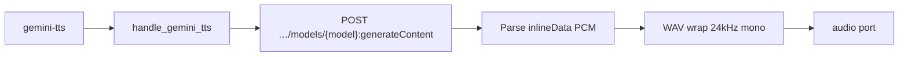

# Contract exemplar: Gemini TTS (`gemini-tts`)

Template for porting agents. **Sync** text-to-speech via `generateContent` with `responseModalities: ["AUDIO"]`.

**In scope:** single node `gemini-tts` (three TTS model variants, 30 prebuilt voices).

**Out of scope:** music generation → [lyria-3.md](./lyria-3.md). Other Google audio → [../03-handler-families/google.md](../03-handler-families/google.md).

---

## References & pricing

Re-check official links when `pricing_verified` is older than `stale_after_days`.

### Official references

| Resource | URL |
|----------|-----|
| Speech generation guide | https://ai.google.dev/gemini-api/docs/speech-generation |
| API — `generateContent` | https://ai.google.dev/api/generate-content |
| Pricing | https://ai.google.dev/gemini-api/docs/pricing |

### Nebula references

| Resource | Path |
|----------|------|
| Family rules | [../03-handler-families/google.md](../03-handler-families/google.md) |
| Handler oracle | `backend/handlers/google_gemini.py` |

### Pricing (Google TTS API, paid tier)

Rates from [official pricing](https://ai.google.dev/gemini-api/docs/pricing) as of `pricing_verified`. TTS models bill **input text tokens + audio output tokens**.

| Model (registry id) | Notes |
|---------------------|-------|
| `gemini-3.1-flash-tts-preview` | Newest flash TTS |
| `gemini-2.5-flash-preview-tts` | Default in registry |
| `gemini-2.5-pro-preview-tts` | Higher quality |

**Nebula params that move the bill**

| Param | Effect |
|-------|--------|
| `model` | Switches rate card |
| Input `text` port length | Input token count |
| `voiceName` | No separate voice surcharge in API — same generation |

---

## 1. How to use this file

| Step | Action |
|------|--------|
| 1 | Read [01-node-schema.md](../01-node-schema.md) + [02-handler-patterns.md](../02-handler-patterns.md) §3 sync |
| 2 | Implement Vol 1 from §2 |
| 3 | Implement sync HTTP mapping §4 |
| 4 | Match `test_google_request_body_matches_fixture[gemini-tts-generate-request.json]` |
| 5 | Wrap raw PCM in WAV on disk (24 kHz, 16-bit mono) |

---

## 2. Node contract (Vol 1)

| Field | Value |
|-------|-------|
| `id` | `gemini-tts` |
| `displayName` | Gemini TTS |
| `category` | `audio-gen` |
| `apiProvider` | `google` |
| `apiEndpoint` | `/v1beta/models/{model}:generateContent` |
| `envKeyName` | `GOOGLE_API_KEY` |
| `executionPattern` | `sync` |

**Input ports**

| `id` | `dataType` | `required` | `multiple` |
|------|------------|------------|------------|
| `text` | `Text` | yes | no |

**Output ports**

| `id` | `dataType` | Notes |
|------|------------|-------|
| `audio` | `Audio` | `.wav` — handler wraps raw PCM |

**Params**

| `key` | `type` | `default` | Values |
|-------|--------|-----------|--------|
| `model` | enum | `gemini-2.5-flash-preview-tts` | `gemini-3.1-flash-tts-preview`, `gemini-2.5-flash-preview-tts`, `gemini-2.5-pro-preview-tts` |
| `voiceName` | enum | `Kore` | Zephyr, Puck, Charon, Kore, Fenrir, Leda, Orus, Aoede, Callirrhoe, Autonoe, Enceladus, Iapetus, Umbriel, Algieba, Despina, Erinome, Algenib, Rasalgethi, Laomedeia, Achernar, Alnilam, Schedar, Gacrux, Pulcherrima, Achird, Zubenelgenubi, Vindemiatrix, Sadachbia, Sadaltager, Sulafat |

**Handler-pinned**

| Field | Value |
|-------|-------|
| `responseModalities` | `["AUDIO"]` always sent |
| PCM format | 24 kHz, 16-bit, mono — wrapped in WAV container on save |
| `speechConfig.voiceConfig.prebuiltVoiceConfig.voiceName` | From `voiceName` param |

---

## 3. Handler pattern (Vol 2)

| Property | Value |
|----------|-------|
| Pattern | **sync** — one POST, full JSON response |
| Handler | `handle_gemini_tts` in `google_gemini.py` |
| Registry | `sync_runner.SYNC_HANDLERS["gemini-tts"]` |
| Timeout | 120s |
| Stream events | **none** |



---

## 4. HTTP mapping (Vol 3)

### Request

```http
POST https://generativelanguage.googleapis.com/v1beta/models/{model}:generateContent
x-goog-api-key: <GOOGLE_API_KEY>
Content-Type: application/json
```

### Body (oracle shape)

```json
{
  "contents": [{ "parts": [{ "text": "<text port>" }] }],
  "generationConfig": {
    "responseModalities": ["AUDIO"],
    "speechConfig": {
      "voiceConfig": {
        "prebuiltVoiceConfig": {
          "voiceName": "Kore"
        }
      }
    }
  }
}
```

**Forwarding rules**

| Source | Rule |
|--------|------|
| `text` port | `contents[0].parts[0].text` |
| `voiceName` param | `generationConfig.speechConfig.voiceConfig.prebuiltVoiceConfig.voiceName` |
| `model` param | URL path segment only |
| `responseModalities` | Always `["AUDIO"]` |

### Response parsing

| Step | Action |
|------|--------|
| 1 | Find `inlineData` in `candidates[0].content.parts` |
| 2 | Base64-decode → raw PCM bytes |
| 3 | Write WAV: 1 channel, 2-byte sample width, 24000 Hz |
| 4 | Return `audio` port with file path |

No audio part → `RuntimeError("Gemini TTS returned no audio content: …")`.

HTTP ≠ 200 → `RuntimeError(f"Gemini TTS API error {status}: {body}")`.

---

## 5. SSE / output / events

Not applicable — sync JSON only.

Final port output:

```json
{
  "audio": { "type": "Audio", "value": "/path/to/abc123.wav" }
}
```

---

## 6. Edge cases

| Condition | Behavior |
|-----------|----------|
| Missing `text` | `ValueError("Text input is required for Gemini TTS")` |
| Missing `GOOGLE_API_KEY` | `ValueError("GOOGLE_API_KEY is required")` |
| Empty API audio | `RuntimeError` with response snippet |
| Long input text | No handler-side truncation — API may reject |

---

## 7. Parity oracle

**Test:** `backend/tests/test_google_contract_fixtures.py::test_google_request_body_matches_fixture[gemini-tts-generate-request.json]`

**Fixture:** `contracts/fixtures/handlers/google/gemini-tts-generate-request.json`

| Test | Asserts |
|------|---------|
| `test_gemini_tts_returns_audio_file` | WAV output path |

Assertions on fixture body:

- `generationConfig.responseModalities == ["AUDIO"]`
- `generationConfig.speechConfig.voiceConfig.prebuiltVoiceConfig.voiceName == "Kore"`

---

## 8. Minimal graph (Vol 4)

```json
{
  "nodes": [
    {
      "id": "n1",
      "definitionId": "text-input",
      "params": { "text": "Hello, welcome to Nebula Nodes." },
      "outputs": {}
    },
    {
      "id": "n2",
      "definitionId": "gemini-tts",
      "params": {
        "model": "gemini-2.5-flash-preview-tts",
        "voiceName": "Kore"
      },
      "outputs": {}
    }
  ],
  "edges": [
    {
      "source": "n1",
      "sourceHandle": "text",
      "target": "n2",
      "targetHandle": "text"
    }
  ]
}
```

---

## 9. vs Lyria 3 (porting note)

| | Gemini TTS | Lyria 3 |
|--|------------|---------|
| Purpose | Speech synthesis | Music generation |
| Modalities | `["AUDIO"]` | `["AUDIO", "TEXT"]` |
| Voice selection | `voiceName` enum | N/A |
| Output wrap | PCM → WAV (24 kHz) | MP3/WAV from API mime |
| Lyrics port | none | `text` |

---

## 10. Parameter matrix (official API vs Nebula)

| Parameter | Official TTS `generateContent` | Nebula |
|-----------|-------------------------------|--------|
| `contents[].parts[].text` | ✓ | `text` port |
| `generationConfig.responseModalities` | ✓ | pinned `["AUDIO"]` |
| `generationConfig.speechConfig` | ✓ | `voiceName` only |
| `speechConfig.multiSpeakerVoiceConfig` | ✓ | **not exposed** |
| Speaking rate / pitch | ✓ (docs) | **not exposed** |
| SSML | ✓ (docs) | **not exposed** |

Official reference: [Speech generation](https://ai.google.dev/gemini-api/docs/speech-generation).

---

## 11. Porting checklist

- [ ] `NodeDefinition` matches §2
- [ ] POST `generateContent` with `x-goog-api-key` header
- [ ] Pin `responseModalities: ["AUDIO"]`
- [ ] Forward `speechConfig.voiceConfig.prebuiltVoiceConfig.voiceName`
- [ ] Decode `inlineData` → wrap PCM in WAV (24 kHz, 16-bit, mono)
- [ ] Return `audio` port with `.wav` path
- [ ] Match error strings from §6
- [ ] Unit test loads fixture JSON body shape

---

## Changelog

| Date | Change |
|------|--------|
| 2026-07-01 | Initial exemplar (partial) |
| 2026-07-01 | Gold upgrade — full Vol 1–4, pricing, parameter matrix |
