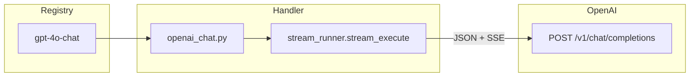

# Contract exemplar: OpenAI Chat (`gpt-4o-chat`)

Template for porting agents. **Node id is `gpt-4o-chat` for graph compatibility**; display name is **OpenAI Chat**. Default model is **GPT-5.4** (not `gpt-4o`).

**In scope:** `gpt-4o-chat` — OpenAI Chat Completions token stream (`OPENAI_API_KEY`).

**Out of scope:** Claude, Gemini, and other chat families — see their exemplars under `docs/contracts/examples/`.

---

## References & pricing

Re-check official links when `pricing_verified` is older than `stale_after_days` or before production cost estimates.

### Official references

| Resource | URL |
|----------|-----|
| Chat guide | https://developers.openai.com/api/docs/guides/chat |
| API — create chat completion | https://developers.openai.com/api/reference/resources/chat/methods/create |
| Models overview | https://developers.openai.com/api/docs/models |
| API pricing | https://developers.openai.com/api/docs/pricing |
| Reasoning models (GPT-5.x) | https://developers.openai.com/api/docs/guides/reasoning |

### Nebula references

| Resource | Path |
|----------|------|
| Handler oracle | `backend/handlers/openai_chat.py` |
| Stream runner | `backend/execution/stream_runner.py` |
| OpenAI family rules | [../03-handler-families/openai.md](../03-handler-families/openai.md) |

### Pricing (OpenAI direct, token-based)

OpenAI bills chat models by **input + output tokens**. Rates vary by model tier — confirm on the [official pricing page](https://developers.openai.com/api/docs/pricing) as of `pricing_verified`.

**Nebula params that move the bill**

| Param | Cost effect |
|-------|-------------|
| `model` | Primary lever — GPT-5.5 > GPT-5.4 > mini/nano tiers |
| `max_completion_tokens` | Caps output tokens (and thus output cost) |
| `images` port | Vision images add image input tokens per attached frame |
| `reasoning_effort` | GPT-5.x only — higher effort can increase internal reasoning tokens |

**Not billed through Nebula UI:** upstream caching, tool calls, or hidden reasoning tokens beyond what the API returns in usage.

---

## 1. How to use this file

| Step | Action |
|------|--------|
| 1 | Read [00-meta.md](../00-meta.md) — tiers of truth, parity rules |
| 2 | Implement **Vol 1** fields from §2 below in your target language |
| 3 | Implement **Vol 2** token stream from §3–§5 |
| 4 | Match pytest oracle in §8 |
| 5 | Wire **Vol 5** `StreamDeltaEvent` to your UI |

Do not re-derive behavior from React components. **Python handler + tests are the oracle.**

**Critical porting note:** GPT-5.x models use `reasoning_effort` and **reject** sampler params (`temperature`, `top_p`, penalties). Legacy `gpt-4o` / `gpt-4.1` models use samplers and **must not** receive `reasoning_effort`.

---

## 2. Node contract (Vol 1)

Registry key: `gpt-4o-chat` (id kept for saved-graph compatibility).

| Field | Value |
|-------|-------|
| `id` | `gpt-4o-chat` |
| `displayName` | OpenAI Chat |
| `category` | `text-gen` |
| `apiProvider` | `openai` |
| `apiEndpoint` | `/v1/chat/completions` |
| `envKeyName` | `OPENAI_API_KEY` |
| `executionPattern` | `stream` |

**Input ports**

| `id` | `dataType` | `required` | `multiple` | Notes |
|------|------------|------------|------------|-------|
| `messages` | `Text` | yes | no | Plain text user message |
| `images` | `Image` | no | yes | Optional vision attachments |

**Output ports**

| `id` | `dataType` | `required` |
|------|------------|------------|
| `text` | `Text` | no |

**Params (UI / registry)**

| `key` | `type` | `default` | Allowed values / notes |
|-------|--------|-----------|------------------------|
| `model` | enum | `gpt-5.4` | `gpt-5.5`, `gpt-5.4`, `gpt-5.4-mini`, `gpt-5.4-nano`, `gpt-4o`, `gpt-4o-mini`, `gpt-4.1`, `gpt-4.1-mini`, `gpt-4.1-nano` |
| `reasoning_effort` | enum | `medium` | `none`, `low`, `medium`, `high`, `xhigh` — **GPT-5.x only** (UI `visibleWhen`) |
| `max_completion_tokens` | int | `4096` | 1–128000 |
| `temperature` | float | `1` | 0–2 — **legacy models only** |
| `top_p` | float | unset | 0–1 — legacy only; omitted when unset |
| `frequency_penalty` | float | `0` | -2–2 — legacy only |
| `presence_penalty` | float | `0` | -2–2 — legacy only |
| `response_format` | enum | `text` | `text`, `json_object` |

**Handler-pinned (not in registry UI)**

| Field | Value |
|-------|-------|
| `stream` | `true` (always) |
| Message role | Single `user` message built from ports |

---

## 3. Handler pattern (Vol 2)

| Property | Value |
|----------|-------|
| Pattern | `stream` — SSE token deltas, not image partials |
| Handler | `handle_openai_chat` |
| Registry | Async handler map in `sync_runner.py` (requires `emit` for live deltas) |
| Transport | JSON `POST` + SSE response |
| Delta path | `choices.0.delta.content` |
| Timeout | 30s |
| Sync fallback | none |



**Model branching (handler logic)**

| Model prefix | Forwarded params | Omitted params |
|--------------|------------------|----------------|
| `gpt-5*` | `reasoning_effort` (when set) | `temperature`, `top_p`, `frequency_penalty`, `presence_penalty` |
| `gpt-4o*`, `gpt-4.1*` | samplers when set | `reasoning_effort` |

---

## 4. HTTP mapping (Vol 3 — OpenAI family)

### Auth

```http
Authorization: Bearer <OPENAI_API_KEY>
Content-Type: application/json
```

Missing key → `ValueError("OPENAI_API_KEY is required")`.

Full URL: `https://api.openai.com/v1/chat/completions`

### Request body

Built inline in `handle_openai_chat`:

```json
{
  "model": "gpt-5.4",
  "messages": [
    {
      "role": "user",
      "content": [
        { "type": "text", "text": "<from port messages>" },
        { "type": "image_url", "image_url": { "url": "https://…" } }
      ]
    }
  ],
  "stream": true,
  "max_completion_tokens": 4096,
  "reasoning_effort": "medium"
}
```

**Forwarding rules**

| Param / port | Rule |
|--------------|------|
| `messages` port | Required; becomes `content[0]` text part |
| `images` port | Optional; each value appended as `image_url` part |
| Local image path | Converted to `data:{mime};base64,{bytes}` data URI |
| `http(s)://` or `data:` image | Passed through unchanged |
| `max_completion_tokens` | Include only when truthy in params |
| `response_format` | Include as `{ "type": "json_object" }` only when ≠ `text` |
| `max_tokens` | **Never** forward (deprecated) |

**Validation**

| Condition | Error |
|-----------|-------|
| No `messages` / empty value | `ValueError("Messages input is required for OpenAI chat")` |

---

## 5. SSE events (Vol 2 + 5)

OpenAI chat streaming uses standard SSE `data:` lines (no `event:` prefix). Each chunk:

```json
{
  "id": "chatcmpl-…",
  "object": "chat.completion.chunk",
  "choices": [{ "delta": { "content": "…" }, "finish_reason": null, "index": 0 }]
}
```

Stream ends with `data: [DONE]`.

Delta extracted via `choices.0.delta.content` in `stream_execute`.

### Nebula WebSocket event

Emit per delta:

```typescript
{
  type: "stream_delta",
  node_id: string,
  delta: string,
  accumulated: string
}
```

Defined in `backend/models/events.py` as `StreamDeltaEvent`.

Handler returns the **full accumulated text** on the `text` output port after stream completes.

---

## 6. Output contract

Handler return value (port output map):

```json
{
  "text": {
    "type": "Text",
    "value": "Hello, world!"
  }
}
```

---

## 7. Edge cases (required for parity)

| Condition | Behavior |
|-----------|----------|
| GPT-5.x + sampler params in saved graph | Samplers silently dropped — only `reasoning_effort` sent |
| Legacy model + `reasoning_effort` in params | `reasoning_effort` never sent |
| `response_format: text` | Key omitted from request body |
| `max_completion_tokens` absent / falsy | Key omitted from request body |
| `temperature: 0` on legacy | Forwarded as `0.0` when explicitly set |
| HTTP ≠ 200 | `RuntimeError` from stream runner |
| Vision with multiple images | All appended to single user message `content` array |

---

## 8. Parity oracle (fixtures + tests)

**Parity suite:** `backend/tests/test_openai_contract_fixtures.py::test_openai_request_body_matches_fixture[gpt-4o-chat-request.json]`

**Fixture:** `contracts/fixtures/handlers/openai/gpt-4o-chat-request.json`

**Primary tests:** `backend/tests/test_openai_chat_handler.py`

| Test | What it pins |
|------|----------------|
| `test_streams_text_and_returns_accumulated` | SSE accumulation + `StreamDeltaEvent` emission |
| `test_missing_messages_raises` | Input validation |
| `test_missing_api_key_raises` | `OPENAI_API_KEY` required |
| `test_request_body_includes_model_and_stream` | `stream: true`, `max_completion_tokens`, legacy samplers |
| `test_optional_params_forwarded` | `top_p`, penalties on legacy |
| `test_response_format_json_forwarded` | `{ type: json_object }` |
| `test_response_format_text_not_forwarded` | Default text omitted |
| `test_gpt5_omits_sampler_params_and_sends_reasoning_effort` | GPT-5.x guard |
| `test_legacy_gpt4o_still_forwards_samplers_and_omits_reasoning_effort` | Legacy guard |
| `test_max_completion_tokens_not_sent_when_absent` | Omission rule |
| `test_registry_model_list` | Registry enum sanity (no deprecated models) |

**SSE fixture:** `contracts/fixtures/handlers/openai/gpt-4o-chat-sse.txt`

**Test:** `backend/tests/test_openai_contract_sse_fixtures.py::test_gpt_4o_chat_sse_fixture_accumulates_text`

---

## 9. Minimal graph (Vol 4)

```json
{
  "nodes": [
    {
      "id": "n1",
      "definitionId": "text-input",
      "params": { "text": "Explain quantum entanglement in one sentence." },
      "outputs": {}
    },
    {
      "id": "n2",
      "definitionId": "gpt-4o-chat",
      "params": { "model": "gpt-5.4", "reasoning_effort": "low" },
      "outputs": {}
    }
  ],
  "edges": [
    {
      "source": "n1",
      "sourceHandle": "text",
      "target": "n2",
      "targetHandle": "messages"
    }
  ]
}
```

**Port wiring:** `Text` → `messages`; `Image` → `images` (multi).

Execution: shared `POST /api/execute` — no node-specific REST route.

---

## 10. Parameter matrix (official API vs Nebula)

| Parameter | OpenAI Chat API | Nebula `gpt-4o-chat` |
|-----------|-----------------|----------------------|
| `model` | ✓ | param |
| `messages` | ✓ | built from ports |
| `stream` | ✓ | pinned `true` |
| `max_completion_tokens` | ✓ | param (optional forward) |
| `reasoning_effort` | ✓ (GPT-5.x) | param, GPT-5.x only |
| `temperature` | ✓ | legacy models only |
| `top_p` | ✓ | legacy only, when set |
| `frequency_penalty` | ✓ | legacy only |
| `presence_penalty` | ✓ | legacy only |
| `response_format` | ✓ | param (`json_object` only) |
| `tools`, `tool_choice` | ✓ | omitted |
| `max_tokens` | deprecated | **never** sent |

Official reference: [Create chat completion](https://developers.openai.com/api/reference/resources/chat/methods/create).

---

## 11. Porting checklist

- [ ] `NodeDefinition` matches §2 — **id** `gpt-4o-chat`, default model `gpt-5.4`
- [ ] Build single `user` message with text + optional `image_url` parts
- [ ] GPT-5.x: forward `reasoning_effort`; strip samplers
- [ ] Legacy: forward samplers; strip `reasoning_effort`
- [ ] POST JSON + parse SSE deltas via `choices.0.delta.content`
- [ ] Emit `stream_delta` (`StreamDeltaEvent`) per chunk
- [ ] Return `PortValueDict` `{ type: "Text", value: accumulated }` on `text` port
- [ ] All §7 errors with exact message substrings from tests
- [ ] Never send `max_tokens`

---

## Changelog

| Date | Change |
|------|--------|
| 2026-07-01 | Initial gold exemplar from `openai_chat.py` + tests |
