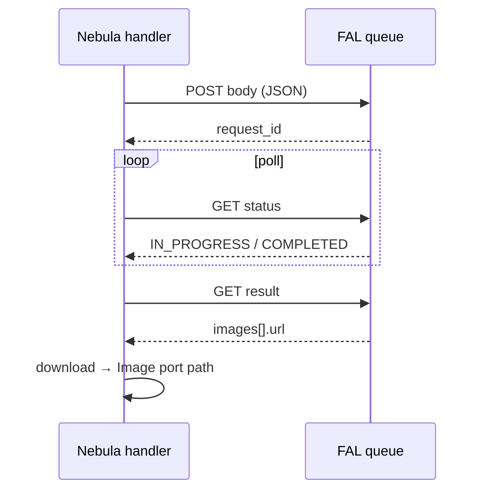

# Contract exemplar: GPT Image 1.5 (FAL)

Template for porting agents. FAL-routed OpenAI **GPT Image 1.5** using `FAL_KEY` and `handle_fal_universal` (**async-poll queue**, not SSE stream).

**In scope:** `gpt-image-1-5` (text-to-image), `gpt-image-1-5-edit` (multi-ref edit).

**Out of scope:** OpenAI direct `gpt-image-1-*` — see [gpt-image-1.md](./gpt-image-1.md). FAL streaming `gpt-image-2-fal` — see [gpt-image-2-fal.md](./gpt-image-2-fal.md).

---

## References & pricing

Re-check when `pricing_verified` is older than `stale_after_days`. You pay **FAL** (`FAL_KEY`), not OpenAI directly.

### Official references

| Resource | URL |
|----------|-----|
| FAL GPT Image 1.5 | https://fal.ai/models/fal-ai/gpt-image-1.5 |
| FAL GPT Image 1.5 Edit | https://fal.ai/models/fal-ai/gpt-image-1.5/edit |
| FAL platform pricing | https://fal.ai/pricing |
| OpenAI model card (informative) | https://developers.openai.com/api/docs/models/gpt-image-1.5 |

### Nebula references

| Resource | Path |
|----------|------|
| OpenAI direct pair | [gpt-image-1.md](./gpt-image-1.md) |
| FAL family rules | [../03-handler-families/fal.md](../03-handler-families/fal.md) |
| Handler oracle | `backend/handlers/fal_universal.py` |

### Pricing (FAL passthrough, indicative)

Confirm on FAL model pages before production. GPT Image 1.5 bills by **image tokens** upstream; FAL may add platform terms.

| Param | Cost effect |
|-------|-------------|
| `quality` | low / medium / high tier |
| `num_images` | Multiplies output count (generate) |
| `image_size` | Larger sizes → more tokens |

---

## 1. How to use this exemplar

| Step | Action |
|------|--------|
| 1 | Read [00-meta.md](../00-meta.md) + [02-handler-patterns.md](../02-handler-patterns.md) §5 async-poll |
| 2 | Implement Vol 1 from §2 for both node ids |
| 3 | Map HTTP in §4 — queue submit + status poll |
| 4 | Match `test_fal_request_body_matches_fixture[gpt-image-1-5-*-request.json]` |
| 5 | Edit node: require `images` port, map to `image_urls` |

---

## 2. Node contract (Vol 1)

### `gpt-image-1-5` (generate)

| Field | Value |
|-------|-------|
| `definitionId` | `gpt-image-1-5` |
| `apiProvider` | `fal` |
| `envKeyName` | `FAL_KEY` |
| `executionPattern` | `async-poll` |
| `apiEndpoint` | `fal-ai/gpt-image-1.5` (injected as `endpoint_id`) |

| Port | Type | Required |
|------|------|----------|
| `prompt` | `Text` | yes |
| `image` | `Image` | no |

| Param | Type | Default | Notes |
|-------|------|---------|-------|
| `image_size` | enum | `1024x1024` | `1024x1024`, `1536x1024`, `1024x1536` |
| `quality` | enum | `high` | `low`, `medium`, `high` |
| `background` | enum | `auto` | `auto`, `transparent`, `opaque` |
| `num_images` | int | `1` | 1–4 |
| `output_format` | enum | `png` | `png`, `jpeg`, `webp` |

### `gpt-image-1-5-edit` (edit)

| Port | Type | Required |
|------|------|----------|
| `prompt` | `Text` | yes |
| `images` | `Image` (multi) | yes |

| Param | Type | Default | Notes |
|-------|------|---------|-------|
| `image_size` | enum | `auto` | includes `auto` |
| `quality` | enum | `high` | same as generate |
| `input_fidelity` | enum | — | `high` / `low` when set |

Handler injects `endpoint_id: fal-ai/gpt-image-1.5/edit` via registry wrapper in `sync_runner.py`.

---

## 3. Execution pattern (Vol 2)

| Field | Value |
|-------|-------|
| Pattern | **async-poll** |
| Auth | `Authorization: Key <FAL_KEY>` |
| Submit | `POST https://queue.fal.run/fal-ai/gpt-image-1.5` (or `/edit`) |
| Poll | `GET …/requests/{id}/status` until `COMPLETED` |
| Result | `GET …/requests/{id}` → `images[0].url` downloaded to run dir |



**Not applicable:** SSE, `StreamPartialImageEvent`, token streams.

---

## 4. HTTP mapping (Vol 3)

### Auth

Missing key → `ValueError("FAL_KEY is required")`.

### Generate body (forwarding)

| Nebula | FAL JSON |
|--------|----------|
| `prompt` port | `prompt` |
| `image_size` param | `image_size` |
| `quality` | `quality` |
| `background` | `background` |
| `num_images` | `num_images` |
| `output_format` | `output_format` |

**Do not send** OpenAI-direct names: `size`, `n`, `stream`.

### Edit body

| Nebula | FAL JSON |
|--------|----------|
| `prompt` | `prompt` |
| `images` port (list) | `image_urls` (array) |
| `input_fidelity` | `input_fidelity` |

Missing images on edit → `ValueError` (see `test_gpt_image_1_5_edit_missing_images_raises`).

Local file paths → data URI via `_to_fal_url()`.

---

## 5. Output / events

| Output | Shape |
|--------|-------|
| `image` | `{ type: "Image", value: "<local path>" }` |

No WebSocket partials. Optional `ProgressEvent` during poll (handler-dependent).

---

## 6. Edge cases

| Case | Behavior |
|------|----------|
| Missing `FAL_KEY` | `ValueError("FAL_KEY is required")` |
| Edit without images | `ValueError` — at least one reference required |
| Queue failure | `RuntimeError` with FAL status text |
| Multi-image edit | `image_urls` list; never singular `image_url` |

---

## 7. Parity oracle

**Parity suite:** `backend/tests/test_fal_contract_fixtures.py::test_fal_request_body_matches_fixture`

| Fixture | Node |
|---------|------|
| `contracts/fixtures/handlers/fal/gpt-image-1-5-generate-request.json` | `gpt-image-1-5` |
| `contracts/fixtures/handlers/fal/gpt-image-1-5-edit-request.json` | `gpt-image-1-5-edit` |

| Test | Asserts |
|------|---------|
| `test_gpt_image_1_5_endpoint_injection` | URL contains `fal-ai/gpt-image-1.5` |
| `test_gpt_image_1_5_key_params_forwarded` | FAL param names; no `size`/`n` |
| `test_gpt_image_1_5_edit_images_map_to_image_urls` | `image_urls` list mapping |

---

## 8. Minimal graph (Vol 4)

```json
{
  "nodes": [
    {
      "id": "n1",
      "definitionId": "text-input",
      "params": { "text": "A ceramic mug on a wooden table" },
      "outputs": {}
    },
    {
      "id": "n2",
      "definitionId": "gpt-image-1-5",
      "params": { "quality": "medium", "num_images": 1 },
      "outputs": {}
    }
  ],
  "edges": [
    {
      "source": "n1",
      "sourceHandle": "text",
      "target": "n2",
      "targetHandle": "prompt"
    }
  ]
}
```

Edit: wire upstream `image` port(s) → `images`, plus `prompt`.

---

## 9. Comparison

| | OpenAI direct `gpt-image-1` | FAL `gpt-image-1-5` |
|--|----------------------------|---------------------|
| Key | `OPENAI_API_KEY` | `FAL_KEY` |
| Pattern | sync JSON | async-poll |
| Model param | UI enum | pinned endpoint |
| Size param | `size` | `image_size` |
| Count | `n` | `num_images` |
| Partials | none | none |

---

## 10. Parameter matrix

| Official / FAL field | Nebula param | Generate | Edit |
|---------------------|--------------|----------|------|
| `prompt` | `prompt` port | ✓ | ✓ |
| `image_size` | `image_size` | ✓ | ✓ |
| `quality` | `quality` | ✓ | ✓ |
| `background` | `background` | ✓ | — |
| `num_images` | `num_images` | ✓ | — |
| `output_format` | `output_format` | ✓ | — |
| `image_urls` | `images` port | — | ✓ |
| `input_fidelity` | `input_fidelity` | — | ✓ |

---

## 11. Porting checklist

- [ ] `NodeDefinition` matches §2 for both ids
- [ ] Registry wrapper sets `endpoint_id` before `handle_fal_universal`
- [ ] POST to `https://queue.fal.run/fal-ai/gpt-image-1.5` (+ `/edit`)
- [ ] Poll loop until `COMPLETED`; download first image URL
- [ ] Edit: map `images` → `image_urls`; reject empty list
- [ ] Load golden JSON fixtures; assert byte-identical bodies
- [ ] No SSE / partial image events on this route

---

## Changelog

| Date | Change |
|------|--------|
| 2026-07-01 | Initial gold exemplar from `fal_universal.py` + contract fixtures |
