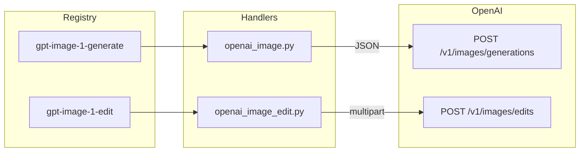

# Contract exemplar: GPT Image 1 (OpenAI direct)

Template for porting agents. Implement **this vertical slice** before batching other OpenAI image nodes.

**In scope:** `gpt-image-1-generate`, `gpt-image-1-edit` (OpenAI direct, `OPENAI_API_KEY`, **sync JSON** — not SSE).

**Out of scope:** `gpt-image-2-*` stream nodes — see [gpt-image-2.md](./gpt-image-2.md). FAL-routed `gpt-image-1-5*` nodes use `FAL_KEY` and async-poll.

---

## References & pricing

Re-check official links when `pricing_verified` is older than `stale_after_days` or before production cost estimates.

### Official references

| Resource | URL |
|----------|-----|
| Model overview | https://developers.openai.com/api/docs/models/gpt-image-1 |
| Image generation guide | https://developers.openai.com/api/docs/guides/image-generation |
| API — create image | https://developers.openai.com/api/reference/resources/images/methods/generate |
| API — create image edit | https://developers.openai.com/api/reference/resources/images/methods/edit |
| API pricing (image models) | https://developers.openai.com/api/docs/pricing |

### Nebula references

| Resource | Path |
|----------|------|
| Generate handler | `backend/handlers/openai_image.py` |
| Edit handler | `backend/handlers/openai_image_edit.py` |
| GPT Image 2 pair (stream) | [gpt-image-2.md](./gpt-image-2.md) |

### Pricing (OpenAI direct, token-based)

GPT Image 1 family models are billed by **tokens** (text + image in/out). Confirm rates on the [official pricing page](https://developers.openai.com/api/docs/pricing) as of `pricing_verified`.

**Nebula params that move the bill**

| Param | Cost effect |
|-------|-------------|
| `model` | `gpt-image-1` vs `gpt-image-1.5` vs `gpt-image-1-mini` |
| `quality` | Largest lever within a model tier |
| `size` | Output resolution scales token count |
| `background: transparent` | Supported on GPT Image 1 (unlike gpt-image-2) |
| Edit `n` | Multiple outputs multiply image output cost |

---

## 1. How to use this file

| Step | Action |
|------|--------|
| 1 | Read [00-meta.md](../00-meta.md) — tiers of truth, parity rules |
| 2 | Implement **Vol 1** fields from §2 below |
| 3 | Implement **Vol 2 sync** pattern from §3–§4 |
| 4 | Match pytest oracle in §8 |
| 5 | Do **not** copy gpt-image-2 SSE/stream rules onto these nodes |

**Oracle:** `openai_image.py`, `openai_image_edit.py` + `test_openai_handler.py`.

---

## 2. Node contract (Vol 1)

### `gpt-image-1-generate`

| Field | Value |
|-------|-------|
| `id` | `gpt-image-1-generate` |
| `displayName` | GPT Image 1 |
| `category` | `image-gen` |
| `apiProvider` | `openai` |
| `apiEndpoint` | `/v1/images/generations` |
| `envKeyName` | `OPENAI_API_KEY` |
| `executionPattern` | `sync` |

**Input ports**

| `id` | `dataType` | `required` | `multiple` |
|------|------------|------------|------------|
| `prompt` | `Text` | yes | no |

**Output ports**

| `id` | `dataType` | `required` |
|------|------------|------------|
| `image` | `Image` | no |

**Params (UI / registry)**

| `key` | `type` | `default` | Allowed values |
|-------|--------|-----------|----------------|
| `model` | enum | `gpt-image-1` | `gpt-image-1`, `gpt-image-1.5`, `gpt-image-1-mini` |
| `size` | enum | `auto` | `auto`, `1024x1024`, `1536x1024`, `1024x1536` |
| `quality` | enum | `auto` | `auto`, `low`, `medium`, `high` |
| `output_format` | enum | `png` | `png`, `jpeg`, `webp` |
| `background` | enum | `auto` | `auto`, `transparent`, `opaque` |

---

### `gpt-image-1-edit`

| Field | Value |
|-------|-------|
| `id` | `gpt-image-1-edit` |
| `displayName` | GPT Image 1 Edit |
| `apiEndpoint` | `/v1/images/edits` |
| *(same provider, key, pattern as generate)* | |

**Input ports**

| `id` | `dataType` | `required` | `multiple` | Notes |
|------|------------|------------|------------|-------|
| `image` | `Image` | yes | no | Single local file path |
| `prompt` | `Text` | yes | no | |
| `mask` | `Mask` | no | no | PNG alpha inpaint region |

**Output ports:** `image` → `Image`.

**Params:** same model/size/quality/output_format/background as generate, plus:

| `key` | `type` | `default` | Notes |
|-------|--------|-----------|-------|
| `n` | int | `1` | 1–10; forwarded only when > 1 |

**Edit vs generate port difference:** edit uses singular `image` port (not multi `images` like gpt-image-2-edit).

---

## 3. Handler pattern (Vol 2)

| Property | Generate | Edit |
|----------|----------|------|
| Pattern | `sync` | `sync` |
| Handler | `handle_openai_image_generate` | `handle_openai_image_edit` |
| Transport | JSON `POST` | `multipart/form-data` `POST` |
| Response | JSON `data[0].b64_json` | JSON `data[0].b64_json` |
| Timeout | 120s | 120s |
| Streaming | none | none |



---

## 4. HTTP mapping (Vol 3 — OpenAI family)

### Auth (both nodes)

```http
Authorization: Bearer <OPENAI_API_KEY>
```

Missing key → `ValueError("OPENAI_API_KEY is required")`.

### Generate — request body

Built in `handle_openai_image_generate`:

```json
{
  "model": "gpt-image-1",
  "prompt": "<from port prompt>"
}
```

**Forwarding rules (generate)**

| Param | Rule |
|-------|------|
| `size`, `quality` | Include only if present and ≠ `auto` |
| `output_format` | Include only if ≠ `png` |
| `background` | Include only if ≠ `auto` |
| `response_format` | **Never** — GPT image models return `b64_json` by default |
| `style`, `n`, `stream` | **Never** forwarded |

Full URL: `https://api.openai.com/v1/images/generations`

### Edit — multipart form

Full URL: `https://api.openai.com/v1/images/edits`

| Part | Content |
|------|---------|
| `image` | PNG bytes from local path (`image.png`) |
| `prompt` | Text |
| `model` | From params (default `gpt-image-1`) |
| `mask` | Optional PNG bytes |
| `n` | Stringified int when > 1 |
| `size`, `quality` | When ≠ `auto` |
| `output_format` | When set (including `png`) |
| `background` | When ≠ `auto` |

**Validation (edit)**

| Condition | Error |
|-----------|-------|
| No `image` | `ValueError("Image input is required but was not provided")` |
| No `prompt` | `ValueError("Prompt input is required but was not provided")` |
| Path not found | `ValueError("Image file not found: …")` |

---

## 5. SSE events

**Not applicable** — sync JSON response only. No `StreamPartialImageEvent` or token stream.

---

## 6. Output contract (media)

Handler return value (both nodes):

```json
{
  "image": {
    "type": "Image",
    "value": "/absolute/path/to/saved/file.png"
  }
}
```

- Files saved under run directory via `save_base64_image`
- Extension follows `output_format` (`png` / `jpeg` / `webp`)
- Default extension `png` when format unset or `png`

---

## 7. Edge cases (required for parity)

| Condition | Behavior |
|-----------|----------|
| HTTP ≠ 200 | `RuntimeError` with status + body text |
| `background: transparent` | **Forwarded** on GPT Image 1 (contrast gpt-image-2) |
| `output_format: png` (generate) | Omitted from JSON body (API default) |
| `output_format` on edit | Always forwarded when set in params |
| Legacy `style` in saved graph | Silently dropped |
| Missing prompt (generate) | `ValueError("Prompt input is required but was not provided")` |
| Edit `n: 1` | `n` part omitted from multipart |

---

## 8. Parity oracle (fixtures + tests)

**Parity suite:** `backend/tests/test_openai_contract_fixtures.py`

| Fixture | Node |
|---------|------|
| `contracts/fixtures/handlers/openai/gpt-image-1-generate-request.json` | `gpt-image-1-generate` |
| `contracts/fixtures/handlers/openai/gpt-image-1-edit-multipart.json` | `gpt-image-1-edit` |

**Primary tests:** `backend/tests/test_openai_handler.py` (generate path)

| Test | What it pins |
|------|----------------|
| `test_generates_image_and_saves_file` | Happy path + body shape |
| `test_gpt_image_1_forwards_output_format_jpeg` | `output_format` forwarding |
| `test_gpt_image_1_omits_output_format_png_default` | PNG default omitted |
| `test_gpt_image_1_forwards_background_transparent` | Transparent background |
| `test_gpt_image_1_omits_background_auto` | Auto background omitted |
| `test_gpt_image_1_does_not_send_response_format` | No `response_format` key |
| `test_gpt_image_1_does_not_send_style` | DALL-E 3 `style` dropped |
| `test_missing_prompt_raises` | Input validation |
| `test_missing_api_key_raises_openai_api_key` | Key error message |
| `test_non_200_response_raises_runtime_error` | HTTP error handling |
| `test_gpt_image_1_saves_jpeg_extension` / `webp` | File extension parity |

---

## 9. Minimal graph (Vol 4)

**Generate**

```json
{
  "nodes": [
    {
      "id": "n1",
      "definitionId": "text-input",
      "params": { "text": "A watercolor lighthouse at dusk" },
      "outputs": {}
    },
    {
      "id": "n2",
      "definitionId": "gpt-image-1-generate",
      "params": { "model": "gpt-image-1", "size": "1024x1024", "quality": "medium" },
      "outputs": {}
    }
  ],
  "edges": [
    {
      "source": "n1",
      "sourceHandle": "text",
      "target": "n2",
      "targetHandle": "prompt"
    }
  ]
}
```

**Edit:** wire upstream `image` → `image` port, `text` → `prompt`, optional `mask` → `mask`.

---

## 10. Parameter matrix (official API vs Nebula)

| Parameter | OpenAI (GPT image 1) | Nebula generate | Nebula edit |
|-----------|---------------------|-----------------|-------------|
| `model` | ✓ | param | param |
| `prompt` | ✓ | port | port |
| `size` | ✓ | param | param |
| `quality` | ✓ | param | param |
| `output_format` | ✓ | param | param |
| `background` | ✓ | param | param |
| `n` | ✓ | — | param (>1 only) |
| `image` / `mask` | edits only | — | ports |
| `stream` | ✓ | omitted | omitted |
| `response_format` | DALL-E legacy | omitted | omitted |
| `moderation` | gpt-image-2+ | omitted | omitted |

Official reference: [Create image](https://developers.openai.com/api/reference/resources/images/methods/generate), [Create image edit](https://developers.openai.com/api/reference/resources/images/methods/edit).

---

## 11. Porting checklist

- [ ] `NodeDefinition` matches §2 for both nodes
- [ ] Generate: JSON POST, parse `data[0].b64_json`, save with correct extension
- [ ] Edit: multipart POST with single `image` + optional `mask`
- [ ] Omit `auto` sentinels for `size`, `quality`, `background` (generate)
- [ ] Never send `response_format` or `style`
- [ ] Return `PortValueDict` `{ type: "Image", value: path }` on `image` port
- [ ] §7 error messages match handler strings
- [ ] Do not implement SSE/stream for these node ids

**Contrast with gpt-image-2:** see [gpt-image-2.md](./gpt-image-2.md) for stream/SSE, multi-image edit, and stripped `background`.

---

## Changelog

| Date | Change |
|------|--------|
| 2026-07-01 | Initial gold exemplar from sync handlers + generate tests |
