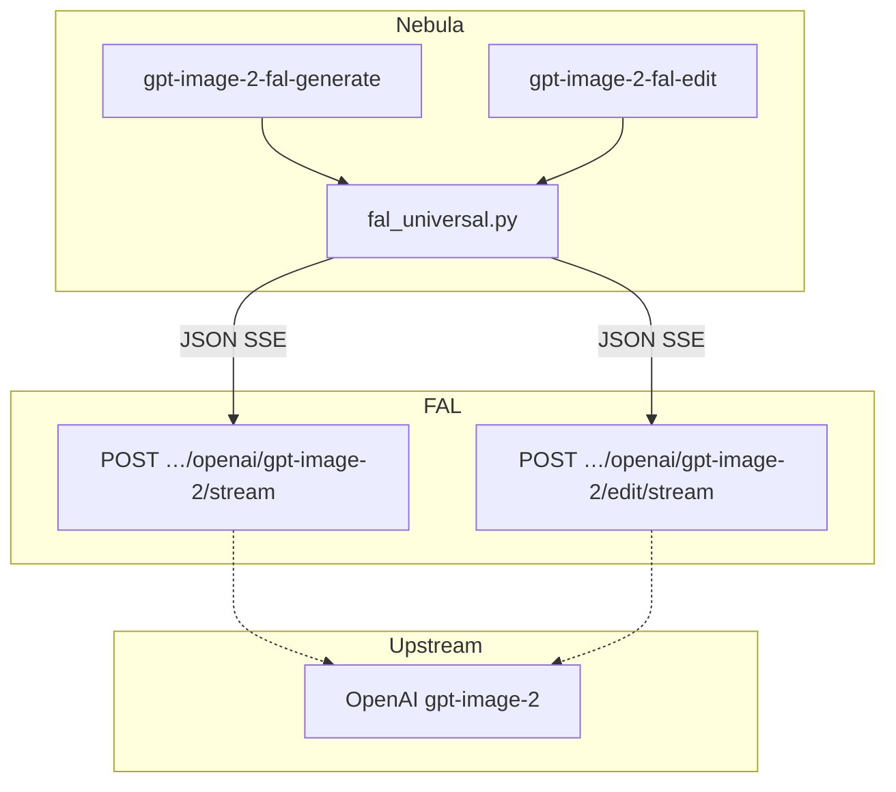

# Contract exemplar: GPT Image 2 (FAL passthrough)

Template for porting agents. Same **model** as [OpenAI direct](./gpt-image-2.md), different **route**: FAL queue streaming proxy with `FAL_KEY`.

**In scope:** `gpt-image-2-fal-generate`, `gpt-image-2-fal-edit`.

**Out of scope:** OpenAI-direct nodes (`OPENAI_API_KEY`, `/v1/images/*`) — see [gpt-image-2.md](./gpt-image-2.md).

---

## References & pricing

Re-check when `pricing_verified` is older than `stale_after_days`. FAL passthrough uses the same underlying model; you pay **FAL** (`FAL_KEY`), not OpenAI directly.

### Official references

| Resource | URL |
|----------|-----|
| FAL model — generate | https://fal.ai/models/openai/gpt-image-2 |
| FAL model — edit | https://fal.ai/models/openai/gpt-image-2/edit |
| FAL OpenAPI schema — generate | https://fal.ai/api/openapi/queue/openapi.json?endpoint_id=openai/gpt-image-2 |
| FAL OpenAPI schema — edit | https://fal.ai/api/openapi/queue/openapi.json?endpoint_id=openai/gpt-image-2/edit |
| FAL platform pricing | https://fal.ai/pricing |
| Nebula streaming URL (generate) | `https://queue.fal.run/openai/gpt-image-2/stream` |
| Nebula streaming URL (edit) | `https://queue.fal.run/openai/gpt-image-2/edit/stream` |
| Upstream model (informative) | https://developers.openai.com/api/docs/models/gpt-image-2 |

### Nebula references

| Resource | Path |
|----------|------|
| FAL passthrough audit | `docs/model-providers/fal/openai-passthroughs.md` |
| OpenAI direct pair | [gpt-image-2.md](./gpt-image-2.md) |
| Handler oracle | `backend/handlers/fal_universal.py` |

### Pricing (FAL passthrough)

FAL’s model pages quote **token rates** for the underlying `gpt-image-2` workload (as of `pricing_verified`). Confirm on [fal.ai/models/openai/gpt-image-2](https://fal.ai/models/openai/gpt-image-2) and [fal.ai/pricing](https://fal.ai/pricing) before production estimates — FAL may round or add platform terms on top of upstream token math.

| Token type | Per 1M tokens (per FAL model page) |
|------------|-------------------------------------|
| Text input | $5.00 |
| Cached text input | $1.25 |
| Text output | $10.00 |
| Image input | $8.00 |
| Cached image input | $2.00 |
| Image output | $30.00 |

FAL notes that **`quality` strongly affects cost** (default in Nebula registry: `high`). Canonical preset sizes have worked examples on the FAL model page; total cost rounds up to the nearest $0.0001.

**Nebula params that move the bill**

| Param | Cost effect |
|-------|-------------|
| `quality` | Primary lever (`auto`, `low`, `medium`, `high`) |
| `image_size` | Preset drives output resolution → output tokens |
| `num_images` | Multiplies output cost (1–4 in UI) |
| `partial_images` | Default **`2`** on FAL nodes (vs `0` on OpenAI direct) — preview frames add output tokens |
| Edit `images` | Each reference → image input tokens via `image_urls` |
| `output_format` | `jpeg` / `webp` may affect payload size; token billing still applies |

**OpenAI direct comparison:** same model, but FAL route exposes `num_images` and higher default `partial_images`, so identical prompts are **not** guaranteed to cost the same as [gpt-image-2.md](./gpt-image-2.md) direct nodes.

---

## 1. How to use this file

| Step | Action |
|------|--------|
| 1 | Read [00-meta.md](../00-meta.md) and OpenAI direct exemplar for shared concepts (ports, `StreamPartialImageEvent`) |
| 2 | Implement **Vol 1** from §2 — note FAL param **names** differ from OpenAI direct |
| 3 | Implement **Vol 3 FAL stream** from §3–§5 (`queue.fal.run`, JSON body, FAL SSE shape) |
| 4 | Match pytest oracles in §8 |
| 5 | Do **not** copy OpenAI-direct `size` / `n` / `moderation` into FAL bodies |

**Oracle:** `fal_universal.py` + tests. FAL OpenAPI (informative): `https://fal.ai/api/openapi/queue/openapi.json?endpoint_id=openai/gpt-image-2`

---

## 2. Node contract (Vol 1)

### `gpt-image-2-fal-generate`

| Field | Value |
|-------|-------|
| `id` | `gpt-image-2-fal-generate` |
| `displayName` | GPT Image 2 (FAL) |
| `category` | `image-gen` |
| `apiProvider` | `fal` |
| `apiEndpoint` | `openai/gpt-image-2` |
| `envKeyName` | `FAL_KEY` |
| `executionPattern` | `stream` |

**Input ports**

| `id` | `dataType` | `required` | `multiple` |
|------|------------|------------|------------|
| `prompt` | `Text` | yes | no |

**Output ports**

| `id` | `dataType` | `required` |
|------|------------|------------|
| `image` | `Image` | no |

**Params**

| `key` | `type` | `default` | Allowed values |
|-------|--------|-----------|----------------|
| `image_size` | enum | `landscape_4_3` | `square_hd`, `square`, `portrait_4_3`, `portrait_16_9`, `landscape_4_3`, `landscape_16_9` |
| `quality` | enum | `high` | `auto`, `low`, `medium`, `high` |
| `num_images` | int | `1` | 1–4 |
| `output_format` | enum | `png` | `png`, `jpeg`, `webp` |
| `partial_images` | int | `2` | 0–3 |

**Handler-pinned (internal, not UI)**

| Field | Value |
|-------|-------|
| `endpoint_id` | `openai/gpt-image-2` (set by registry wrapper in `sync_runner.py`) |

---

### `gpt-image-2-fal-edit`

| Field | Value |
|-------|-------|
| `id` | `gpt-image-2-fal-edit` |
| `displayName` | GPT Image 2 Edit (FAL) |
| `apiEndpoint` | `openai/gpt-image-2/edit` |
| *(same provider, key, pattern as FAL generate)* | |

**Input ports**

| `id` | `dataType` | `required` | `multiple` | Notes |
|------|------------|------------|------------|-------|
| `images` | `Image` | yes | yes | Maps to `image_urls` in JSON body |
| `prompt` | `Text` | yes | no | |

**No `mask` port** on FAL variant (OpenAI-direct edit exposes `mask`; FAL schema has `mask_url` but Nebula does not surface it).

**Output ports:** `image` → `Image`.

**Params:** same as generate, except `image_size` default is `auto` and enum includes `auto`.

---

## 3. OpenAI direct vs FAL (critical for ports)

| Concept | OpenAI direct ([gpt-image-2.md](./gpt-image-2.md)) | FAL passthrough (this doc) |
|---------|-----------------------------------------------------|----------------------------|
| API key | `OPENAI_API_KEY` | `FAL_KEY` |
| Size param | `size` (`1024x1024`, `auto`, 4K WxH…) | `image_size` (preset names only in UI) |
| Count | `n` (dropped when streaming) | `num_images` (1–4) |
| Moderation | `moderation` | **not exposed** |
| Compression | `output_compression` | **not exposed** |
| Preview frames | pinned `partial_images: 0` | UI param, default `2` |
| Generate URL | `api.openai.com/v1/images/generations` | `queue.fal.run/openai/gpt-image-2/stream` |
| Edit transport | multipart + SSE | JSON + SSE |
| Edit images | local file paths in multipart | `image_urls` (URL or data URI) |
| Mask | optional `mask` port | not exposed |



---

## 4. Handler pattern (Vol 2)

| Property | Value |
|----------|-------|
| Pattern | `stream` (FAL SSE — **not** async-poll queue) |
| Handler | `handle_fal_universal` when `endpoint_id ∈ STREAMING_FAL_ENDPOINTS` |
| Stream gate | **`emit` must be non-null** — without `emit`, handler falls through to wrong async-poll path |
| Body builder | `_build_fal_stream_body(node, inputs)` |
| Stream runner | shared `stream_execute_image(..., provider="fal")` |
| Timeout | 180s |
| Registry wrappers | `sync_runner.py` sets `endpoint_id` before calling handler |

```python
STREAMING_FAL_ENDPOINTS = {"openai/gpt-image-2", "openai/gpt-image-2/edit"}
```

---

## 5. HTTP mapping (Vol 3 — FAL family)

### Auth

```http
Authorization: Key <FAL_KEY>
Content-Type: application/json
Accept: text/event-stream
```

Missing key → `ValueError("FAL_KEY is required")`.

Missing `endpoint_id` → `ValueError("FAL endpoint ID is required …")`.

### Generate — request

```http
POST https://queue.fal.run/openai/gpt-image-2/stream
```

**Body** (`_build_fal_stream_body`):

```json
{
  "prompt": "<from port>",
  "image_size": "landscape_4_3",
  "quality": "high",
  "num_images": 1,
  "output_format": "png",
  "partial_images": 2
}
```

**Forwarding rules**

| Rule | Detail |
|------|--------|
| Ports → body | `prompt` from input; params copied except `endpoint_id` |
| Omit empty | Skip params where value is `null` or `""` |
| Never send | `size`, `n`, `moderation`, `output_compression`, `stream`, `model` |
| `endpoint_id` | Internal only — not in POST body |

### Edit — request

```http
POST https://queue.fal.run/openai/gpt-image-2/edit/stream
```

**Body:**

```json
{
  "prompt": "<from port>",
  "image_urls": ["https://…", "data:image/png;base64,…"],
  "image_size": "auto",
  "quality": "high",
  "num_images": 1,
  "output_format": "png",
  "partial_images": 2
}
```

**Image URL conversion** (`_to_fal_url`):

| Input | Sent as |
|-------|---------|
| `http://` / `https://` | unchanged |
| `data:` URI | unchanged |
| Local file path | `data:{mime};base64,{bytes}` |

**Validation (edit)**

| Condition | Error |
|-----------|-------|
| No images / empty list / empty strings | `ValueError("At least one reference image is required for gpt-image-2 edit")` |

**Note:** FAL edit does not use OpenAI multipart. Reference images must be URLs or data URIs in JSON.

---

## 6. SSE events (Vol 2 + 5)

FAL streaming uses **JSON lines in `data:`** (no `event:` prefix). Parsed in `stream_runner._parse_image_event` when `provider="fal"`.

| Phase | `data.type` | Payload shape |
|-------|-------------|---------------|
| Partial | `image.partial` | `{ "type": "image.partial", "image": { "partial_index": n, "b64_json": "…" } }` |
| Final | `image.completed` | `{ "type": "image.completed", "image": { "b64_json": "…" } }` |

Parser also accepts speculative aliases: `image_edit.partial`, `image_edit.partial_image`, `image_edit.completed`.

Stream ends with `data: [DONE]`.

### Nebula WebSocket event

Same as OpenAI direct — `StreamPartialImageEvent`:

```typescript
{
  type: "stream_partial_image",
  node_id: string,
  partial_index: number,
  src: string,
  is_final: false
}
```

Partial/final files saved under run dir: `{nodeId}_partial_{index}`, `{nodeId}_final`.

---

## 7. Output contract (media)

```json
{
  "image": {
    "type": "Image",
    "value": "/absolute/path/to/{nodeId}_final.png"
  }
}
```

Returns **local file path** (base64 decoded from stream), not a remote FAL CDN URL — same as OpenAI direct stream path.

---

## 8. Parity oracle (fixtures + tests)

**Parity suite:** `backend/tests/test_fal_contract_fixtures.py::test_fal_request_body_matches_fixture`

| Fixture | Node |
|---------|------|
| `contracts/fixtures/handlers/fal/gpt-image-2-fal-generate-request.json` | gpt-image-2-fal-generate |
| `contracts/fixtures/handlers/fal/gpt-image-2-fal-edit-request.json` | gpt-image-2-fal-edit |

| Test file | What it pins |
|-----------|----------------|
| `test_fal_contract_fixtures.py` | Golden JSON body parity (all `handlers/fal/*.json`) |
| `test_fal_handler.py` | Endpoint injection, URL contains `/stream`, param forwarding, `image_urls` mapping |
| `test_fal_stream_body.py` | Edit validation, generate does not require images |
| `test_stream_runner_image.py::test_fal_image_stream_parses_partials` | FAL SSE parsing |

**SSE fixture (generate):** `contracts/fixtures/handlers/fal/gpt-image-2-fal-generate-sse.txt`

**SSE fixture (edit):** `contracts/fixtures/handlers/fal/gpt-image-2-fal-edit-sse.txt`

**Test:** `backend/tests/test_fal_contract_sse_fixtures.py`

**Key assertions from tests**

| Test | Assertion |
|------|-----------|
| `test_gpt_image_2_fal_generate_endpoint_injection` | URL contains `openai/gpt-image-2/stream` |
| `test_gpt_image_2_fal_generate_key_params_forwarded` | `image_size`, `num_images` in body; no `size`, no `n` |
| `test_gpt_image_2_fal_edit_images_map_to_image_urls` | `image_urls` list; no singular `image_url` |
| `test_gpt_image_2_fal_edit_missing_images_raises` | ValueError on missing images |
| `test_fal_image_stream_parses_partials` | 2 partials + final from fixture |

---

## 9. Minimal graph (Vol 4)

```json
{
  "nodes": [
    {
      "id": "n1",
      "definitionId": "text-input",
      "params": { "text": "A ceramic mug on a wooden table" },
      "outputs": {}
    },
    {
      "id": "n2",
      "definitionId": "gpt-image-2-fal-generate",
      "params": { "image_size": "square_hd", "quality": "low", "partial_images": 1 },
      "outputs": {}
    }
  ],
  "edges": [
    {
      "source": "n1",
      "sourceHandle": "text",
      "target": "n2",
      "targetHandle": "prompt"
    }
  ]
}
```

Edit example: wire `image-input` or upstream `image` port → `images` (multi), plus `prompt`.

---

## 10. Params not exposed (vs FAL / OpenAI upstream)

| Param | Status |
|-------|--------|
| `openai_api_key` | FAL BYOK field — users only provide `FAL_KEY` |
| `mask_url` | FAL edit schema supports; Nebula FAL edit node does not expose |
| `moderation` | OpenAI-direct only in Nebula |
| `sync_mode` | Not used — always streaming |
| `size`, `n` | Wrong names for FAL — use `image_size`, `num_images` |

---

## 11. Porting checklist

- [ ] `NodeDefinition` matches §2 (FAL param names, preset `image_size` enums)
- [ ] Wrapper injects `endpoint_id` before handler dispatch
- [ ] Stream path only when `emit` is available
- [ ] `buildFalStreamBody` maps `images` → `image_urls`, converts local paths to data URIs
- [ ] POST to `https://queue.fal.run/{endpoint_id}/stream` with `Key` auth
- [ ] Parse FAL SSE (`image.partial` / `image.completed`) — not OpenAI `event:` format
- [ ] Emit `stream_partial_image` events
- [ ] Return `Image` port with local file path
- [ ] Edit: require ≥1 reference image with exact error substring from tests
- [ ] XCTest loads generate SSE → 2 partials + 1 final; edit SSE → 1 partial + 1 final

**Informative audit:** `docs/model-providers/fal/openai-passthroughs.md`

---

## 12. Pair with OpenAI direct exemplar

When porting **both** routes for the same model family:

| Concern | OpenAI direct | FAL |
|---------|---------------|-----|
| Exemplar | [gpt-image-2.md](./gpt-image-2.md) | this file |
| Keychain key | `OPENAI_API_KEY` | `FAL_KEY` |
| UI must not | show FAL presets on direct node | show WxH `size` on FAL node |
| Shared | `StreamPartialImageEvent`, `image` output port type, graph edge rules |

---

## Changelog

| Date | Change |
|------|--------|
| 2026-07-01 | Initial FAL passthrough exemplar |
| 2026-07-01 | Added References & pricing section |
