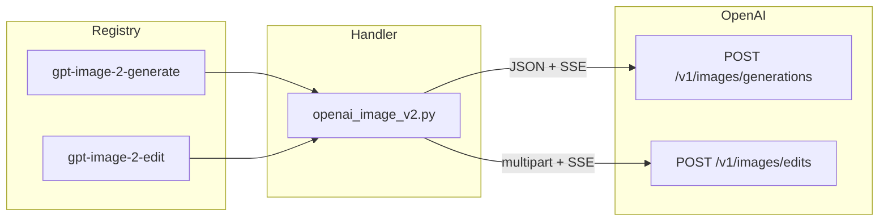

# Contract exemplar: GPT Image 2 (OpenAI direct)

Template for porting agents. Implement **this vertical slice** on iPad/browser/Mac before batching other OpenAI image nodes.

**In scope:** `gpt-image-2-generate`, `gpt-image-2-edit` (OpenAI direct, `OPENAI_API_KEY`).

**Out of scope (separate contract):** `gpt-image-2-fal-generate`, `gpt-image-2-fal-edit` — same model, `FAL_KEY` — see [gpt-image-2-fal.md](./gpt-image-2-fal.md).

---

## References & pricing

Re-check official links when `pricing_verified` is older than `stale_after_days` or before production cost estimates.

### Official references

| Resource | URL |
|----------|-----|
| Model overview | https://developers.openai.com/api/docs/models/gpt-image-2 |
| Image generation guide | https://developers.openai.com/api/docs/guides/image-generation |
| API — create image | https://developers.openai.com/api/reference/resources/images/methods/generate |
| API — create image edit | https://developers.openai.com/api/reference/resources/images/methods/edit |
| API pricing (image models) | https://developers.openai.com/api/docs/pricing |
| Prompting cookbook | https://developers.openai.com/cookbook/examples/multimodal/image-gen-models-prompting-guide |
| Org verification (required for API) | https://platform.openai.com/settings/organization/general |

### Nebula references

| Resource | Path |
|----------|------|
| Integration audit | `docs/model-providers/openai/gpt-image-2.md` |
| Shared model notes | `~/Documents/Workspace/Reference/model-providers/openai/gpt-image-2.md` |
| Handler oracle | `backend/handlers/openai_image_v2.py` |

### Pricing (OpenAI direct, token-based)

OpenAI bills `gpt-image-2` by **tokens**, not a flat per-image fee. Rates below are from the [official pricing page](https://developers.openai.com/api/docs/pricing) as of `pricing_verified`; confirm before batch or 4K work.

| Token type | Per 1M tokens |
|------------|---------------|
| Text input | $5.00 |
| Cached text input | $1.25 |
| Image input | $8.00 |
| Cached image input | $2.00 |
| Image output | $30.00 |

**Rough formula:** `text_in + image_in + image_out` (each term = tokens × rate / 1M).

**Nebula params that move the bill**

| Param | Cost effect |
|-------|-------------|
| `quality` | Largest lever — `low` vs `high` can differ by an order of magnitude at the same `size` |
| `size` | Output token count scales with resolution (4K presets cost more than 1024²) |
| `partial_images` | Each partial frame adds **image output** tokens (handler defaults to `0`; legacy graphs may override) |
| Edit `images` | Reference images add **image input** tokens; multi-ref edits are often 2–3× generate cost |
| `num_images` | N/A on direct route — `n` is dropped because streaming is always on |

**Not billed through Nebula UI:** `user`, `background`, `moderation` still affect upstream behavior; moderation does not change token math.

Use OpenAI’s image cost guidance in the [image generation guide](https://developers.openai.com/api/docs/guides/image-generation) for per-request estimates. Failed requests may still appear in usage dashboards — reconcile against the API dashboard before assuming zero cost.

---

## 1. How to use this file

| Step | Action |
|------|--------|
| 1 | Read [00-meta.md](../00-meta.md) — tiers of truth, parity rules |
| 2 | Implement **Vol 1** fields from §2 below in your target language |
| 3 | Implement **Vol 2** stream pattern from §3–§5 |
| 4 | Load golden fixtures in §8; match pytest oracle |
| 5 | Wire **Vol 5** `StreamPartialImageEvent` to your UI |

Do not re-derive behavior from React components. **Python handler + tests are the oracle.**

---

## 2. Node contract (Vol 1)

Registry keys: `gpt-image-2-generate`, `gpt-image-2-edit`.

### `gpt-image-2-generate`

| Field | Value |
|-------|-------|
| `id` | `gpt-image-2-generate` |
| `displayName` | GPT Image 2 |
| `category` | `image-gen` |
| `apiProvider` | `openai` |
| `apiEndpoint` | `/v1/images/generations` |
| `envKeyName` | `OPENAI_API_KEY` |
| `executionPattern` | `stream` |

**Input ports**

| `id` | `dataType` | `required` | `multiple` |
|------|------------|------------|------------|
| `prompt` | `Text` | yes | no |

**Output ports**

| `id` | `dataType` | `required` |
|------|------------|------------|
| `image` | `Image` | no |

**Params (UI / registry)**

| `key` | `type` | `default` | Allowed values |
|-------|--------|-----------|----------------|
| `size` | enum | `auto` | `auto`, `1024x1024`, `1536x1024`, `1024x1536`, `2048x2048`, `2048x1152`, `3840x2160`, `2160x3840` |
| `quality` | enum | `auto` | `auto`, `low`, `medium`, `high` |
| `output_format` | enum | `png` | `png`, `jpeg`, `webp` |
| `output_compression` | int | `90` | 0–100 |
| `moderation` | enum | `auto` | `auto`, `low` |

**Handler-pinned (not in registry UI)**

| Field | Value |
|-------|-------|
| `model` | `gpt-image-2` |
| `stream` | `true` |
| `partial_images` | `0` (unless legacy graph has override) |

---

### `gpt-image-2-edit`

| Field | Value |
|-------|-------|
| `id` | `gpt-image-2-edit` |
| `displayName` | GPT Image 2 Edit |
| `apiEndpoint` | `/v1/images/edits` |
| *(same provider, key, pattern as generate)* | |

**Input ports**

| `id` | `dataType` | `required` | `multiple` | Notes |
|------|------------|------------|------------|-------|
| `images` | `Image` | yes | yes | ≤10 local file paths |
| `prompt` | `Text` | yes | no | Describe **whole** desired image |
| `mask` | `Mask` | no | no | PNG alpha; applies to **first** image |

**Output ports:** same as generate (`image` → `Image`).

**Params:** identical set to generate.

---

## 3. Handler pattern (Vol 2)

| Property | Value |
|----------|-------|
| Pattern | `stream` — SSE image events, not token stream |
| Registry | Async handler map in `sync_runner.py` (requires `emit`) |
| Generate transport | JSON `POST` + SSE response |
| Edit transport | `multipart/form-data` `POST` + SSE response |
| Timeout | 180s |
| Sync fallback | none |



---

## 4. HTTP mapping (Vol 3 — OpenAI family)

### Auth (both nodes)

```http
Authorization: Bearer <OPENAI_API_KEY>
Accept: text/event-stream
```

Missing key → `ValueError("OPENAI_API_KEY is required")` before HTTP.

### Generate — request body

Built by `build_generate_body()`:

```json
{
  "model": "gpt-image-2",
  "prompt": "<from port prompt>",
  "stream": true,
  "partial_images": 0
}
```

**Forwarding rules**

| Param | Rule |
|-------|------|
| `size`, `quality`, `moderation` | Include only if value present and ≠ `auto` |
| `output_format` | Include only if ≠ `png` |
| `output_compression` | Include only when `output_format` is `jpeg` or `webp` |
| `partial_images` | From legacy `node.params` if set; else `0` |
| `n` | **Never** forward (incompatible with `stream: true`) |
| `background`, `input_fidelity` | **Never** forward (stripped defensively) |

Full URL: `https://api.openai.com/v1/images/generations`

### Edit — multipart form

Full URL: `https://api.openai.com/v1/images/edits`

| Part | Content |
|------|---------|
| `image[]` | One file per input path (max 10), MIME from extension or `image/png` |
| `mask` | Optional PNG bytes |
| `model` | `gpt-image-2` |
| `prompt` | Text |
| `stream` | `"true"` |
| `partial_images` | Stringified int |
| `size`, `quality`, `moderation`, `output_format` | From `build_generate_body` when present |
| `output_compression` | Stringified int when present |

**Validation**

| Condition | Error |
|-----------|-------|
| No `prompt` | `ValueError("Prompt input is required but was not provided")` |
| No `images` / empty list | `ValueError("Image input is required but was not provided")` |
| >10 images | `ValueError("gpt-image-2 edit accepts up to 10 input images; got N")` |

---

## 5. SSE events (Vol 2 + 5)

### OpenAI event types

| Endpoint | Partial | Completed |
|----------|---------|-----------|
| Generate | `image_generation.partial_image` | `image_generation.completed` |
| Edit | `image_edit.partial_image` | `image_edit.completed` |

Parser accepts **both** namespaces on either path (structurally identical).

**Data shape (partial):** `{ "partial_image_index": number, "b64_json": string }`

**Data shape (completed):** `{ "b64_json": string }`

Stream ends with `data: [DONE]`.

If stream ends without a completed event → `RuntimeError` (edit includes diagnostic `seen event types`).

### Nebula WebSocket event

Emit during partial frames:

```typescript
{
  type: "stream_partial_image",
  node_id: string,
  partial_index: number,
  src: string,       // path to saved partial file
  is_final: false
}
```

Defined in `backend/models/events.py` as `StreamPartialImageEvent`.

Generate uses shared `stream_execute_image()`; edit inlines equivalent SSE loop in the handler.

---

## 6. Output contract (media)

Handler return value (port output map):

```json
{
  "image": {
    "type": "Image",
    "value": "/absolute/path/to/{nodeId}_final.png"
  }
}
```

- Files saved under run directory via `save_base64_image_named`
- Extension follows `output_format` (`png` / `jpeg` / `webp`)
- Partial files: `{nodeId}_partial_{index}.*`

---

## 7. Edge cases (required for parity)

| Condition | Behavior |
|-----------|----------|
| Org not verified for gpt-image-2 | `RuntimeError` with friendly message + link to `platform.openai.com/settings/organization/general` |
| HTTP ≠ 200 | `RuntimeError` with status + body |
| Legacy `n` in saved graph | Silently dropped |
| `background: transparent` in params | Stripped — not supported for gpt-image-2 |
| Multiple images + mask | Mask applies to first image only |

---

## 8. Parity oracle (fixtures + tests)

**Parity suite:** `backend/tests/test_openai_contract_fixtures.py`

| Fixture | Node |
|---------|------|
| `contracts/fixtures/handlers/openai/gpt-image-2-generate-request.json` | `gpt-image-2-generate` |
| `contracts/fixtures/handlers/openai/gpt-image-2-edit-multipart.json` | `gpt-image-2-edit` |

**Primary tests:** `backend/tests/test_openai_image_v2.py`

| Test | What it pins |
|------|----------------|
| `test_build_generate_body_minimal` | Pinned model, stream, default partial_images |
| `test_build_generate_body_omits_unsupported_params` | No background / input_fidelity |
| `test_build_generate_body_passes_quality_format_moderation` | Forwarding rules; `n` dropped |
| `test_build_generate_body_drops_output_compression_for_png` | Compression only for jpeg/webp |
| `test_handle_generate_requires_*` | Input validation |
| `test_edit_rejects_more_than_10_images` | Max 10 images |
| `test_edit_streams_partial_and_returns_final_image` | Edit SSE + `StreamPartialImageEvent` |
| `test_e2e_generate_emits_partials_and_returns_image` | Generate SSE fixture |
| `test_openai_contract_sse_fixtures` | Generate + edit SSE oracles |

**SSE fixture (generate):** `contracts/fixtures/handlers/openai/gpt-image-2-generate-sse.txt` (copy: `backend/tests/fixtures/openai_image_v2_sse.txt`)

**SSE fixture (edit):** `contracts/fixtures/handlers/openai/gpt-image-2-edit-sse.txt`

**Test:** `backend/tests/test_openai_contract_sse_fixtures.py`

Ports should load the same bytes and assert identical output paths/event counts.

---

## 9. Minimal graph (Vol 4)

```json
{
  "nodes": [
    {
      "id": "n1",
      "definitionId": "text-input",
      "params": { "text": "A ceramic mug on a wooden table" },
      "outputs": {}
    },
    {
      "id": "n2",
      "definitionId": "gpt-image-2-generate",
      "params": { "size": "1024x1024", "quality": "low" },
      "outputs": {}
    }
  ],
  "edges": [
    {
      "source": "n1",
      "sourceHandle": "text",
      "target": "n2",
      "targetHandle": "prompt"
    }
  ]
}
```

**Port wiring:** `Text` → `prompt`; `Image` → `images`; `Mask` → `mask`.

Execution: shared `POST /api/execute` — no node-specific REST route.

---

## 10. Parameter matrix (official API vs Nebula)

OpenAI `POST /v1/images/generations` supports more fields than Nebula exposes. For **this port**, implement Nebula's subset only.

| Parameter | OpenAI (GPT image) | Nebula generate | Nebula edit |
|-----------|-------------------|-----------------|-------------|
| `model` | ✓ | pinned | pinned |
| `prompt` | ✓ | port | port |
| `size` | ✓ | param | param |
| `quality` | ✓ | param | param |
| `moderation` | ✓ | param | param |
| `output_format` | ✓ | param | param |
| `output_compression` | ✓ | param | param |
| `stream` | ✓ | pinned `true` | pinned `true` |
| `partial_images` | ✓ | pinned `0` | pinned `0` |
| `n` | ✓ | dropped | dropped |
| `background` | ✓ (limits on gpt-image-2) | dropped | dropped |
| `input_fidelity` | edits only | dropped | dropped |
| `user` | ✓ | omitted | omitted |
| `image` / `mask` | edits only | — | ports |

Official reference: [Create image](https://developers.openai.com/api/reference/resources/images/methods/generate), [Create image edit](https://developers.openai.com/api/reference/resources/images/methods/edit).

---

## 11. Porting checklist

Use when implementing Swift (iPad) or another client:

- [ ] `NodeDefinition` matches §2 registry fields
- [ ] `buildGenerateBody` equivalent matches §4 forwarding rules
- [ ] Generate: JSON POST + SSE parser → partial + final file save
- [ ] Edit: multipart POST + SSE parser (same event types as §5)
- [ ] Emit `stream_partial_image` events with correct `partial_index`
- [ ] Return `PortValueDict` `{ type: "Image", value: path }` on `image` port
- [ ] All §7 errors with exact message substrings from tests
- [ ] XCTest / Vitest loads `openai_image_v2_sse.txt` and asserts 2 partials + 1 final (generate)
- [ ] Edit test: 1 partial + 1 final from `gpt-image-2-edit-sse.txt`

**Related audit notes (informative):** `docs/model-providers/openai/gpt-image-2.md`

---

## 12. FAL variants (separate contract)

See **[gpt-image-2-fal.md](./gpt-image-2-fal.md)** for the full FAL passthrough contract (`FAL_KEY`, `image_size`, `num_images`, `queue.fal.run` streaming).

| Node | Key | Endpoint |
|------|-----|----------|
| `gpt-image-2-fal-generate` | `FAL_KEY` | `openai/gpt-image-2` |
| `gpt-image-2-fal-edit` | `FAL_KEY` | `openai/gpt-image-2/edit` |

Handler: `fal_universal.py` + `STREAMING_FAL_ENDPOINTS`.

---

## Changelog

| Date | Change |
|------|--------|
| 2026-07-01 | Initial exemplar from web reference implementation |
| 2026-07-01 | Added References & pricing section |
