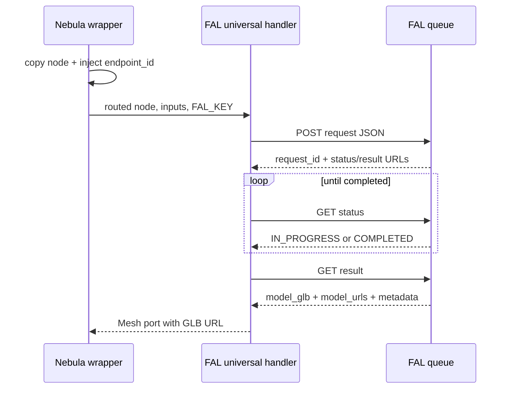

# Contract exemplar: Hunyuan3D V3 (FAL)

Template for porting the fixed Hunyuan3D V3 text-to-mesh and image-to-mesh
nodes. Both use `FAL_KEY`, the FAL queue, and `handle_fal_universal` in
async-poll mode.

**In scope:** `hunyuan3d-text-to-3d` and `hunyuan3d-image-to-3d`.

**Out of scope:** Hunyuan3D v3.1 Pro/Rapid endpoints, direct Tencent Cloud,
and paid live-generation validation.

---

## References & pricing

Re-check when `pricing_verified` is older than `stale_after_days`.

### Official references

| Resource | URL |
|----------|-----|
| Text-to-3D API schema | https://fal.ai/models/fal-ai/hunyuan3d-v3/text-to-3d/api |
| Image-to-3D API schema | https://fal.ai/models/fal-ai/hunyuan3d-v3/image-to-3d/api |
| Text-to-3D model/pricing | https://fal.ai/models/fal-ai/hunyuan3d-v3/text-to-3d |
| Image-to-3D model/pricing | https://fal.ai/models/fal-ai/hunyuan3d-v3/image-to-3d |

### Nebula references

| Resource | Path |
|----------|------|
| Provider audit | [../../model-providers/hunyuan/hunyuan3d.md](../../model-providers/hunyuan/hunyuan3d.md) |
| FAL family rules | [../03-handler-families/fal.md](../03-handler-families/fal.md) |
| Handler oracle | `backend/handlers/fal_universal.py` |
| Fixed wrappers | `backend/execution/sync_runner.py` |

### Pricing (FAL, as verified)

| Generation type | Base price |
|-----------------|------------|
| `Normal` | $0.375 per generation |
| `LowPoly` | $0.45 per generation |
| `Geometry` | $0.225 per generation |

PBR, multi-view image input, and a custom face count each add $0.15 where
applicable. This contract pass did not make a paid request.

---

## 1. How to use this exemplar

| Step | Action |
|------|--------|
| 1 | Read [00-meta.md](../00-meta.md) and the async-poll pattern in [02-handler-patterns.md](../02-handler-patterns.md) |
| 2 | Implement both Vol 1 node definitions from §2 |
| 3 | Route the fixed endpoint on a per-run copy, never by mutating persisted node params |
| 4 | Map the image ports exactly as shown in §4, especially `front_image` to `input_image_url` |
| 5 | Load both golden request fixtures from §7 and match the pytest oracle |

---

## 2. Node contract (Vol 1)

### Shared fields

| Field | Value |
|-------|-------|
| `category` | `3d-gen` |
| `apiProvider` | `fal` |
| `envKeyName` | `FAL_KEY` |
| `executionPattern` | `async-poll` |
| Output | `mesh`, data type `Mesh`, optional |

### `hunyuan3d-text-to-3d`

| Field | Value |
|-------|-------|
| `displayName` | Hunyuan3D V3 Text-to-3D |
| `apiEndpoint` | `fal-ai/hunyuan3d-v3/text-to-3d` |

| Input port | Type | Required | Notes |
|------------|------|----------|-------|
| `prompt` | `Text` | yes | Maximum 1,024 characters |

### `hunyuan3d-image-to-3d`

| Field | Value |
|-------|-------|
| `displayName` | Hunyuan3D V3 Image-to-3D |
| `apiEndpoint` | `fal-ai/hunyuan3d-v3/image-to-3d` |

| Input port | Type | Required | FAL field |
|------------|------|----------|-----------|
| `front_image` | `Image` | yes | `input_image_url` |
| `back_image` | `Image` | no | `back_image_url` |
| `left_image` | `Image` | no | `left_image_url` |
| `right_image` | `Image` | no | `right_image_url` |

### Shared params

| Key | Type | Default | Range or values |
|-----|------|---------|-----------------|
| `generate_type` | enum | `Normal` | `Normal`, `LowPoly`, `Geometry` |
| `face_count` | integer | `500000` | 40000-1500000 |
| `enable_pbr` | boolean | `false` | `true`, `false` |
| `polygon_type` | enum | `triangle` | `triangle`, `quadrilateral` |

`endpoint_id` is handler-internal. The wrapper injects it into a copied
`GraphNode`; it is not a persisted node param and must not appear in the POST
body.

---

## 3. Execution pattern (Vol 2)

| Property | Value |
|----------|-------|
| Pattern | `async-poll` |
| Handler | `handle_fal_universal` |
| Wrappers | `_hunyuan3d_text_to_3d_handler`, `_hunyuan3d_image_to_3d_handler` |
| Submit | `POST https://queue.fal.run/{endpoint_id}` |
| Poll | Status URL every 2 seconds, maximum 300 polls |
| Result | Fetch response URL, parse `model_glb` or `model_urls.glb` |
| SSE | Not used |



---

## 4. HTTP mapping (Vol 3)

### Auth

```http
Authorization: Key <FAL_KEY>
Content-Type: application/json
```

Missing key raises `ValueError("FAL_KEY is required")`.

### Text request

```http
POST https://queue.fal.run/fal-ai/hunyuan3d-v3/text-to-3d
```

```json
{
  "prompt": "a ceramic teapot",
  "generate_type": "Normal",
  "face_count": 500000,
  "enable_pbr": false,
  "polygon_type": "triangle"
}
```

### Image request

```http
POST https://queue.fal.run/fal-ai/hunyuan3d-v3/image-to-3d
```

```json
{
  "input_image_url": "https://example.com/front.png",
  "back_image_url": "https://example.com/back.png",
  "left_image_url": "https://example.com/left.png",
  "right_image_url": "https://example.com/right.png",
  "generate_type": "LowPoly",
  "face_count": 120000,
  "enable_pbr": true,
  "polygon_type": "quadrilateral"
}
```

Local image paths are converted to data URIs by `_to_fal_url`. Missing optional
views are omitted, not sent as null. `seed` is not an input in either current
FAL schema.

---

## 5. Events and output

These nodes do not emit SSE partials. Poll progress may be reported through
the normal FAL progress event path.

Primary response fields include `model_glb`, `model_urls`, optional
`thumbnail`, and the inference `seed`. Nebula returns the GLB as:

```json
{
  "mesh": {
    "type": "Mesh",
    "value": "https://fal.ai/generated/model.glb"
  }
}
```

`model_glb.url` has priority; `model_urls.glb.url` is the fallback. The
thumbnail does not leak into an `image` output when a mesh is present.

---

## 6. Edge cases

| Case | Required behavior |
|------|-------------------|
| Missing `FAL_KEY` | Raise `ValueError("FAL_KEY is required")` |
| Text prompt over 1,024 characters | Fail before submit with limit and received length in the message |
| Exactly 1,024 characters | Submit normally |
| Image node with front view only | Send only `input_image_url`; omit optional view fields |
| Local image path | Convert to data URI before submit |
| Queue failure or timeout | Raise the normal FAL runtime error with provider status |
| Result without `model_glb` | Use `model_urls.glb` fallback |
| `seed` | Read-only response metadata; never send it |
| Wrapper routing | Must not add `endpoint_id` to the persisted source node |

---

## 7. Parity oracle

**Parity suite:**
`backend/tests/test_fal_contract_fixtures.py::test_fal_request_body_matches_fixture`

| Fixture | Node |
|---------|------|
| `contracts/fixtures/handlers/fal/hunyuan3d-text-to-3d-request.json` | `hunyuan3d-text-to-3d` |
| `contracts/fixtures/handlers/fal/hunyuan3d-image-to-3d-request.json` | `hunyuan3d-image-to-3d` |

`backend/tests/test_fal_handler.py` additionally pins:

- mesh parsing from both response shapes;
- thumbnail suppression when a mesh is present;
- text endpoint/payload mapping;
- the 1,024-character boundary and pre-submit rejection;
- `front_image` to `input_image_url` plus optional multi-view mapping;
- front-only behavior; and
- source-node immutability during fixed-endpoint routing.

---

## 8. Minimal graph (Vol 4)

```json
{
  "nodes": [
    {
      "id": "prompt-1",
      "definitionId": "text-input",
      "params": { "text": "A ceramic teapot with a round handle" },
      "outputs": {}
    },
    {
      "id": "mesh-1",
      "definitionId": "hunyuan3d-text-to-3d",
      "params": {
        "generate_type": "Geometry",
        "face_count": 500000,
        "enable_pbr": false,
        "polygon_type": "triangle"
      },
      "outputs": {}
    }
  ],
  "edges": [
    {
      "source": "prompt-1",
      "sourceHandle": "text",
      "target": "mesh-1",
      "targetHandle": "prompt"
    }
  ]
}
```

For image-to-3D, replace the generator node id and wire an upstream `Image`
output to `front_image`. Add back, left, and right edges only when those views
depict the same object in a consistent pose.

---

## 9. Text vs image comparison

| Concern | Text-to-3D | Image-to-3D |
|---------|------------|-------------|
| Required input | Prompt | Front image |
| Optional conditioning | None | Back, left, right views |
| Primary mapping trap | Prompt length cap | `front_image` maps to `input_image_url`, not `image_url` |
| Extra cost lever | Custom face count, PBR | Custom face count, PBR, multi-view |
| Best use | Fast concept mesh from language | Better shape/color fidelity from reference art |

---

## 10. Parameter matrix

| Official FAL field | Text node | Image node | Nebula representation |
|--------------------|-----------|------------|-----------------------|
| `prompt` | yes | no | `prompt` input port |
| `input_image_url` | no | yes | `front_image` input port |
| `back_image_url` | no | optional | `back_image` input port |
| `left_image_url` | no | optional | `left_image` input port |
| `right_image_url` | no | optional | `right_image` input port |
| `generate_type` | yes | yes | enum param |
| `face_count` | yes | yes | integer param |
| `enable_pbr` | yes | yes | boolean param |
| `polygon_type` | yes | yes | enum param |
| `seed` | output only | output only | not exposed as request param |

---

## 11. Porting checklist

- [ ] Both `NodeDefinition` records match §2
- [ ] Fixed wrapper injects the correct endpoint into a copied node
- [ ] `endpoint_id` is absent from persisted params and request JSON
- [ ] Text prompt longer than 1,024 characters fails before provider submit
- [ ] Image ports map to the four exact FAL URL field names
- [ ] Missing optional image views are omitted
- [ ] Submit, poll, and result fetch follow the FAL async-poll pattern
- [ ] `model_glb.url` and `model_urls.glb.url` both resolve to `Mesh`
- [ ] `seed` remains output-only metadata
- [ ] Both golden fixtures match byte-for-byte request objects
- [ ] No SSE or paid provider call is required for structural parity

---

## Changelog

| Date | Change |
|------|--------|
| 2026-07-22 | Initial gold exemplar from live FAL schemas, Nebula wrappers, and request fixtures |
