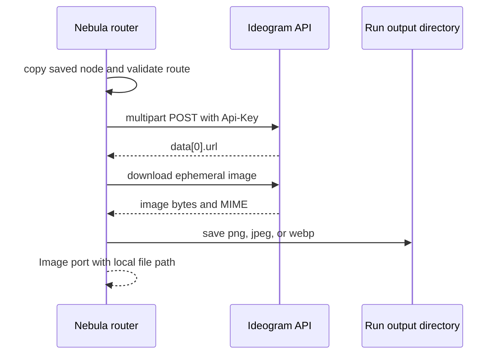

# Contract exemplar: Ideogram direct route

Gold family-wave exemplar for the direct side of Nebula's seven dual-route
Ideogram nodes. Direct requests use `IDEOGRAM_API_KEY`, synchronous
`multipart/form-data`, and `Api-Key` authentication. Returned ephemeral URLs
are downloaded into the active Nebula run directory before completion.

## References and pricing

Ideogram prices direct generation, remix, edit, reframe, and background
replacement per output image. The official page was last revised 2025-08-06.

| Direct route | Price verified 2026-07-23 |
|---|---|
| V4 TURBO / DEFAULT / QUALITY | $0.03 / $0.06 / $0.10 per image |
| V3 TURBO / DEFAULT / QUALITY | $0.03 / $0.06 / $0.09 per image |
| V3 character TURBO / DEFAULT / QUALITY | $0.10 / $0.15 / $0.20 per image |
| Upscale | $0.06 per input image |

Use Ideogram's official [API pricing](https://ideogram.ai/api-pricing) as the
live source. This contract pass verified schemas and pricing without making a
paid request.

## 1. How to use this exemplar

| Step | Action |
|---|---|
| 1 | Select the direct route only when `IDEOGRAM_API_KEY` is present |
| 2 | Copy the saved node before character expansion or route adaptation |
| 3 | Build multipart fields and binary parts exactly as section 4 describes |
| 4 | Reject unsupported values before opening an HTTP client |
| 5 | Download the first result URL into the run directory |
| 6 | Match `test_ideogram_handler.py` for request and output parity |

## 2. Node contract (Volume 1)

The ports are shared with the FAL definitions in
[ideogram-fal.md](./ideogram-fal.md). Direct parameter dialects are:

| Node | Direct endpoint | Direct parameters |
|---|---|---|
| `ideogram-v4` | `/v1/ideogram-v4/generate` | V4 `resolution`; TURBO/DEFAULT/QUALITY; copyright detection |
| `ideogram-edit` | `/v1/ideogram-v3/inpaint` | `magic_prompt`; rendering speed; shared `num_images` and `seed` |
| `ideogram-remix` | `/v1/ideogram-v4/remix` | optional `image_weight` 1-100; V4 resolution; rendering speed; copyright detection |
| `ideogram-reframe` | `/v1/ideogram-v3/reframe` | required V3 pixel `resolution`; rendering speed; shared `num_images` and `seed` |
| `ideogram-replace-background` | `/v1/ideogram-v3/replace-background` | `magic_prompt`; rendering speed; shared `num_images` and `seed` |
| `ideogram-character` | `/v1/ideogram-v3/generate` | aspect ratio; AUTO/REALISTIC/FICTION; `magic_prompt`; rendering speed; optional custom model URI |
| `ideogram-upscale` | `/upscale` | resemblance/detail 1-100; `magic_prompt`; optional prompt and seed |

V4 supports 23 published pixel resolutions. The registry exposes all 23 for
generate and remix, with Auto additionally available for remix. Direct V4 does
not accept `num_images` or `seed`, so stored FAL values are not forwarded.

## 3. Execution pattern (Volume 2)

| Property | Value |
|---|---|
| Pattern | synchronous multipart request plus result download |
| API base | `https://api.ideogram.ai` |
| Request timeout | 300 seconds |
| Result download timeout | 120 seconds |
| Output persistence | base64-save into `get_run_dir()` |
| SSE | none |

## 4. HTTP mapping (Volume 3)

All requests carry `Api-Key: <IDEOGRAM_API_KEY>`. Text-only requests still use
multipart text parts, not form-urlencoded bodies.

| Node | Multipart text fields | Binary parts |
|---|---|---|
| V4 | `text_prompt`, `resolution`, `rendering_speed`, copyright boolean | none |
| Edit | `prompt`, `magic_prompt`, `num_images`, `seed`, speed | `image`, `mask`, repeated `style_reference_images` |
| Remix | `text_prompt`, `image_weight`, `resolution`, speed, copyright boolean | `image` |
| Reframe | required `resolution`, `num_images`, `seed`, speed | `image`, repeated style refs |
| Replace background | `prompt`, `magic_prompt`, `num_images`, `seed`, speed | `image`, repeated style refs |
| Character | `prompt`, aspect/style/magic/speed/count/seed/custom model | exactly one `character_reference_images`, optional style refs |
| Upscale | JSON string in `image_request` | `image_file` |

Boolean multipart fields use lowercase `true` or `false`. Direct V4 text
prompts automatically invoke Ideogram's prompt expansion. The structured
`json_prompt` input is not represented by the fixed canvas node.

## 5. Events and output

There are no partial events. The handler requires a non-empty `data` array and
URL, downloads the first image, preserves PNG/JPEG/WebP MIME where possible,
and returns a local `Image` path. An empty response or missing URL is a runtime
error, never a successful empty output.

## 6. Edge cases and runtime guards

| Case | Required behavior |
|---|---|
| Missing direct key | Router falls back to FAL; direct handler alone names `IDEOGRAM_API_KEY` |
| V4 `rendering_speed=FLASH` | Reject before request because the current API documents FLASH as unavailable |
| FAL-only `rendering_speed=BALANCED` on direct route | Reject with valid direct values |
| Unknown V4 resolution | Reject before request |
| Unknown V3 reframe resolution | Reject before request |
| `image_weight` outside 1-100 | Reject before request |
| V3 `num_images` outside 1-8 | Reject before request |
| Character style GENERAL or DESIGN | Reject; character references accept AUTO/REALISTIC/FICTION |
| Character count other than one | Reject before request |
| Upscale resemblance/detail outside 1-100 | Reject before request |
| Local image missing or unsupported | Shared binary loader fails loudly before provider submit |
| Source graph node | Remains unchanged after routing and character seed expansion |

## 7. Parity oracle

`backend/tests/test_ideogram_handler.py` pins:

- all seven direct endpoint paths;
- exact multipart field and file names;
- V4 exclusion of FAL-only `num_images`, `seed`, and expansion params;
- copyright boolean serialization;
- V4 and V3 resolution validation;
- character count and style guards;
- upscale JSON blob shape;
- direct preference, FAL fallback, and source-node immutability;
- ephemeral result download and saved output path.

The seven JSON fixtures in the sibling FAL exemplar are not direct multipart
fixtures and must not be reused as direct request oracles.

## 8. Minimal graph (Volume 4)

The minimal graph is the same two-node graph shown in
[ideogram-fal.md](./ideogram-fal.md#8-minimal-graph-volume-4). With an
`IDEOGRAM_API_KEY`, its V4 node sends `text_prompt`, the chosen V4 pixel
resolution, and the direct rendering speed.

## 9. Direct versus FAL

| Concern | Direct | FAL |
|---|---|---|
| V4 generation | current Ideogram multipart | `ideogram/v4` JSON |
| V4 remix | direct V4 endpoint | fixed node intentionally retains V3 remix |
| Size | pixel resolution enums | named image-size presets |
| Result lifetime | immediately downloaded | returned provider URL |
| Prompt expansion | V4 automatic; V3 `magic_prompt` | V4 `expansion_model`; V3 boolean |
| Request contract | route-filtered multipart | route-filtered JSON queue |

## 10. Official-to-Nebula field matrix

| Official direct field | Nebula representation |
|---|---|
| `text_prompt` | `prompt` port on V4 generate/remix |
| `prompt` | `prompt` port on V3 and upscale JSON blob |
| `image` / `image_file` | `image` port |
| `mask` | `mask` port; black pixels are edited |
| `style_reference_images` | `images` multi-Image port |
| `character_reference_images` | `reference_images`; exactly one |
| `resolution` | route-specific enum param |
| `magic_prompt` | direct V3 enum param |
| `enable_copyright_detection` | direct V4 boolean param |
| `json_prompt`, palettes, style codes, character masks | intentionally not exposed by these fixed nodes |

## 11. Porting checklist

- [ ] Direct key selection and FAL fallback match the router contract
- [ ] The persisted node is copied before any adaptation
- [ ] All seven endpoint paths match section 2
- [ ] Multipart scalar and binary names match section 4
- [ ] Route-incompatible fields are omitted
- [ ] Runtime guards run before HTTP client creation
- [ ] Character requests contain exactly one identity reference
- [ ] Result URLs are downloaded before returning success
- [ ] Output MIME and extension handling match the Python oracle
- [ ] No paid call is required for handler parity

## Changelog

| Date | Change |
|---|---|
| 2026-07-23 | Initial seven-node direct gold exemplar and guardrail audit |
