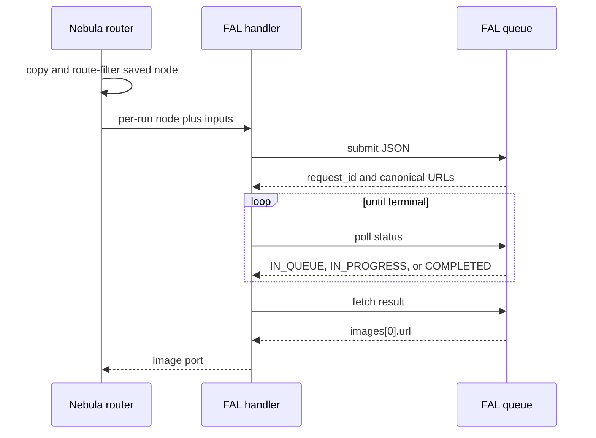

# Contract exemplar: Ideogram FAL route

Gold family-wave exemplar for the FAL side of Nebula's seven dual-route
Ideogram nodes. Every request uses `FAL_KEY`, a fixed endpoint, the FAL queue,
and `handle_fal_universal`.

The FAL editing nodes intentionally remain on V3. FAL's V4 image-to-image
endpoint is not a drop-in replacement for V3 remix because it does not expose
the existing style-reference, style, or negative-prompt controls.

## References and pricing

Re-check the official model pages when `pricing_verified` is older than
`stale_after_days`.

| Route | Price verified 2026-07-23 |
|---|---|
| V4 generate | $0.0075/MP TURBO, $0.015/MP BALANCED, $0.025/MP QUALITY |
| V3 edit, remix, reframe, replace background | $0.03 TURBO, $0.06 BALANCED, $0.09 QUALITY per image |
| V3 character | $0.10 TURBO, $0.15 BALANCED, $0.20 QUALITY per image |
| Upscale | $0.06 per image |

Official schemas are the `sources` URLs in the frontmatter. Nebula's
user-facing route guidance is [ideogram.md](../../api-guides/ideogram.md).

## 1. How to use this exemplar

| Step | Action |
|---|---|
| 1 | Implement the node definition from section 2 |
| 2 | Copy only the FAL route's allowed params into a per-run node |
| 3 | Inject the fixed endpoint into that copy, never the persisted graph node |
| 4 | Map connected media ports using section 4 |
| 5 | Match the corresponding golden request fixture byte-for-byte |
| 6 | Preserve the queue, progress, cancellation, and output behavior in sections 3 and 5 |

## 2. Node contract (Volume 1)

All seven nodes declare `apiProvider: fal`, `executionPattern: async-poll`,
`envKeyName: [IDEOGRAM_API_KEY, FAL_KEY]`, and
`directKeyName: IDEOGRAM_API_KEY`. The direct key wins when both are present.

| Node | FAL endpoint | Required inputs | Output |
|---|---|---|---|
| `ideogram-v4` | `ideogram/v4` | `prompt: Text` | `image: Image` |
| `ideogram-edit` | `fal-ai/ideogram/v3/edit` | `prompt`, `image`, `mask` | `image` |
| `ideogram-remix` | `fal-ai/ideogram/v3/remix` | `prompt`, `image` | `image` |
| `ideogram-reframe` | `fal-ai/ideogram/v3/reframe` | `image` | `image` |
| `ideogram-replace-background` | `fal-ai/ideogram/v3/replace-background` | `prompt`, `image` | `image` |
| `ideogram-character` | `fal-ai/ideogram/character` | `prompt` plus exactly one character reference | `image` |
| `ideogram-upscale` | `fal-ai/ideogram/upscale` | `image`; prompt optional | `image` |

Optional `images` ports map to V3 style references. `ideogram-character` uses
`reference_images` for the character identity and `images` for style. These
are distinct upstream fields.

### FAL parameter matrix

| Node | Parameters exposed by Nebula |
|---|---|
| V4 | `expansion_model` None/Medium/Large; `image_size`; `rendering_speed`; `acceleration`; `num_images` 1-4; `seed`; `enable_safety_checker`; `output_format` |
| Edit | `rendering_speed`; `expand_prompt`; `num_images`; `seed` |
| Remix | `strength` 0-1; `image_size`; `style`; `negative_prompt`; `rendering_speed`; `expand_prompt`; `num_images`; `seed` |
| Reframe | required `image_size`; `style`; `rendering_speed`; `num_images`; `seed` |
| Replace background | `style`; `rendering_speed`; `expand_prompt`; `num_images`; `seed` |
| Character | `style`; `image_size`; `rendering_speed`; `expand_prompt`; `negative_prompt`; `num_images`; `seed` |
| Upscale | `resemblance` 1-100; `detail` 1-100; `expand_prompt`; `seed` |

Provider fields that require arrays or structured objects, such as color
palettes, style codes, and reference masks, remain available through
`fal-universal`. Fixed nodes do not accept arbitrary provider fields.

## 3. Execution pattern (Volume 2)

| Property | Value |
|---|---|
| Pattern | async-poll |
| Submit | `POST https://queue.fal.run/{endpoint}` |
| Poll | FAL-provided `status_url`, every 2 seconds, up to 300 polls |
| Result | FAL-provided `response_url` |
| Progress | Normalized poll progress, capped at 0.99 before completion |
| Cancellation | `PUT` to the provider cancel URL on task cancellation |



## 4. HTTP mapping (Volume 3)

Every request uses `Authorization: Key <FAL_KEY>` and JSON. Connected ports
map as follows.

| Nebula input | FAL field | Applies to |
|---|---|---|
| `prompt` | `prompt` | all prompt-driven nodes; optional on upscale |
| `image` | `image_url` | edit, remix, reframe, replace background, upscale |
| `mask` | `mask_url` | edit |
| `images` | `image_urls` | V3 style references |
| `reference_images` | `reference_image_urls` | character |

For `ideogram-edit`, black mask pixels identify the edited area and the image
and mask dimensions must match exactly.

The fixed router allowlists the parameters in section 2. Direct-only fields
such as `resolution`, `magic_prompt`, `image_weight`, `aspect_ratio`, and
`custom_model_uri` are removed before FAL submission. `endpoint_id` is also
handler-internal and never appears in the upstream JSON.

## 5. Events and output

These routes do not emit SSE partials. Queue progress uses the standard
`ProgressEvent`. Successful responses parse `images[0].url` to:

```json
{"image": {"type": "Image", "value": "https://fal.media/generated.png"}}
```

Provider URLs may expire. The FAL handler currently returns the URL rather than
downloading it, so platform ports must preserve the same contract until that
family-wide behavior changes.

## 6. Edge cases and runtime guards

| Case | Required behavior |
|---|---|
| Missing `FAL_KEY` | Raise `ValueError("FAL_KEY is required")` |
| Direct-only param stored on the graph | Omit it from FAL JSON |
| FAL `rendering_speed=DEFAULT` | Reject before submit; valid values are TURBO/BALANCED/QUALITY |
| V4 `num_images` outside 1-4 | Reject before submit |
| V3 `num_images` outside 1-8 | Reject before submit |
| Invalid V4 `expansion_model` or `acceleration` | Reject before submit |
| Remix `strength` outside 0-1 | Reject before submit |
| Upscale resemblance/detail outside 1-100 | Reject before submit |
| Character has zero references | Reject before submit |
| Character has more than one reference | Reject before submit instead of letting FAL ignore extras |
| Reframe lacks `image_size` | Graph validation or provider schema rejects it; fixed-node UI marks it required |
| Source node after execution | Byte-equivalent params; no `endpoint_id` or bundle seed mutation |

## 7. Parity oracle

`backend/tests/test_fal_contract_fixtures.py::test_fal_request_body_matches_fixture`
loads these seven fixtures through the real registry and FAL body builder:

| Fixture | Node |
|---|---|
| `ideogram-v4-request.json` | V4 generate |
| `ideogram-edit-request.json` | masked edit |
| `ideogram-remix-request.json` | remix |
| `ideogram-reframe-request.json` | reframe |
| `ideogram-replace-background-request.json` | background replacement |
| `ideogram-character-request.json` | character generation |
| `ideogram-upscale-request.json` | upscale |

All live under `contracts/fixtures/handlers/fal/`. Handler tests additionally
pin endpoint selection, input mapping, guards, cancellation, direct preference,
and source-node immutability.

## 8. Minimal graph (Volume 4)

```json
{
  "nodes": [
    {"id": "prompt-1", "definitionId": "text-input", "params": {"text": "a poster that says NEBULA"}, "outputs": {}},
    {"id": "image-1", "definitionId": "ideogram-v4", "params": {"expansion_model": "Medium", "image_size": "square_hd", "rendering_speed": "BALANCED"}, "outputs": {}}
  ],
  "edges": [
    {"source": "prompt-1", "sourceHandle": "text", "target": "image-1", "targetHandle": "prompt"}
  ]
}
```

The same saved graph uses the direct route when `IDEOGRAM_API_KEY` is present.

## 9. FAL versus direct

| Concern | FAL | Direct Ideogram |
|---|---|---|
| Auth | `FAL_KEY` | `IDEOGRAM_API_KEY` |
| Pattern | async-poll JSON | synchronous multipart |
| V4 generation size | named `image_size` | pixel `resolution` enum |
| Prompt expansion | `expansion_model` on V4, `expand_prompt` on V3 | implicit V4 text prompt, `magic_prompt` on V3 |
| Remix | V3, `strength`, style controls | V4, optional `image_weight` |
| Result | provider URL | downloaded into Nebula run directory |

## 10. Official-to-Nebula field matrix

| Official FAL field | Nebula representation |
|---|---|
| `prompt` | `prompt` Text port |
| `image_url` | `image` Image port |
| `mask_url` | `mask` Image port |
| `image_urls` | `images` multi-Image style port |
| `reference_image_urls` | `reference_images` multi-Image port, runtime count exactly one |
| scalar fields in section 2 | same-key node params |
| `sync_mode` | not exposed; fixed queue contract remains persistent URL output |
| structured palette/style fields | use `fal-universal` |

## 11. Porting checklist

- [ ] Seven node definitions match section 2
- [ ] Direct key takes precedence when both keys exist
- [ ] FAL params are allowlisted on a copied node
- [ ] Original node params remain unchanged after success and failure
- [ ] All connected media mappings match section 4
- [ ] Character reference count is exactly one
- [ ] Runtime guards reject invalid values before network creation
- [ ] Seven golden JSON fixtures match the implementation
- [ ] Queue progress, cancellation, and output parsing match section 3
- [ ] No paid call is required for contract parity

## Changelog

| Date | Change |
|---|---|
| 2026-07-23 | Initial seven-node FAL gold exemplar and fixture wave |
