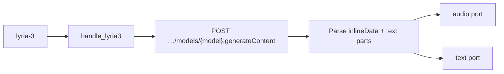

# Contract exemplar: Lyria 3 (`lyria-3`)

Template for porting agents. **Sync** music generation via `generateContent` with `responseModalities: ["AUDIO", "TEXT"]`.

**In scope:** single node `lyria-3` (Clip ~30s and Pro full-song variants).

**Out of scope:** TTS → [gemini-tts.md](./gemini-tts.md). Other Google audio → [../03-handler-families/google.md](../03-handler-families/google.md).

---

## References & pricing

Re-check official links when `pricing_verified` is older than `stale_after_days`.

### Official references

| Resource | URL |
|----------|-----|
| Music generation guide | https://ai.google.dev/gemini-api/docs/music-generation |
| API — `generateContent` | https://ai.google.dev/api/generate-content |
| Pricing | https://ai.google.dev/gemini-api/docs/pricing |

### Nebula references

| Resource | Path |
|----------|------|
| Family rules | [../03-handler-families/google.md](../03-handler-families/google.md) |
| Handler oracle | `backend/handlers/google_gemini.py` |

### Pricing (Google Lyria API, paid tier)

Rates from [official pricing](https://ai.google.dev/gemini-api/docs/pricing) as of `pricing_verified`. Lyria bills per generation (model + duration dependent).

| Model (registry id) | Duration |
|---------------------|----------|
| `lyria-3-clip-preview` | ~30 second clip |
| `lyria-3-pro-preview` | Full song |

**Nebula params that move the bill**

| Param | Effect |
|-------|--------|
| `model` | Clip vs Pro tier |
| `images` port | Reference images add input tokens |
| `outputFormat` | `wav` vs `mp3` on Pro — same generation cost |

---

## 1. How to use this file

| Step | Action |
|------|--------|
| 1 | Read [01-node-schema.md](../01-node-schema.md) + [02-handler-patterns.md](../02-handler-patterns.md) §3 sync |
| 2 | Implement Vol 1 from §2 |
| 3 | Implement sync HTTP mapping §4 |
| 4 | Match `test_google_request_body_matches_fixture[lyria-3-generate-request.json]` |
| 5 | Pin `AUDIO_WAV` enum for WAV — not literal `audio/wav` |

---

## 2. Node contract (Vol 1)

| Field | Value |
|-------|-------|
| `id` | `lyria-3` |
| `displayName` | Lyria 3 |
| `category` | `audio-gen` |
| `apiProvider` | `google` |
| `apiEndpoint` | `/v1beta/models/{model}:generateContent` |
| `envKeyName` | `GOOGLE_API_KEY` |
| `executionPattern` | `sync` |

**Input ports**

| `id` | `dataType` | `required` | `multiple` |
|------|------------|------------|------------|
| `prompt` | `Text` | yes | no |
| `images` | `Image` | no | yes |

**Output ports**

| `id` | `dataType` | Notes |
|------|------------|-------|
| `audio` | `Audio` | `.mp3` or `.wav` from `inlineData` |
| `text` | `Text` | Lyrics / structure text |

**Params**

| `key` | `type` | `default` | Values |
|-------|--------|-----------|--------|
| `model` | enum | `lyria-3-clip-preview` | `lyria-3-clip-preview`, `lyria-3-pro-preview` |
| `outputFormat` | enum | `mp3` | Pro only: `mp3`, `wav` → `responseFormat.audio.mimeType` |

**Handler-pinned**

| Field | Value |
|-------|-------|
| `responseModalities` | `["AUDIO", "TEXT"]` always sent |
| WAV mime enum | `AUDIO_WAV` proto enum — **not** `"audio/wav"` (verified 2026-05-17) |
| Timeout | 180s |

---

## 3. Handler pattern (Vol 2)

| Property | Value |
|----------|-------|
| Pattern | **sync** — one POST, full JSON response |
| Handler | `handle_lyria3` in `google_gemini.py` |
| Registry | `sync_runner.SYNC_HANDLERS["lyria-3"]` |
| Timeout | 180s |
| Stream events | **none** |



---

## 4. HTTP mapping (Vol 3)

### Request

```http
POST https://generativelanguage.googleapis.com/v1beta/models/{model}:generateContent
x-goog-api-key: <GOOGLE_API_KEY>
Content-Type: application/json
```

### Body (oracle shape — Pro WAV)

```json
{
  "contents": [{ "parts": [{ "text": "<prompt>" }, { "inlineData": { "mimeType": "image/png", "data": "…" } }] }],
  "generationConfig": {
    "responseModalities": ["AUDIO", "TEXT"],
    "responseFormat": {
      "audio": { "mimeType": "AUDIO_WAV" }
    }
  }
}
```

**Forwarding rules**

| Source | Rule |
|--------|------|
| `prompt` port | First part: `{ "text": "..." }` |
| `images` port | Additional `inlineData` or `fileData` parts |
| Local image | `inlineData` with camelCase keys |
| HTTP(S) URL | `fileData.fileUri` |
| `outputFormat: wav` + Pro model | `generationConfig.responseFormat.audio.mimeType: "AUDIO_WAV"` |
| `outputFormat: mp3` or Clip model | Omit `responseFormat` — default MP3 |

### Response parsing

Walk `candidates[0].content.parts[]`:

| Part | Port |
|------|------|
| `inlineData` (audio/*) | `audio` — decode base64, save `.wav` or `.mp3` |
| `text` | `text` — concatenate multiple text parts |

Empty → `RuntimeError("Lyria 3 returned no audio or text content: …")`.

HTTP ≠ 200 → `RuntimeError(f"Lyria 3 API error {status}: {body}")`.

---

## 5. SSE / output / events

Not applicable — sync JSON only.

Final port output example:

```json
{
  "audio": { "type": "Audio", "value": "/path/to/abc123.mp3" },
  "text": { "type": "Text", "value": "[Verse]\n…" }
}
```

---

## 6. Edge cases

| Condition | Behavior |
|-----------|----------|
| Missing `prompt` | `ValueError("Prompt input is required for Lyria 3")` |
| Missing `GOOGLE_API_KEY` | `ValueError("GOOGLE_API_KEY is required")` |
| `outputFormat: wav` on Clip model | `responseFormat` not sent — WAV option UI-hidden for Clip |
| Local image path missing | Skipped silently |
| Multiple text parts | Concatenated with newlines on `text` port |

---

## 7. Parity oracle

**Test:** `backend/tests/test_google_contract_fixtures.py::test_google_request_body_matches_fixture[lyria-3-generate-request.json]`

**Fixture:** `contracts/fixtures/handlers/google/lyria-3-generate-request.json`

| Test | Asserts |
|------|---------|
| `test_lyria3_wav_uses_response_format` | `AUDIO_WAV` enum + audio file output |

Assertions on fixture body:

- `generationConfig.responseModalities == ["AUDIO", "TEXT"]`
- `generationConfig.responseFormat.audio.mimeType == "AUDIO_WAV"`

---

## 8. Minimal graph (Vol 4)

```json
{
  "nodes": [
    {
      "id": "n1",
      "definitionId": "text-input",
      "params": { "text": "Upbeat jazz with brushed drums and upright bass" },
      "outputs": {}
    },
    {
      "id": "n2",
      "definitionId": "lyria-3",
      "params": {
        "model": "lyria-3-clip-preview"
      },
      "outputs": {}
    }
  ],
  "edges": [
    {
      "source": "n1",
      "sourceHandle": "text",
      "target": "n2",
      "targetHandle": "prompt"
    }
  ]
}
```

Mood-from-image: connect reference `image` port(s) → `images` (multi).

---

## 9. vs Gemini TTS (porting note)

| | Lyria 3 | Gemini TTS |
|--|---------|------------|
| Output | Music + lyrics text | Speech only |
| Modalities | `["AUDIO", "TEXT"]` | `["AUDIO"]` |
| Voice param | none | `voiceName` enum |
| PCM wrap | Raw audio bytes saved directly | Raw PCM wrapped in WAV (24 kHz mono) |
| Timeout | 180s | 120s |

---

## 10. Parameter matrix (official API vs Nebula)

| Parameter | Official Lyria `generateContent` | Nebula |
|-----------|----------------------------------|--------|
| `contents[].parts` | ✓ | `prompt` + optional `images` |
| `generationConfig.responseModalities` | ✓ | pinned `["AUDIO", "TEXT"]` |
| `generationConfig.responseFormat.audio` | ✓ | `outputFormat` on Pro only |
| `speechConfig` | N/A | N/A |
| Duration / BPM controls | ✓ (docs) | **not exposed** |
| Negative prompt | ✓ (docs) | **not exposed** |

Official reference: [Music generation](https://ai.google.dev/gemini-api/docs/music-generation).

---

## 11. Porting checklist

- [ ] `NodeDefinition` matches §2
- [ ] POST `generateContent` with `x-goog-api-key` header
- [ ] Pin `responseModalities: ["AUDIO", "TEXT"]`
- [ ] Use `AUDIO_WAV` enum for WAV — never `"audio/wav"`
- [ ] Parse `inlineData` audio → save file → `audio` port
- [ ] Optional `text` parts → `text` port
- [ ] Match error strings from §6
- [ ] Unit test loads fixture JSON body shape

---

## Changelog

| Date | Change |
|------|--------|
| 2026-07-01 | Initial exemplar (partial) |
| 2026-07-01 | Gold upgrade — full Vol 1–4, pricing, parameter matrix |
