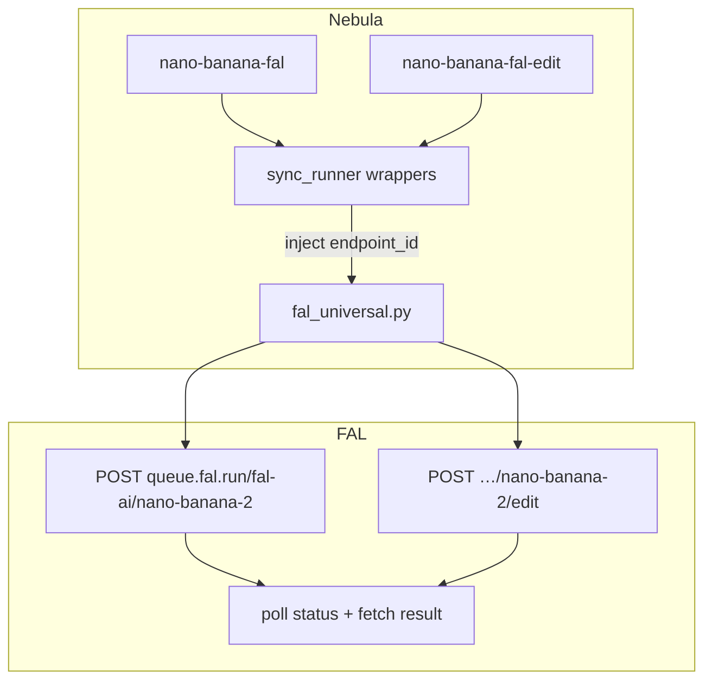

# Contract exemplar: Nano Banana (FAL)

Template for porting agents. FAL-routed Gemini image nodes using `FAL_KEY` and `handle_fal_universal` (**async-poll queue**, not SSE stream).

**In scope:** `nano-banana-fal` (text-to-image), `nano-banana-fal-edit` (multi-ref edit).

**Out of scope:** Google direct `nano-banana` — see [nano-banana.md](./nano-banana.md). FAL streaming gpt-image-2 — see [gpt-image-2-fal.md](./gpt-image-2-fal.md).

---

## References & pricing

Re-check when `pricing_verified` is older than `stale_after_days`. You pay **FAL** (`FAL_KEY`), not Google directly.

### Official references

| Resource | URL |
|----------|-----|
| FAL Nano Banana 2 | https://fal.ai/models/fal-ai/nano-banana-2 |
| FAL Nano Banana 2 Edit | https://fal.ai/models/fal-ai/nano-banana-2/edit |
| FAL Nano Banana Pro | https://fal.ai/models/fal-ai/nano-banana-pro |
| FAL Nano Banana (2.5 Flash) | https://fal.ai/models/fal-ai/nano-banana |
| FAL platform pricing | https://fal.ai/pricing |
| Google image models (informative) | https://ai.google.dev/gemini-api/docs/models |

### Nebula references

| Resource | Path |
|----------|------|
| Google direct pair | [nano-banana.md](./nano-banana.md) |
| FAL family rules | [../03-handler-families/fal.md](../03-handler-families/fal.md) |
| Handler oracle | `backend/handlers/fal_universal.py` |
| Endpoint resolver | `nano_banana_fal_endpoint()` in `fal_universal.py` |

### Pricing (FAL passthrough, indicative)

Per-image estimates from FAL model pages (as of `pricing_verified` — verify before production):

| Model tier | Indicative rate |
|------------|-----------------|
| `nano-banana` (2.5 Flash) | ~$0.039/image |
| `nano-banana-2` | ~$0.08/image |
| `nano-banana-pro` | Higher; scales with `resolution` (2K/4K) |

**Nebula params that move the bill**

| Param | Cost effect |
|-------|-------------|
| `model` | Tier selection (primary lever) |
| `resolution` | NB2/Pro only — 2K/4K > 1K |
| `num_images` | Multiplies output count (1–4) |
| Edit `images` | Reference count affects upstream workload |
| `thinking_level`, `enable_web_search` | NB2-only; may add latency/cost on FAL |

---

## 1. How to use this file

| Step | Action |
|------|--------|
| 1 | Read [00-meta.md](../00-meta.md) and [fal.md](../03-handler-families/fal.md) async-poll pattern |
| 2 | Implement **Vol 1** from §2 — note `model` selects endpoint, **not** sent in body |
| 3 | Implement **Vol 3 FAL queue** from §4–§5 (`queue.fal.run` submit + poll) |
| 4 | Load golden fixtures in §8; match pytest oracle |
| 5 | Contrast with [gpt-image-2-fal.md](./gpt-image-2-fal.md) — that family uses **stream**, not poll |

**Oracle:** `fal_universal.py` + `sync_runner.py` wrappers + tests.

---

## 2. Node contract (Vol 1)

### `nano-banana-fal`

| Field | Value |
|-------|-------|
| `id` | `nano-banana-fal` |
| `displayName` | Nano Banana (FAL) |
| `category` | `image-gen` |
| `apiProvider` | `fal` |
| `apiEndpoint` | `fal-ai/nano-banana-2` (default tier) |
| `envKeyName` | `FAL_KEY` |
| `executionPattern` | `async-poll` |

**Input ports**

| `id` | `dataType` | `required` | `multiple` |
|------|------------|------------|------------|
| `prompt` | `Text` | yes | no |

**Output ports**

| `id` | `dataType` | `required` |
|------|------------|------------|
| `image` | `Image` | no |

**Params**

| `key` | `type` | `default` | Notes |
|-------|--------|-----------|-------|
| `model` | enum | `nano-banana-2` | Selects FAL endpoint — **not in POST body** |
| `aspect_ratio` | enum | `1:1` | `auto` for NB2/Pro; extended ratios for NB2/Pro |
| `resolution` | enum | `1K` | NB2/Pro only: `0.5K`, `1K`, `2K`, `4K` |
| `num_images` | int | `1` | 1–4 |
| `output_format` | enum | `png` | `png`, `jpeg`, `webp` |
| `thinking_level` | enum | `""` | NB2 only: `""`, `minimal`, `high` |
| `enable_web_search` | bool | `false` | NB2 only |
| `seed` | int | — | Optional |

**Handler-pinned (internal)**

| Field | Value |
|-------|-------|
| `endpoint_id` | Set by `sync_runner` wrapper via `nano_banana_fal_endpoint(model, edit=False)` |

---

### `nano-banana-fal-edit`

| Field | Value |
|-------|-------|
| `id` | `nano-banana-fal-edit` |
| `displayName` | Nano Banana Edit (FAL) |
| `apiEndpoint` | `fal-ai/nano-banana-2/edit` |
| *(same provider, key, pattern as generate)* | |

**Input ports**

| `id` | `dataType` | `required` | `multiple` | Notes |
|------|------------|------------|------------|-------|
| `prompt` | `Text` | yes | no | |
| `images` | `Image` | yes | yes | Maps to `image_urls`; NB2 supports up to 14 refs |

**Output ports:** `image` → `Image`.

**Params:** same model/aspect_ratio/resolution/output_format/seed as generate; `aspect_ratio` default `auto`.

---

## 3. Model → endpoint routing

`model` param selects the FAL `endpoint_id` (injected by wrapper, **never** in request JSON):

| `model` value | Generate endpoint | Edit endpoint |
|---------------|-------------------|---------------|
| `nano-banana-2` (default) | `fal-ai/nano-banana-2` | `fal-ai/nano-banana-2/edit` |
| `nano-banana-pro` | `fal-ai/nano-banana-pro` | `fal-ai/nano-banana-pro/edit` |
| `nano-banana` | `fal-ai/nano-banana` | `fal-ai/nano-banana/edit` |
| `gemini-25-flash-image` | `fal-ai/gemini-25-flash-image` | `fal-ai/gemini-25-flash-image/edit` |
| `gemini-3-pro-image` | `fal-ai/gemini-3-pro-image-preview` | `fal-ai/gemini-3-pro-image-preview/edit` |

Resolver: `nano_banana_fal_endpoint()` in `fal_universal.py`.



---

## 4. Handler pattern (Vol 2)

| Property | Value |
|----------|-------|
| Pattern | `async-poll` — submit → poll `status_url` → fetch `response_url` |
| Handler | `handle_fal_universal` (non-streaming path) |
| Wrappers | `sync_runner.py` → `_nano_banana_fal_handler`, `_nano_banana_fal_edit_handler` |
| Body builder | Maps ports + params into `fal_input`; strips `endpoint_id`, `model` |
| Poll interval | 2s, max 300 polls |
| Submit timeout | 30s |
| Stream gate | **Not** in `STREAMING_FAL_ENDPOINTS` — always async-poll |

---

## 5. HTTP mapping (Vol 3 — FAL family)

### Auth

```http
Authorization: Key <FAL_KEY>
Content-Type: application/json
```

Missing key → `ValueError("FAL_KEY is required")`.

### Generate — submit

```http
POST https://queue.fal.run/fal-ai/nano-banana-2
```

**Body** (params + prompt; no `model`, no `endpoint_id`):

```json
{
  "prompt": "a red apple",
  "aspect_ratio": "16:9",
  "resolution": "2K",
  "num_images": 2,
  "output_format": "png"
}
```

**Forwarding rules**

| Rule | Detail |
|------|--------|
| `prompt` | From input port |
| Params | Copied except `endpoint_id`, `model` |
| Omit empty | Skip params where value is `null` or `""` |
| `model` | **Never** in POST body — only selects URL path |

### Edit — submit

```http
POST https://queue.fal.run/fal-ai/nano-banana-pro/edit
```

**Body:**

```json
{
  "prompt": "change shirt to blue",
  "image_urls": ["https://example.com/ref1.png", "https://example.com/ref2.png"],
  "resolution": "2K",
  "aspect_ratio": "9:16"
}
```

**Image URL conversion** (`_to_fal_url`):

| Input | Sent as |
|-------|---------|
| `http://` / `https://` | unchanged |
| `data:` URI | unchanged |
| Local file path | `data:{mime};base64,{bytes}` |

**Validation (edit)**

| Condition | Error |
|-----------|-------|
| No images / empty list | `ValueError("Nano Banana edit requires at least one reference image")` |

### Poll flow

1. `POST {FAL_QUEUE_BASE}/{endpoint_id}` → `{ request_id, status_url, response_url }`
2. `GET status_url` every 2s until `status` is `COMPLETED` or failed
3. `GET response_url` → parse image URL from FAL output
4. Download/decode → local file path on `image` port

---

## 6. SSE events

**Not applicable** — async-poll queue, not streaming. No `StreamPartialImageEvent`.

Progress may emit `ProgressEvent` during poll loops (handler-dependent).

---

## 7. Output contract (media)

```json
{
  "image": {
    "type": "Image",
    "value": "/absolute/path/to/downloaded/image.png"
  }
}
```

Returns **local file path** after FAL result fetch — same pattern as other async-poll FAL nodes.

---

## 8. Parity oracle (fixtures + tests)

**Parity suite:** `backend/tests/test_fal_contract_fixtures.py::test_fal_request_body_matches_fixture`

| Fixture | Node | Endpoint (not in body) |
|---------|------|------------------------|
| `contracts/fixtures/handlers/fal/nano-banana-fal-generate-request.json` | nano-banana-fal | `fal-ai/nano-banana-2` |
| `contracts/fixtures/handlers/fal/nano-banana-fal-edit-request.json` | nano-banana-fal-edit | `fal-ai/nano-banana-pro/edit` |

| Test file | What it pins |
|-----------|----------------|
| `test_fal_contract_fixtures.py` | Golden JSON body parity |
| `test_fal_handler.py` | `test_nano_banana_fal_endpoint_injection` — URL contains tier, no `model` in body |
| `test_fal_handler.py` | `test_nano_banana_fal_edit_requires_images` — ValueError substring |
| `test_fal_handler.py` | `test_nano_banana_fal_edit_endpoint_and_image_urls` — `/edit` path + `image_urls` |

**Key assertions**

| Test | Assertion |
|------|-----------|
| `test_nano_banana_fal_endpoint_injection` | POST URL contains `fal-ai/nano-banana-2`; payload has no `model` |
| `test_nano_banana_fal_edit_requires_images` | `match="at least one reference image"` |
| `test_nano_banana_fal_edit_endpoint_and_image_urls` | `/edit` in URL; `image_urls` list present |

---

## 9. Minimal graph (Vol 4)

```json
{
  "nodes": [
    {
      "id": "n1",
      "definitionId": "text-input",
      "params": { "text": "A ceramic mug on a wooden table" },
      "outputs": {}
    },
    {
      "id": "n2",
      "definitionId": "nano-banana-fal",
      "params": { "model": "nano-banana-2", "aspect_ratio": "16:9", "resolution": "2K" },
      "outputs": {}
    }
  ],
  "edges": [
    {
      "source": "n1",
      "sourceHandle": "text",
      "target": "n2",
      "targetHandle": "prompt"
    }
  ]
}
```

**Edit:** wire upstream `image` ports → `images` (multi), plus `prompt`.

---

## 10. Parameter matrix (FAL schema vs Nebula)

| Parameter | FAL Nano Banana | Nebula generate | Nebula edit |
|-----------|-----------------|-----------------|-------------|
| `prompt` | ✓ | port | port |
| `image_urls` | edit only | — | from `images` port |
| `aspect_ratio` | ✓ | param | param |
| `resolution` | NB2/Pro | param | param |
| `num_images` | ✓ | param | param (generate only in registry) |
| `output_format` | ✓ | param | param |
| `thinking_level` | NB2 | param | — |
| `enable_web_search` | NB2 | param | — |
| `seed` | ✓ | param | param |
| `model` | — (routing only) | UI enum → endpoint | UI enum → endpoint |
| `sync_mode` | FAL optional | not used | not used |

---

## 11. Porting checklist

- [ ] `NodeDefinition` matches §2 for both nodes
- [ ] Wrapper injects `endpoint_id` from `model` before handler dispatch
- [ ] `model` never appears in POST JSON body
- [ ] Edit: map `images` → `image_urls`, convert local paths to data URIs
- [ ] POST to `https://queue.fal.run/{endpoint_id}` with `Key` auth
- [ ] Implement submit → poll → result download (not SSE)
- [ ] Edit: require ≥1 reference image with exact error substring from tests
- [ ] Return `Image` port with local file path
- [ ] Load golden fixtures and assert byte-identical request bodies

**Pair with Google direct:** [nano-banana.md](./nano-banana.md) when porting both routes.

---

## 12. Contrast with FAL streaming (gpt-image-2-fal)

| Concern | Nano Banana FAL (this doc) | GPT Image 2 FAL |
|---------|---------------------------|-----------------|
| Pattern | async-poll | stream (SSE) |
| URL suffix | `queue.fal.run/{endpoint}` | `…/{endpoint}/stream` |
| Exemplar | this file | [gpt-image-2-fal.md](./gpt-image-2-fal.md) |
| Partial previews | none | `StreamPartialImageEvent` |

---

## Changelog

| Date | Change |
|------|--------|
| 2026-07-01 | Initial draft exemplar |
| 2026-07-01 | Upgraded to gold — full Vol 1–5, fixtures, poll flow, both nodes |
