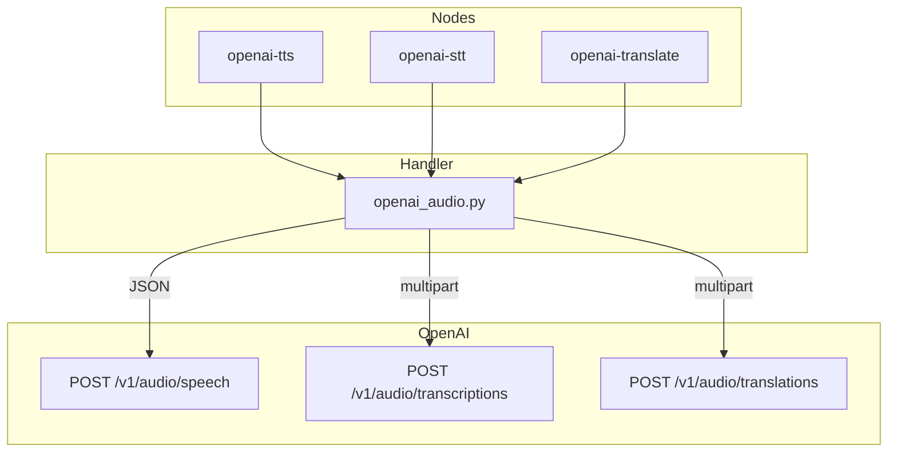

# Contract exemplar: OpenAI Audio (TTS / STT / Translate)

Template for porting agents. Three **sync** nodes sharing one handler module.

**In scope:** `openai-tts`, `openai-stt`, `openai-translate` (`OPENAI_API_KEY`).

**Out of scope:** ElevenLabs, Gemini TTS, and other audio providers.

---

## References & pricing

Re-check official links when `pricing_verified` is older than `stale_after_days`.

### Official references

| Resource | URL |
|----------|-----|
| Text-to-speech guide | https://developers.openai.com/api/docs/guides/text-to-speech |
| Speech-to-text guide | https://developers.openai.com/api/docs/guides/speech-to-text |
| Audio API reference | https://developers.openai.com/api/reference/resources/audio |
| API pricing | https://developers.openai.com/api/docs/pricing |

### Nebula references

| Resource | Path |
|----------|------|
| Handler oracle | `backend/handlers/openai_audio.py` |
| OpenAI family rules | [../03-handler-families/openai.md](../03-handler-families/openai.md) |

### Pricing (indicative)

| Node | Billing unit | Notes |
|------|--------------|-------|
| `openai-tts` | Per character / per model | `tts-1` vs `tts-1-hd` vs `gpt-4o-mini-tts` |
| `openai-stt` | Per minute | Model-dependent (`whisper-1`, `gpt-4o-transcribe`, …) |
| `openai-translate` | Per minute | Fixed `whisper-1` upstream |

Confirm current rates on [OpenAI pricing](https://developers.openai.com/api/docs/pricing) before production estimates.

---

## 1. How to use this file

| Step | Action |
|------|--------|
| 1 | Read [00-meta.md](../00-meta.md) |
| 2 | Implement **Vol 1** for all three node ids (§2) |
| 3 | Implement **Vol 2 sync** transports (§3–§4) |
| 4 | Match pytest oracle in §8 |

**Oracle:** `openai_audio.py` + `test_openai_audio_handler.py`.

---

## 2. Node contract (Vol 1)

### `openai-tts`

| Field | Value |
|-------|-------|
| `id` | `openai-tts` |
| `displayName` | OpenAI TTS |
| `category` | `audio-gen` |
| `apiProvider` | `openai` |
| `apiEndpoint` | `/v1/audio/speech` |
| `envKeyName` | `OPENAI_API_KEY` |
| `executionPattern` | `sync` |

**Input ports:** `text` (Text, required)

**Output ports:** `audio` (Audio)

**Params**

| `key` | `type` | `default` | Allowed values |
|-------|--------|-----------|----------------|
| `model` | enum | `tts-1` | `tts-1`, `tts-1-hd`, `gpt-4o-mini-tts` |
| `voice` | enum | `alloy` | `alloy`, `ash`, `ballad`, `cedar`, `coral`, `echo`, `fable`, `marin`, `nova`, `onyx`, `sage`, `shimmer`, `verse` |
| `speed` | float | `1` | 0.25–4 |
| `response_format` | enum | `mp3` | `mp3`, `wav`, `flac`, `opus`, `aac`, `pcm` |
| `instructions` | string | — | `gpt-4o-mini-tts` only |

---

### `openai-stt`

| Field | Value |
|-------|-------|
| `id` | `openai-stt` |
| `displayName` | OpenAI Whisper STT |
| `apiEndpoint` | `/v1/audio/transcriptions` |
| *(same provider, key, pattern)* | |

**Input ports:** `audio` (Audio, required)

**Output ports:** `text` (Text)

**Params**

| `key` | `type` | `default` | Notes |
|-------|--------|-----------|-------|
| `model` | enum | `whisper-1` | `whisper-1`, `gpt-4o-transcribe`, `gpt-4o-mini-transcribe` |
| `language` | enum | `auto` | ISO codes; `auto` **not** forwarded |
| `response_format` | enum | `text` | `text`, `json`, `verbose_json`, `srt`, `vtt` |
| `temperature` | float | `0` | Forwarded only when ≠ 0 |
| `prompt` | string | — | Optional style guide |

---

### `openai-translate`

| Field | Value |
|-------|-------|
| `id` | `openai-translate` |
| `displayName` | OpenAI Audio Translate |
| `apiEndpoint` | `/v1/audio/translations` |
| *(same provider, key, pattern)* | |

**Input ports:** `audio` (Audio, required)

**Output ports:** `text` (Text, label "English Text")

**Params:** `response_format`, `temperature`, `prompt` — **no `model` param** (handler hardcodes `whisper-1`).

---

## 3. Handler pattern (Vol 2)

| Node | Handler | Transport | Base URL |
|------|---------|-----------|----------|
| `openai-tts` | `handle_openai_tts` | JSON POST → raw bytes | `…/v1/audio/speech` |
| `openai-stt` | `handle_openai_stt` | multipart POST | `…/v1/audio/transcriptions` |
| `openai-translate` | `handle_openai_translate` | multipart POST | `…/v1/audio/translations` |



| Property | Value |
|----------|-------|
| Pattern | `sync` for all three |
| TTS timeout | 60s |
| STT / Translate timeout | 120s |
| Streaming | none |

---

## 4. HTTP mapping (Vol 3 — OpenAI family)

### Auth (all nodes)

```http
Authorization: Bearer <OPENAI_API_KEY>
```

Missing key → `ValueError("OPENAI_API_KEY is required")`.

### TTS — JSON body

```http
POST https://api.openai.com/v1/audio/speech
Content-Type: application/json
```

```json
{
  "model": "tts-1",
  "input": "<from port text>",
  "voice": "alloy",
  "speed": 1.0,
  "response_format": "mp3"
}
```

| Param | Rule |
|-------|------|
| `instructions` | Include only when non-empty (`gpt-4o-mini-tts`) |

Response: **raw audio bytes** (not JSON). Saved to run dir with extension matching `response_format`.

### STT — multipart form

```http
POST https://api.openai.com/v1/audio/transcriptions
```

| Field | Content |
|-------|---------|
| `file` | Audio file bytes (`audio/mpeg` MIME in handler) |
| `model` | From params |
| `response_format` | From params |
| `language` | Only when ≠ `auto` |
| `prompt` | When set |
| `temperature` | Stringified float when ≠ 0 |

### Translate — multipart form

```http
POST https://api.openai.com/v1/audio/translations
```

| Field | Content |
|-------|---------|
| `file` | Audio file bytes |
| `model` | **Hardcoded** `whisper-1` |
| `response_format`, `prompt`, `temperature` | Same rules as STT |

**Validation (STT / Translate)**

| Condition | Error |
|-----------|-------|
| No `audio` | `ValueError("Audio input is required for transcription")` / `…translation` |
| File not found | `ValueError("Audio file not found: …")` |

**Validation (TTS)**

| Condition | Error |
|-----------|-------|
| No `text` | `ValueError("Text input is required for TTS")` |

---

## 5. SSE events

**Not applicable** — all three nodes use synchronous request/response.

---

## 6. Output contract

**TTS**

```json
{
  "audio": {
    "type": "Audio",
    "value": "/absolute/path/to/{uuid}.mp3"
  }
}
```

**STT / Translate**

```json
{
  "text": {
    "type": "Text",
    "value": "transcribed or translated text"
  }
}
```

- TTS extension matches `response_format`; unknown format falls back to `.mp3`
- STT/Translate: `text` format returns `response.text`; `json` / `verbose_json` parse `.text` field

---

## 7. Edge cases (required for parity)

| Condition | Behavior |
|-----------|----------|
| `temperature: 0` (STT/Translate default) | **Not** forwarded |
| `language: auto` (STT) | **Not** forwarded |
| Translate model param in UI | Ignored — always `whisper-1` |
| `instructions` on `tts-1` | Forwarded if set (API ignores) |
| HTTP ≠ 200 | `RuntimeError` with `OpenAI TTS/STT/Translate error {code}` |
| TTS unknown `response_format` | Save as `.mp3` defensively |

---

## 8. Parity oracle (fixtures + tests)

**Parity suite:** `backend/tests/test_openai_contract_fixtures.py`

| Fixture | Node |
|---------|------|
| `contracts/fixtures/handlers/openai/openai-tts-request.json` | `openai-tts` |
| `contracts/fixtures/handlers/openai/openai-stt-request.json` | `openai-stt` |
| `contracts/fixtures/handlers/openai/openai-translate-request.json` | `openai-translate` |

**Primary tests:** `backend/tests/test_openai_audio_handler.py`

| Area | Key tests |
|------|-----------|
| STT | `test_stt_form_data_includes_model_and_format`, `test_stt_language_auto_not_forwarded`, `test_stt_temperature_zero_is_omitted`, `test_stt_text_format_returns_raw_response_text` |
| Translate | `test_translate_model_hardcoded_to_whisper1`, `test_translate_temperature_zero_is_omitted` |
| TTS | `test_tts_request_body_shape`, `test_tts_file_extension_matches_response_format`, `test_tts_instructions_forwarded_for_gpt4o_mini_tts`, `test_tts_unknown_format_falls_back_to_mp3` |
| Errors | `test_*_missing_*_raises`, `test_*_http_error_raises_runtime_error` |

---

## 9. Minimal graph (Vol 4)

**TTS**

```json
{
  "nodes": [
    {
      "id": "n1",
      "definitionId": "text-input",
      "params": { "text": "Welcome to Nebula Nodes." },
      "outputs": {}
    },
    {
      "id": "n2",
      "definitionId": "openai-tts",
      "params": { "model": "tts-1", "voice": "nova", "response_format": "mp3" },
      "outputs": {}
    }
  ],
  "edges": [
    {
      "source": "n1",
      "sourceHandle": "text",
      "target": "n2",
      "targetHandle": "text"
    }
  ]
}
```

**STT:** wire `audio-input` or upstream `audio` port → `audio`.

**Translate:** same wiring as STT; output is English text regardless of source language.

---

## 10. Parameter matrix (official API vs Nebula)

| Parameter | TTS API | STT API | Translate API | Nebula |
|-----------|---------|---------|---------------|--------|
| `model` | ✓ | ✓ | ✓ (whisper-1 only) | TTS/STT param; translate hardcoded |
| `input` / `file` | ✓ | ✓ | ✓ | `text` / `audio` ports |
| `voice`, `speed` | ✓ | — | — | TTS only |
| `response_format` | ✓ (audio) | ✓ (text/json/srt) | ✓ | all three |
| `language` | — | ✓ | — | STT only |
| `instructions` | ✓ | — | — | TTS only |
| `temperature` | — | ✓ | ✓ | STT/Translate, nonzero only |
| `prompt` | — | ✓ | ✓ | STT/Translate |

---

## 11. Porting checklist

- [ ] Three `NodeDefinition` records match §2
- [ ] TTS: JSON POST, write raw bytes with correct extension
- [ ] STT: multipart with `file` + form `data` dict
- [ ] Translate: multipart, `model` always `whisper-1`
- [ ] Omit `temperature` when 0; omit `language` when `auto`
- [ ] Return correct port types (`Audio` vs `Text`)
- [ ] Error substrings match §7 / tests

---

## Changelog

| Date | Change |
|------|--------|
| 2026-07-01 | Initial gold exemplar from `openai_audio.py` + tests |
