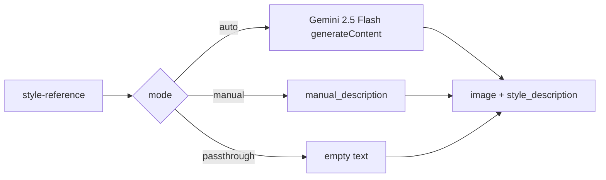

# Contract exemplar: Style Reference (`style-reference`)

**Utility** glue node — extracts a style-only text descriptor from a reference image (or passes image through). Uses Gemini 2.5 Flash in `auto` mode; **no input ports** (image via `filePath` param).

Not a generative model node — documented here because `apiProvider: google` and it calls `generateContent` internally.

**In scope:** single node `style-reference` with `auto`, `manual`, and `passthrough` modes.

**Out of scope:** downstream image models that consume style — see [nano-banana.md](./nano-banana.md), [gpt-image-2.md](./gpt-image-2.md).

---

## References & pricing

Re-check official links when `pricing_verified` is older than `stale_after_days`.

### Official references

| Resource | URL |
|----------|-----|
| Text / vision generation | https://ai.google.dev/gemini-api/docs/text-generation |
| API — `generateContent` | https://ai.google.dev/api/generate-content |
| Pricing (Flash) | https://ai.google.dev/gemini-api/docs/pricing |

### Nebula references

| Resource | Path |
|----------|------|
| Handler oracle | `backend/handlers/style_reference.py` |
| Family rules | [../03-handler-families/google.md](../03-handler-families/google.md) |
| Module docstring | Describes cinema glue role + ExecutionCache determinism |

### Pricing (`auto` mode only)

`auto` mode calls `gemini-2.5-flash` once per run (non-streaming). Bills **input image + output text tokens** at Flash rates from [official pricing](https://ai.google.dev/gemini-api/docs/pricing) as of `pricing_verified`.

| Mode | API cost |
|------|----------|
| `auto` | One Flash `generateContent` call |
| `manual` | **none** |
| `passthrough` | **none** |

---

## 1. How to use this file

| Step | Action |
|------|--------|
| 1 | Read [01-node-schema.md](../01-node-schema.md) + [02-handler-patterns.md](../02-handler-patterns.md) §3 sync |
| 2 | Implement Vol 1 from §2 — note **no input ports** |
| 3 | Implement mode branching §4 (`auto` only hits HTTP) |
| 4 | Match `test_google_request_body_matches_fixture[style-reference-auto-request.json]` |
| 5 | Wire `style_description` → downstream prompt nodes |

---

## 2. Node contract (Vol 1)

| Field | Value |
|-------|-------|
| `id` | `style-reference` |
| `displayName` | Style Reference |
| `category` | `utility` |
| `apiProvider` | `google` |
| `apiEndpoint` | `/v1beta/models/gemini-2.5-flash:generateContent` |
| `envKeyName` | `GOOGLE_API_KEY` |
| `executionPattern` | `sync` |

**Input ports:** none

**Output ports**

| `id` | `dataType` | Notes |
|------|------------|-------|
| `image` | `Image` | Resolved local path of reference |
| `style_description` | `Text` | Style phrase for downstream prompts |

**Params**

| `key` | `type` | `default` | Values |
|-------|--------|-----------|--------|
| `filePath` | file | `""` | **Required** — `/api/outputs/…` or absolute path |
| `mode` | enum | `auto` | `auto`, `manual`, `passthrough` |
| `manual_description` | textarea | `""` | Required when `mode=manual` |
| `focus` | enum | `all` | `auto` only: `all`, `palette`, `lighting`, `medium` |
| `strength` | float | `0.7` | 0–1 — appends `(style strength: X.XX)` when ≠ 1.0 |

**Handler-pinned (`auto` mode)**

| Field | Value |
|-------|-------|
| Model | `gemini-2.5-flash` (not selectable in UI) |
| `generationConfig.temperature` | `0.4` |
| `generationConfig.maxOutputTokens` | `200` |
| System prompt | From `_STYLE_PROMPTS[focus]` in handler |

---

## 3. Handler pattern (Vol 2)

| Property | Value |
|----------|-------|
| Pattern | **sync** — mode-dependent (HTTP only in `auto`) |
| Handler | `handle_style_reference` in `style_reference.py` |
| Registry | `sync_runner.SYNC_HANDLERS["style-reference"]` |
| Timeout | 60s (`auto` API call) |
| Stream events | **none** |



### Modes

| `mode` | API call | `style_description` |
|--------|----------|---------------------|
| `auto` | Gemini 2.5 Flash vision | 15–40 word style phrase (focus-dependent) |
| `manual` | none | User `manual_description` |
| `passthrough` | none | Empty string |

---

## 4. HTTP mapping (Vol 3 — `auto` mode only)

Internal call only:

```http
POST https://generativelanguage.googleapis.com/v1beta/models/gemini-2.5-flash:generateContent
x-goog-api-key: <GOOGLE_API_KEY>
Content-Type: application/json
```

### Body (oracle shape — `focus: palette`)

```json
{
  "contents": [
    {
      "role": "user",
      "parts": [
        { "text": "<_STYLE_PROMPTS[focus]>" },
        { "inline_data": { "mime_type": "image/png", "data": "<base64>" } }
      ]
    }
  ],
  "generationConfig": {
    "temperature": 0.4,
    "maxOutputTokens": 200
  }
}
```

**Forwarding rules**

| Source | Rule |
|--------|------|
| `filePath` param | Resolved to local path → base64 `inline_data` |
| `/api/outputs/…` URL | Mapped under `OUTPUT_ROOT` |
| `focus` param | Selects prompt from `_STYLE_PROMPTS` |
| `strength` param | Appends `(style strength: X.XX)` to final text when ≠ 1.0 |
| `manual` / `passthrough` | **No HTTP** |

### Response parsing (`auto`)

Extract `candidates[0].content.parts[].text` → join → `style_description` port. Always emit resolved `image` port with absolute path.

---

## 5. SSE / output / events

Not applicable for `manual` / `passthrough`. `auto` uses non-streaming sync JSON.

Final port output (`auto`):

```json
{
  "image": { "type": "Image", "value": "/absolute/path/to/reference.png" },
  "style_description": { "type": "Text", "value": "warm amber palette, soft tungsten lighting, grainy 35mm film (style strength: 0.70)" }
}
```

---

## 6. Edge cases

| Condition | Behavior |
|-----------|----------|
| Missing `filePath` | `ValueError("Style Reference needs a reference image (filePath param)")` |
| Unresolvable path | `ValueError("Reference image not found: …")` |
| `auto` without key | `ValueError` with hint to use manual/passthrough |
| Path traversal via `/api/outputs/` | Rejected — must resolve under `OUTPUT_ROOT` |
| Invalid `strength` | Falls back to `0.7` |
| Gemini no candidates | `RuntimeError("Gemini returned no candidates: …")` |
| Gemini no text | `RuntimeError("Gemini returned no text content: …")` |

---

## 7. Parity oracle

**Test:** `backend/tests/test_google_contract_fixtures.py::test_google_request_body_matches_fixture[style-reference-auto-request.json]`

**Fixture:** `contracts/fixtures/handlers/google/style-reference-auto-request.json`

| Test | Asserts |
|------|---------|
| `test_auto_calls_gemini_with_focus_specific_prompt` | Prompt selection + body shape |
| `test_manual_mode_skips_api` | No HTTP |
| `test_passthrough_emits_empty_description` | Passthrough |
| `test_style_reference_fixture_uses_palette_prompt` | Palette focus prompt text |

Fixture uses canonical 1×1 PNG base64 from `test_style_reference._png_bytes()`.

---

## 8. Minimal graph (Vol 4)

```json
{
  "nodes": [
    {
      "id": "n1",
      "definitionId": "style-reference",
      "params": {
        "filePath": "/api/outputs/run-abc/reference.png",
        "mode": "auto",
        "focus": "all",
        "strength": 0.8
      },
      "outputs": {}
    },
    {
      "id": "n2",
      "definitionId": "text-input",
      "params": { "text": "A ceramic mug on a table" },
      "outputs": {}
    },
    {
      "id": "n3",
      "definitionId": "nano-banana",
      "params": { "model": "gemini-3.1-flash-image" },
      "outputs": {}
    }
  ],
  "edges": [
    {
      "source": "n1",
      "sourceHandle": "image",
      "target": "n3",
      "targetHandle": "images"
    },
    {
      "source": "n2",
      "sourceHandle": "text",
      "target": "n3",
      "targetHandle": "prompt"
    }
  ]
}
```

Append `style_description` to prompts in a merge node or inline in downstream text.

---

## 9. vs Nano Banana style refs

| | Style Reference | Nano Banana `images` port |
|--|-----------------|---------------------------|
| Purpose | Extract text descriptor + pass image | Generate/edit with visual refs |
| Input | `filePath` param only | `images` port (multi) |
| API | Optional Flash vision call | Always `generateContent` image model |
| Output text | Style-only phrase | Optional model text |
| Modes | auto / manual / passthrough | generate only |

Style Reference is **glue** — it does not generate pixels.

---

## 10. Parameter matrix (official API vs Nebula)

| Parameter | Official `generateContent` | Nebula `auto` mode |
|-----------|---------------------------|-------------------|
| `contents[].parts` | ✓ | prompt text + `inline_data` image |
| `generationConfig.temperature` | ✓ | pinned `0.4` |
| `generationConfig.maxOutputTokens` | ✓ | pinned `200` |
| Model selection | ✓ | pinned `gemini-2.5-flash` |
| `systemInstruction` | ✓ | embedded in user parts as prompt text |
| Streaming | ✓ | **not used** (sync) |

`manual` and `passthrough` modes: no API parameters.

---

## 11. Porting checklist

- [ ] `NodeDefinition` matches §2 — zero input ports
- [ ] Resolve `filePath` (`/api/outputs/…` and absolute paths)
- [ ] Branch on `mode` before any HTTP
- [ ] `auto`: POST `generateContent` with `_STYLE_PROMPTS[focus]`
- [ ] Apply `strength` suffix when ≠ 1.0
- [ ] Return `image` + `style_description` on every mode
- [ ] Match error strings from §6
- [ ] Unit test loads fixture JSON body shape (`auto` + palette focus)

---

## Changelog

| Date | Change |
|------|--------|
| 2026-07-01 | Initial exemplar (partial) |
| 2026-07-01 | Gold upgrade — full Vol 1–4, pricing, parameter matrix |
