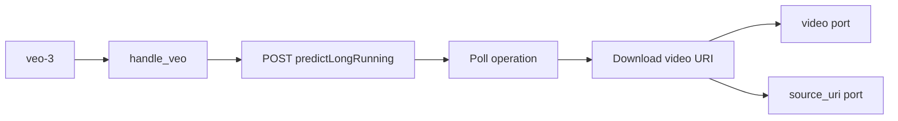

# Contract exemplar: Veo 3.1 (`veo-3`)

Template for porting agents. **Async-poll** video via `predictLongRunning`. Dual-route: **Google direct** (`GOOGLE_API_KEY`) preferred; falls back to FAL `fal-ai/veo3` when only `FAL_KEY` is set.

For conversational video (Interactions API), use [gemini-omni-flash.md](./gemini-omni-flash.md) instead.

**In scope:** single node `veo-3` with T2V, I2V, interpolation, and extension modes (Google direct).

**Out of scope:** Omni Flash conversational edits → [gemini-omni-flash.md](./gemini-omni-flash.md). FAL-only params when no Google key.

---

## References & pricing

Re-check official links when `pricing_verified` is older than `stale_after_days`.

### Official references

| Resource | URL |
|----------|-----|
| Video generation guide | https://ai.google.dev/gemini-api/docs/video |
| Pricing | https://ai.google.dev/gemini-api/docs/pricing |
| Long-running operations | https://ai.google.dev/api/long-running-operations |

### Nebula references

| Resource | Path |
|----------|------|
| Family rules | [../03-handler-families/google.md](../03-handler-families/google.md) |
| Handler oracle | `backend/handlers/veo.py` |
| FAL fallback | `backend/handlers/fal_universal.py` |

### Pricing (Google Veo API, paid tier)

Rates from [official pricing](https://ai.google.dev/gemini-api/docs/pricing) as of `pricing_verified`. Veo bills **per second of generated video** (model + resolution dependent).

| Model tier | Notes |
|------------|-------|
| `veo-3.1-generate-preview` | Full quality + 4K option |
| `veo-3.1-fast-generate-preview` | Faster, lower cost |
| `veo-3.1-lite-generate-preview` | Lightweight |
| `veo-3.0-*` / `veo-2.0-*` | Legacy tiers |

**Nebula params that move the bill**

| Param | Effect |
|-------|--------|
| `model` | Switches rate card |
| `duration` | `durationSeconds` — primary cost lever |
| `resolution` | `720p` / `1080p` / `4k` |
| Extension mode | Output locked to **720p** regardless of param |

Indicative: Veo 3.1 Fast ~$0.10/second (re-check pricing page before batch work).

---

## 1. How to use this file

| Step | Action |
|------|--------|
| 1 | Read [01-node-schema.md](../01-node-schema.md) + [02-handler-patterns.md](../02-handler-patterns.md) §5 async-poll |
| 2 | Implement Vol 1 from §2 |
| 3 | Implement submit + poll HTTP mapping §4 |
| 4 | Match `test_google_request_body_matches_fixture[veo-3-text-to-video-request.json]` (Google) or `[veo-3-fal-request.json]` (FAL fallback) |
| 5 | Emit `ProgressEvent` during poll loop; expose `source_uri` for extension chains |

---

## 2. Node contract (Vol 1)

| Field | Value |
|-------|-------|
| `id` | `veo-3` |
| `displayName` | Veo 3.1 |
| `category` | `video-gen` |
| `apiProvider` | `google` |
| `apiEndpoint` | `veo-3.1-generate-preview` |
| `directKeyName` | `GOOGLE_API_KEY` |
| `envKeyName` | `["GOOGLE_API_KEY", "FAL_KEY"]` |
| `executionPattern` | `async-poll` |

**Input ports**

| `id` | `dataType` | `required` | `multiple` | Notes |
|------|------------|------------|------------|-------|
| `prompt` | `Text` | yes | no | |
| `image` | `Image` | no | no | First frame (i2v) |
| `last_frame` | `Image` | no | no | Interpolation end frame |
| `video` | `Video` | no | no | **Extension only** — upstream `source_uri` |

**Output ports**

| `id` | `dataType` | Notes |
|------|------------|-------|
| `video` | `Video` | Local `.mp4` path |
| `source_uri` | `Video` | Gemini `files/...` URI (~2 days) for extension chains |

**Params (Google direct)**

`sharedParams` + `directParams` merge at runtime (`params` array is empty on node):

| Group | Keys |
|-------|------|
| `sharedParams` | `aspectRatio`, `duration`, `resolution`, `personGeneration` |
| `directParams` | `model`, `seed` |
| `falParams` | `negative_prompt`, `seed`, `safety_tolerance`, … (FAL route only) |

| `key` | `type` | `default` | Values |
|-------|--------|-----------|--------|
| `model` | enum | `veo-3.1-generate-preview` | `veo-3.1-generate-preview`, `veo-3.1-fast-generate-preview`, `veo-3.1-lite-generate-preview`, `veo-3.0-generate-001`, `veo-3.0-fast-generate-001`, `veo-2.0-generate-001` |
| `aspectRatio` | enum | `16:9` | `16:9`, `9:16` |
| `duration` | enum | `8` | `4`, `5` (Veo 2), `6`, `8` seconds |
| `resolution` | enum | `720p` | `720p`, `1080p`, `4k` (model-gated) |
| `personGeneration` | enum | `allow_adult` | `allow_all`, `allow_adult`, `dont_allow` |
| `seed` | integer | random | 3.x models only |

**Handler-pinned**

| Field | Value |
|-------|-------|
| Extension resolution | Forced `720p` when `video` port connected |
| Extension models | `VEO_EXTEND_MODELS` — 3.0/3.1 generate/fast only |
| Reference-image mode | **Not exposed** — live API rejects (verified 2026-06) |

---

## 3. Handler pattern (Vol 2)

| Property | Google direct | FAL fallback |
|----------|---------------|--------------|
| Handler | `handle_veo` | `handle_fal_universal` |
| Submit | `POST …/models/{model}:predictLongRunning` | `fal-ai/veo3` queue |
| Poll | `GET …/operations/{id}` | FAL queue poll |
| Progress | `ProgressEvent` during poll | FAL progress |
| Max polls | 300 × 3s interval | FAL defaults |
| Cancel | Best-effort upstream cancel on task cancel | — |



---

## 4. HTTP mapping (Vol 3 — Google direct)

### Submit

```http
POST https://generativelanguage.googleapis.com/v1beta/models/{model}:predictLongRunning
x-goog-api-key: <GOOGLE_API_KEY>
Content-Type: application/json
```

### Body (oracle shape — text-to-video)

```json
{
  "instances": [{ "prompt": "<prompt port>" }],
  "parameters": {
    "aspectRatio": "16:9",
    "durationSeconds": 8,
    "resolution": "720p",
    "personGeneration": "allow_adult",
    "seed": 42
  }
}
```

**Forwarding rules**

| Source | Rule |
|--------|------|
| `prompt` port | `instances[0].prompt` when non-empty |
| `image` port | `instances[0].image` — `{ bytesBase64Encoded, mimeType }` |
| `last_frame` port | `instances[0].lastFrame` — same payload shape |
| `video` port (extension) | `instances[0].video.uri` — must be Gemini `files/...` URI |
| `aspectRatio` param | `parameters.aspectRatio` |
| `duration` param | `parameters.durationSeconds` (strips trailing `s`) |
| `resolution` param | `parameters.resolution` — overridden to `720p` on extension |
| `personGeneration` param | `parameters.personGeneration` |
| `seed` param | `parameters.seed` when set |

### Poll

```http
GET https://generativelanguage.googleapis.com/v1beta/{operation_name}
x-goog-api-key: <GOOGLE_API_KEY>
```

When `done: true`, read `response.generateVideoResponse.generatedSamples[0].video.uri` (or `generatedVideos` fallback). Download with same API key → save `.mp4` → return `video` + `source_uri`.

---

## 5. SSE / output / events

No SSE. Async progress via WebSocket:

```typescript
{ type: "progress", node_id: string, value: number }  // 0.0–0.99 during poll
```

Final port output:

```json
{
  "video": { "type": "Video", "value": "/path/to/clip.mp4" },
  "source_uri": { "type": "Video", "value": "https://generativelanguage.googleapis.com/.../files/..." }
}
```

Wire `source_uri` → downstream `video` port for extension (not the downloaded file path).

---

## 6. Edge cases

| Condition | Behavior |
|-----------|----------|
| Missing `GOOGLE_API_KEY` (direct route) | `ValueError("GOOGLE_API_KEY is required")` |
| Extension + `image` or `last_frame` | `ValueError("Veo video extension cannot be combined with a first or last frame")` |
| Extension on lite/2.0 model | `ValueError("Video extension requires a Veo 3.0/3.1 model …")` |
| Extension without `files/...` URI | `ValueError` with wiring hint for `source_uri` |
| Poll timeout | `RuntimeError("Veo timed out after 300 polls")` |
| Operation error | `RuntimeError(f"Veo failed: {error}")` |
| Reference images (“ingredients”) | Not exposed — API rejects |

---

## 7. Parity oracle

**Test:** `backend/tests/test_google_contract_fixtures.py::test_google_request_body_matches_fixture[veo-3-text-to-video-request.json]`

**Fixture (Google direct):** `contracts/fixtures/handlers/google/veo-3-text-to-video-request.json`

**Fixture (FAL fallback, `FAL_KEY` only):** `contracts/fixtures/handlers/google/veo-3-fal-request.json`

| Test | Asserts |
|------|---------|
| `test_google_request_body_matches_fixture[veo-3-text-to-video-request.json]` | Google T2V submit body |
| `test_google_request_body_matches_fixture[veo-3-fal-request.json]` | FAL `fal-ai/veo3` queue body |
| `test_returns_source_uri_for_chaining` | Full happy path + `source_uri` |
| `test_extension_rejected_on_veo2` | Model guard |

Assertions on fixture body:

- `instances[0].prompt` present
- `parameters.aspectRatio == "16:9"`

---

## 8. Minimal graph (Vol 4)

```json
{
  "nodes": [
    {
      "id": "n1",
      "definitionId": "text-input",
      "params": { "text": "A golden retriever running through a sunlit meadow" },
      "outputs": {}
    },
    {
      "id": "n2",
      "definitionId": "veo-3",
      "params": {
        "model": "veo-3.1-generate-preview",
        "aspectRatio": "16:9",
        "duration": "8",
        "resolution": "720p"
      },
      "outputs": {}
    }
  ],
  "edges": [
    {
      "source": "n1",
      "sourceHandle": "text",
      "target": "n2",
      "targetHandle": "prompt"
    }
  ]
}
```

Extension chain: wire `n2.source_uri` → `n3.video` on a second `veo-3` node.

---

## 9. vs Gemini Omni Flash

| | Veo 3 | Omni Flash |
|--|-------|------------|
| API | `predictLongRunning` | Interactions API |
| Edit | Extension via `source_uri` only | `previous_interaction_id` |
| Last frame interpolation | Supported | Not supported |
| Extension | `video` port + `files/...` URI | Not supported |
| Audio | Veo 3.1 native audio | Native in output |
| Dual provider | Google + FAL fallback | Google only |

---

## 10. Parameter matrix (official API vs Nebula)

| Parameter | Official Veo `predictLongRunning` | Nebula (Google direct) |
|-----------|-----------------------------------|------------------------|
| `instances[].prompt` | ✓ | `prompt` port |
| `instances[].image` | ✓ | `image` port |
| `instances[].lastFrame` | ✓ | `last_frame` port |
| `instances[].video.uri` | ✓ | `video` port (extension) |
| `parameters.aspectRatio` | ✓ | `aspectRatio` |
| `parameters.durationSeconds` | ✓ | `duration` |
| `parameters.resolution` | ✓ | `resolution` |
| `parameters.personGeneration` | ✓ | `personGeneration` |
| `parameters.seed` | ✓ | `seed` |
| Reference images | ✓ (API) | **not exposed** |
| `negative_prompt` | FAL route | `falParams` only |

Official reference: [Video generation](https://ai.google.dev/gemini-api/docs/video).

---

## 11. Porting checklist

- [ ] `NodeDefinition` matches §2 (merged `sharedParams` + `directParams`)
- [ ] POST `predictLongRunning` with `x-goog-api-key`
- [ ] Build `instances` + `parameters` per §4 forwarding rules
- [ ] Poll operation until `done`; emit `ProgressEvent`
- [ ] Download `video.uri` → save `.mp4` → `video` port
- [ ] Return original `video.uri` on `source_uri` port
- [ ] Enforce extension guards from §6
- [ ] Unit test loads fixture JSON body shape

---

## Changelog

| Date | Change |
|------|--------|
| 2026-07-01 | Initial exemplar (partial) |
| 2026-07-01 | Gold upgrade — full Vol 1–4, pricing, parameter matrix |
