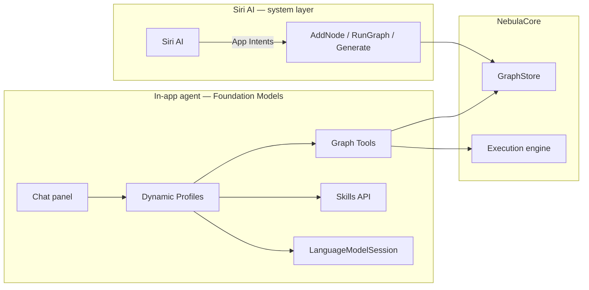

# Nebula iPad — Master Conversion Spec

Planning document for a **native iPad app** version of Nebula Nodes. Captures architecture decisions, contract-first conversion strategy, agent pipeline logic, competitive positioning, and iOS 27 Siri AI / Foundation Models agent integration.

> **Web repo stays canonical.** iPad is a contract-compliant port implemented in Swift/SwiftUI under `ipad/`. The existing Python/FastAPI backend and React frontend are not wrapped in WKWebView.

---

## Table of contents

1. [Vision and positioning](#1-vision-and-positioning)
2. [What we are building](#2-what-we-are-building)
3. [Competitive landscape](#3-competitive-landscape)
4. [Architecture](#4-architecture)
5. [Contract-first conversion](#5-contract-first-conversion)
6. [Agent pipeline](#6-agent-pipeline)
7. [Component taxonomy](#7-component-taxonomy)
8. [Phased roadmap](#8-phased-roadmap)
9. [iOS 27 Siri AI integration](#9-ios-27-siri-ai-integration)
10. [Foundation Models agent (Daedalus replacement)](#10-foundation-models-agent-daedalus-replacement)
11. [Testing strategy](#11-testing-strategy)
12. [Platform constraints](#12-platform-constraints)
13. [Repo layout](#13-repo-layout)
14. [v1 scope and defer list](#14-v1-scope-and-defer-list)
15. [Open decisions](#15-open-decisions)
16. [References](#16-references)

---

## 1. Vision and positioning

**Nebula Nodes** is a local-first, BYOK AI creation studio: visual node graph, 138 built-in nodes across 15 provider families, four universal nodes (OpenRouter, Nous Portal, Replicate, FAL), seven workspaces, optional agent chat that builds graphs from natural language.

The iPad version targets a **specific white space**:

> The only native iPad studio where you wire 100+ cloud models with your own keys — image, video, audio, and 3D — on a real node graph, with no subscription markup.

**Positioning statement (defensible today):**

| Competitor | Node graph | BYOK | Native iPad | Full creative studio |
|---|---|---|---|---|
| Flora (florafauna.ai) | Yes | No | Web only | Partial |
| MoodNode / Gulab | Yes | Partial | Browser only | Partial |
| NodeTool | Yes | Yes | Desktop + browser | Partial |
| Krea iOS | Web nodes only | No | Yes | Partial |
| SDAI | No | Yes | Yes | Image only |
| Aigentik | Yes | Yes | Yes | Automation, not media |
| **Nebula iPad (target)** | **Yes** | **Yes** | **Yes** | **Yes (phased)** |

Mac app remains a separate track (Electron/Tauri shell + bundled Python). iPad is a **native Swift rewrite** of engine + UI, not a remote client to Mac — though hybrid bootstrap against a Mac backend is allowed during development.

---

## 2. What we are building

### In scope (native iPad)

- SwiftUI app with touch-first UX
- Swift execution engine (`NebulaCore`) — graph model, topological sort, cache, handler registry
- BYOK API keys in Keychain (not plaintext `settings.json`)
- Provider HTTP clients ported from Python handlers
- Foundation Models in-app agent (replaces Hermes/Daedalus subprocess)
- App Intents for Siri AI / Shortcuts / Spotlight
- View Annotations for on-screen node awareness

### Out of scope for v1

| Item | Reason |
|---|---|
| WKWebView wrapping React app | Not native; defeats purpose |
| Hermes / Claude / Codex subprocess agents | iOS sandbox forbids |
| Remotion editor | JS runtime / web-specific |
| Full 138-node catalog day one | Port by handler waves |
| Cinema / Character / Moodboard studios | v1.1 after canvas works |
| Video editor (ffmpeg) | AVFoundation wave; v1.2 |
| EU consumer Siri AI on iPad | Apple platform limitation at launch |

---

## 3. Competitive landscape

Research date: 2026-06-30.

**Closest web analogs** (not native iPad): Flora, Figma Weave, MoodNode, Gulab, NodeTool Cloud.

**Closest native iPad analogs** (different product category): Aigentik (BYOK automation), Flow Nodes (VJ/graphics), SDAI (BYOK image form UI), Krea iOS (generate/refine; node editor stays on web).

**ComfyUI ecosystem**: Comfy Portal, Comfy Remote — remote controllers, not standalone studios.

**Conclusion:** Native iPad + BYOK + full creative node studio is an open lane. Krea is the brand to watch if they ship full Nodes on iPad.

---

## 4. Architecture

```
┌─────────────────────────────────────────────────────────────────┐
│  Nebula (SwiftUI)                                               │
│  ┌──────────────┐  ┌──────────────┐  ┌────────────────────────┐ │
│  │ Workspaces   │  │ Chat panel   │  │ Siri / Shortcuts       │ │
│  │ Create/Canvas│  │ (FM agent)   │  │ (App Intents)          │ │
│  └──────┬───────┘  └──────┬───────┘  └───────────┬────────────┘ │
│         │                 │                      │              │
│  ┌──────▼─────────────────▼──────────────────────▼────────────┐ │
│  │ GraphStore + UI view models                                │ │
│  └──────┬─────────────────────────────────────────────────────┘ │
│         │                                                       │
│  ┌──────▼─────────────────────────────────────────────────────┐ │
│  │ NebulaCore                                                   │ │
│  │  • Graph validation + topological execution                  │ │
│  │  • ExecutionCache                                            │ │
│  │  • Handler registry (Swift provider clients)                 │ │
│  │  • Output store (sandbox)                                    │ │
│  └──────┬─────────────────────────────────────────────────────┘ │
│         │                                                       │
│  ┌──────▼───────┐  ┌────────────────┐  ┌──────────────────────┐ │
│  │ Keychain     │  │ Files / iCloud │  │ Foundation Models    │ │
│  │ (BYOK keys)  │  │ (.nebula)      │  │ (on-device / PCC)    │ │
│  └──────────────┘  └────────────────┘  └──────────────────────┘ │
└────────────────────────────┬────────────────────────────────────┘
                             │ HTTPS (BYOK)
                             ▼
              OpenAI · Anthropic · Google · FAL · Replicate · …
```

### Layer responsibilities

| Layer | Role |
|---|---|
| **NebulaUI** | SwiftUI workspaces, touch gestures, Slava design tokens |
| **NebulaAgent** | Foundation Models session, Dynamic Profiles, Tools, Skills |
| **NebulaIntents** | App Intents, entities, View Annotations, App Shortcuts |
| **NebulaCore** | Graph engine, handlers, events — parity with `backend/` |
| **NebulaPlatform** | Keychain, networking, file sandbox, notifications |

### Dual agent surfaces



- **Siri AI** — voice/shortcuts front door; high-level commands
- **In-app agent** — Daedalus-style graph authoring; multi-step tool loops

Both call the same `GraphStore` methods. Both are generated from **Intent Contracts**.

---

## 5. Contract-first conversion

The durable asset is not React or Python — it is the **contract stack**. Agents emit target-specific implementations from shared contracts and prove parity with golden fixtures.

### Contract layers

| Contract | Source of truth today | Generates |
|---|---|---|
| **Node** | `backend/data/node_definitions.json` | Swift types, Intent param enums |
| **Handler** | `backend/handlers/*.py` + `docs/model-providers/` | Swift provider clients, contract tests |
| **Graph** | `.nebula` JSON + `graphStore` logic | `GraphStore`, persistence |
| **API** | `backend/main.py` routes + WS events | OpenAPI (reference), Swift models |
| **UI** | component source + `frontend/tests/` | SwiftUI + view model tests |
| **Intent** | *new* — derived from graph operations | App Intents + FM `Tool` structs |

### What makes a contract "good enough to convert"

1. **Typed I/O** — `POST /api/execute` request/response shapes, not prose
2. **Enumerated states** — `idle | generating | error`, not "handles loading"
3. **Golden fixtures** — pytest/Vitest JSON both platforms must match
4. **Named edge cases** — missing key, moderation error, cache hit
5. **Platform notes** — `ipad: Keychain`, `siri: LongRunningIntent`, `agent: Tool`

### Contract emission rule

```
Contract (canonical)
  → Agent selects target (SwiftUI / Handler / AppIntent / Tool)
  → Implementation
  → Parity test against fixture
  → Registry status: verified
```

Existing tooling already supports this direction:

- `scripts/check-node-contracts.mjs` — node definition drift gate
- `backend/tests/test_*.py` — handler oracle
- `frontend/tests/**` — UI logic oracle
- `docs/model-providers/**` — audit notes with `verified:` frontmatter

### Example intent contract

```yaml
# ipad/contracts/intents/run-graph.intent.yaml
intent_id: run-graph
exposes:
  - AppIntent          # Siri / Shortcuts / Spotlight
  - Tool               # Foundation Models in-app agent
parameters:
  scope:
    type: string
    enum: [full, selected_node, subgraph]
long_running: true
progress: ExecutionEvent stream
handler: GraphStore.run(scope:)
parity_fixture: ipad/Tests/Fixtures/run-graph.json
view_annotation: optional NodeEntity
```

---

## 6. Agent pipeline

Human or autonomous agents convert the web repo component-by-component. Each agent run is bounded: **spec → implement → verify → registry update**.

### Pipeline stages

| Stage | Agent | Output |
|---|---|---|
| **0 — Contract extraction** | `contract-extractor` | `ipad/contracts/` |
| **1 — Platform foundation** | `platform-scaffold` | Keychain, networking, files, design tokens |
| **2 — Core engine** | `engine-porter` | Graph model, toposort, cache, events |
| **3 — Handler ports** | `handler-porter` | Swift handlers from Python + pytest fixtures |
| **4 — UI surfaces** | `ui-porter` | SwiftUI workspaces |
| **5 — Agent + Siri layer** | `agent-scaffold`, `intent-scaffold` | Tools, Profiles, App Intents |
| **6 — Integration** | `integration-verifier` | Cross-flow E2E smokes |
| **7 — Release hardening** | `release-auditor` | App Store compliance |

Stages 3 and 4 can run in parallel once engine + contracts exist. UI may mock handlers until Swift handlers pass contract tests.

### Per-component agent loop

```yaml
component_id: create-view
tier: B
dependencies: [platform-networking, handler-gpt-image-generate]
source_files:
  - frontend/src/components/create-studio/*
  - frontend/tests/lib/create*.test.ts
api_routes:
  - POST /api/graph/cluster
  - POST /api/execute
done_when:
  - parity_tests_pass
  - smoke_generate_flow
```

**Agent steps:** Extract → Classify tier → Implement → Port tests → Verify → Update `component-registry.yaml`.

### Agent roles

| Agent | Does | Never does |
|---|---|---|
| `contract-extractor` | Generate `ipad/contracts/` | Write UI |
| `engine-porter` | Swift graph runner | Touch SwiftUI |
| `handler-porter` | One handler + tests | Redesign UX |
| `ui-porter` | One workspace + view model | Change API contracts |
| `test-porter` | TS/pytest → XCTest fixtures | Implement features |
| `agent-scaffold` | FM Tools + Dynamic Profiles | Siri phrase tuning |
| `intent-scaffold` | App Intents + View Annotations | Handler logic |
| `integration-verifier` | Cross-flow E2E | Single-component fixes |

### Orchestrator pseudologic

```python
for component in topological_sort(COMPONENT_REGISTRY):
    if not all_deps_verified(component):
        continue
    dispatch_agent(component)
    if not gate_passed(component.done_when):
        block_downstream(component.id)
        escalate_to_human()
    else:
        mark_verified(component.id)
```

Work queue: [`component-registry.yaml`](./component-registry.yaml).

### Agent task packet (every invocation)

Each agent receives:

1. Component spec YAML (`ipad/specs/{id}.yaml`)
2. Relevant contracts from `ipad/contracts/`
3. Source file list (read-only)
4. Output path list (write)
5. Tier rules + touch requirements (44pt min targets, no hover-only)
6. `done_when` checklist
7. Verify command: `xcodebuild test -only-testing:…`

### Hybrid bootstrap (development)

During conversion, UI agents may target a **Mac Nebula backend over LAN** while Swift handlers are ported. Each component contract lists required endpoints; mocks acceptable until handler `verified`.

---

## 7. Component taxonomy

| Tier | What | Conversion rule | Test gate |
|---|---|---|---|
| **A** | Pure UI chrome | Touch redesign; preserve behavior | Snapshot + interaction |
| **B** | REST/client UI | Port store logic; same API shapes | Contract + logic parity |
| **C** | Graph/canvas UI | Rebuild interactions (not React Flow verbatim) | Gesture + state machine |
| **D** | Handlers + engine | Swift from Python + audit doc | Ported pytest fixtures |
| **E** | System deps | Replace or defer | Platform matrix |
| **Intent** | Siri + FM agent | App Intent + Tool from same contract | AppIntentsTesting |

### Web → iPad mapping

| Web component | Tier | iPad v1 |
|---|---|---|
| Settings | B | Ship |
| Create view | B | Ship |
| Canvas + nodes | C | Ship (basic) |
| Moodboard / Character / Cinema | B | v1.1 |
| Video editor | D+E | v1.2 |
| Remotion editor | — | Defer |
| Agent chat (Hermes) | — | Replace with FM agent |
| Brand showcase | A | Skip |

### Handler port waves

| Wave | Handlers | Rationale |
|---|---|---|
| W0 | Utility (text-input, preview, reroute) | No API keys; validates plumbing |
| W1 | OpenAI image + text | Best documented; high dogfood value |
| W2 | Google (Gemini, Imagen, Nano Banana) | Same httpx patterns |
| W3 | FAL + OpenRouter universal | One handler → many models |
| W4 | ElevenLabs, Runway, video | Async-poll |
| W5 | 3D (Meshy), SVG (Quiver), cinema | Specialized I/O |
| W6 | Remaining families | Post-launch catalog expansion |

---

## 8. Phased roadmap

### Phase 0 — Contracts (no native code)

- [ ] `contract-extractor` script → `ipad/contracts/`
- [ ] Intent contract schema defined
- [ ] `component-registry.yaml` populated (done — draft)
- [ ] Gate: `check-node-contracts.mjs` passes; contract gen deterministic

### Phase 1 — Foundation + engine

- [ ] Xcode project scaffold (`ipad/Nebula/`)
- [ ] Keychain settings, graph JSON persistence
- [ ] Swift graph model, toposort, cache, event stream
- [ ] Gate: engine tests green against Python fixtures

### Phase 2 — Handlers W0–W3 + Create view

- [ ] Utility + OpenAI + FAL/OpenRouter handlers
- [ ] Create view SwiftUI (best iPad-first surface)
- [ ] Settings with Keychain
- [ ] Gate: generate flow end-to-end on device

### Phase 3 — Canvas + agent layer

- [ ] Canvas engine (pan/zoom/connect/validate ports)
- [ ] Foundation Models Tools (graph operations)
- [ ] Dynamic Profiles (Planner / Executor / Daedalus)
- [ ] Skills ported from `daedalus-core`
- [ ] Chat panel UI
- [ ] Gate: "text → agent builds graph → run → preview" smoke

### Phase 4 — Siri + polish

- [ ] App Intents (run graph, generate, add node)
- [ ] View Annotations on canvas nodes
- [ ] App Shortcuts
- [ ] LongRunningIntent for video jobs
- [ ] Gate: AppIntentsTesting + manual Siri smokes

### Phase 5 — v1.1 studios

- [ ] Moodboard, Character, Cinema studios
- [ ] Expand handler catalog toward 138 nodes

### Phase 6 — Mac app (parallel track)

- Electron/Tauri + bundled Python (separate spec; shares contracts)

---

## 9. iOS 27 Siri AI integration

Based on [Apple Newsroom (2026-06)](https://www.apple.com/newsroom/2026/06/apple-introduces-siri-ai-a-profoundly-more-capable-and-personal-assistant/) and [WWDC26 Apple Intelligence guide](https://developer.apple.com/wwdc26/guides/apple-intelligence/).

### What Siri AI is (iOS 27)

- Rebuilt conversational assistant with dedicated **Siri app** (iCloud-synced history)
- Personal context (Messages, Mail, Photos + **third-party via Spotlight** when integrated)
- Onscreen awareness (View Annotations)
- Cross-app actions
- Visual Intelligence on iPad
- Powered by next-gen **Apple Foundation Models** (+ Private Cloud Compute)

### How developers participate

Apple's stack:

| System component | Role |
|---|---|
| **Spotlight semantic index** | Your App Entities discoverable by meaning |
| **App Toolbox** | System knows what features exist across apps |
| **System orchestrator** | Routes requests; privacy-preserving |
| **Your App Intents** | Structured actions Siri executes |

**Siri does not load installable skill packs.** You register **App Intents** and **App Entities**. Siri handles language; your app executes.

### APIs to adopt

| API | Nebula use |
|---|---|
| `AppEntity` | `NodeEntity`, `GraphEntity`, `GenerationEntity`, `CharacterEntity` |
| `AppIntent` / `AssistantIntent` | `RunGraphIntent`, `AddNodeIntent`, `GenerateIntent` |
| App Schemas / Domains | Map to shapes Siri understands (no training phrases) |
| `IndexedEntity` | "Show my last GPT Image output" |
| View Annotations | "Change the prompt on **this** node" |
| `Transferable` | Pass images between apps |
| `LongRunningIntent` | Video / 3D generation |
| `AppIntentsTesting` | Test through real Siri pathways |

### Siri vs in-app agent

| | Siri AI | In-app FM agent |
|---|---|---|
| **Who runs the model** | Apple (on-device / PCC) | Your app (on-device / PCC / BYOK cloud) |
| **How app is controlled** | App Intents | `Tool` protocol |
| **Skills** | No — intents only | Yes — Skills API in FM utilities |
| **Best for** | Quick commands, Shortcuts | Complex graph authoring |
| **Nebula analog** | "Run my graph" | Daedalus full loop |

### Availability caveats

- English beta first; more languages later
- Not in China
- **Not on iOS/iPadOS in EU initially** (Mac/Vision Pro in EU)
- Requires Apple Intelligence hardware

### Planned Nebula App Intents (v1)

| Intent | Parameters | Long-running |
|---|---|---|
| `RunGraphIntent` | scope: full / node / subgraph | Yes |
| `AddNodeIntent` | definitionId, prompt?, position? | No |
| `ConnectNodesIntent` | sourceNodeId, sourcePort, targetNodeId, targetPort | No |
| `GenerateImageIntent` | prompt, model?, refs? | Yes |
| `OpenGenerationIntent` | generationId | No |
| `SaveGraphIntent` | name? | No |
| `LoadGraphIntent` | file | No |

Register via `AppShortcutsProvider` for discoverability without user configuration.

---

## 10. Foundation Models agent (Daedalus replacement)

The in-app chat agent replaces `hermes-daedalus` subprocess + `nebula` CLI tools. Implemented with **Foundation Models framework** (iOS 27).

Sources: [WWDC26 — Build agentic app experiences](https://developer.apple.com/videos/play/wwdc2026/242/), [What's new in Foundation Models](https://developer.apple.com/videos/play/wwdc2026/241/).

### Web agent today

```
User message
  → hermes-daedalus chat (subprocess)
  → nebula create / connect / run / graph (CLI)
  → cli_graph mutation
  → graphSync WebSocket → canvas updates
```

Primer rules live in `backend/services/chat_session.py` (`NEBULA_SYSTEM_PRIMER`). Cookbook in `.hermes/skills/daedalus-core/SKILL.md`.

### iPad agent architecture

```
User message
  → LanguageModelSession (Dynamic Profiles)
  → Tool calls (Swift)
  → GraphStore mutation
  → @Observable canvas refresh
```

No subprocess. No WebSocket bridge. Direct store updates.

### Core APIs

| API | Purpose |
|---|---|
| `LanguageModelSession` | Conversation + tool loop |
| `DynamicProfile` | Switch instructions/tools/model per phase |
| `Tool` | `addNode`, `connectNodes`, `runGraph`, `getGraph` |
| `DynamicInstructions` | Composable instruction blocks |
| **Skills** (FM utilities package) | Procedural knowledge — port `daedalus-core` |
| `ToolCallingMode` | `.required` for agentic action loops |
| `historyTransform` | Trim context when switching models |
| Language Model protocol | Optional BYOK cloud model (Claude, etc.) |

### Dynamic Profiles (agent modes)

| Profile | Model | Tools | Instructions source |
|---|---|---|---|
| **Daedalus** | PCC or BYOK | All graph tools | Persona + full cookbook |
| **Planner** | PCC (reasoning) | `getGraph`, `addNode` (read-heavy) | Plan pipeline, don't execute |
| **Executor** | On-device or PCC | `runGraph`, `connectNodes` | Execute plan steps |
| **Quick** | On-device | `generateImage` only | Create-view shortcuts |

**Orchestration patterns** (from Apple WWDC26):

- **Baton-pass** — profiles share transcript; tool toggles active profile (Planner → Executor)
- **Phone-a-friend** — spawn short-lived sub-session for subtask (e.g. title generation)

### Graph Tools (port from CLI)

| CLI command | Swift Tool | GraphStore method |
|---|---|---|
| `nebula graph` | `GetGraphTool` | `graphSnapshot()` |
| `nebula create <type>` | `AddNodeTool` | `addNode(definitionId:params:)` |
| `nebula connect` | `ConnectNodesTool` | `connect(from:to:)` |
| `nebula set <id> k=v` | `SetNodeParamsTool` | `updateNode(id:params:)` |
| `nebula run` | `RunGraphTool` | `execute(scope:)` |
| `nebula delete` | `DeleteNodeTool` | `removeNode(id:)` |

Each Tool conforms to `Tool` protocol:

```swift
struct AddNodeTool: Tool {
    let name = "addNode"
    let description = "Add a node to the canvas by definition ID."

    @Generable struct Arguments {
        @Guide(description: "Node definition ID, e.g. gpt-image-2-generate")
        let definitionId: String
        @Guide(description: "Optional prompt for text-input nodes")
        let prompt: String?
    }

    @Dependency var graph: GraphStore

    func call(arguments: Arguments) async throws -> String {
        let node = try await graph.addNode(
            definitionId: arguments.definitionId,
            params: arguments.prompt.map { ["text": $0] } ?? [:]
        )
        return "Created node \(node.id) (\(arguments.definitionId))"
    }
}
```

### Skills (Daedalus cookbook port)

Apple's **Foundation Models framework utilities** package includes a `Skills` type for procedural context loading — explicitly modeled on the popular skills pattern.

Port from `.hermes/skills/daedalus-core/SKILL.md`:

| Skill content | Activation |
|---|---|
| Branch don't overwrite | Variant / aspect-ratio requests |
| Aspect ratio vocabulary | iPhone → 9:16, cinema → 2.39:1, etc. |
| Verify after create | Re-read graph after param set |
| Provider param casing gotchas | Nano Banana mixed snake/camel |
| Pipeline cookbooks | Image chain, video chain, SVG chain |
| FAL i2v URL compatibility | v3.fal.media WebPs safest |

```swift
struct DaedalusSkills: LanguageModelSession.DynamicInstructions {
    var activations: SkillActivations

    var body: some DynamicInstructions {
        Skills(activations: activations) {
            Skill(
                name: "branch-dont-overwrite",
                description: "Default to new nodes for variants; modify in place only on explicit replace signals.",
                content: { /* ported markdown chunks */ }
            )
            Skill(name: "aspect-ratios", ...)
            Skill(name: "verify-after-create", ...)
        }
    }
}
```

### Primer rules → Profile instructions

Port `NEBULA_SYSTEM_PRIMER` bullets into `DynamicInstructions` on the Daedalus profile:

1. Always `getGraph` first
2. Branch by default; reuse existing inputs
3. Never dump raw tool output — canvas is the output surface
4. Verify params landed after create/set
5. Vision: attach image bytes when user asks about output quality

### Model routing

| Task | Recommended model |
|---|---|
| Graph planning / complex wiring | Private Cloud Compute or BYOK Claude |
| Quick param edits | On-device Foundation Model |
| User-configured BYOK | Language Model protocol → OpenRouter / Anthropic |
| Offline canvas edits | No model — local GraphStore only |

Respect privacy boundaries: don't send Keychain contents to cloud models; redact in `historyTransform` when switching from PCC to on-device.

### Chat UI

Port `ChatPanel.tsx` behaviors:

- Streaming text display
- Tool call narration ("Adding GPT Image node…")
- Code block → Apply to node (paste prompt back)
- `@nX` node references
- Drag image into chat for vision (when model supports images)
- No subprocess spawn UI — agent status from session `isResponding`

### What we are NOT doing

- Hermes / Claude CLI subprocess (forbidden on iOS)
- `nebula quick` one-shot mode (unless ported as simplified Tool-only profile)
- Nous Portal OAuth via `~/.hermes/auth.json` (use OpenRouter BYOK or in-app OAuth flow instead)

---

## 11. Testing strategy

### Three layers

| Layer | Oracle | Applies to |
|---|---|---|
| **Contract tests** | Ported pytest handler fixtures | Handlers (Tier D) |
| **Logic parity** | Ported Vitest store tests | View models (Tier B/C) |
| **UI / Intent smoke** | XCUITest + AppIntentsTesting | Workspaces, Siri |

**Rule:** A component is not `verified` until all applicable layers pass.

### Fixture export (one-time / CI)

```bash
# Backend handler fixtures → ipad/Tests/Fixtures/
cd backend && python -m pytest tests/test_openai_image.py --fixture-export=../ipad/Tests/Fixtures/

# Frontend logic tests → manual port checklist per component spec
```

### Integration smokes

| ID | Flow |
|---|---|
| F1 | Settings → Create → generate → result in gallery |
| F2 | Add node → wire → run → preview output |
| F3 | Siri: "Run my Nebula graph" |
| F4 | Load `.nebula` from Files → graph restores |
| F5 | Agent: "Text input → GPT Image → preview" → graph matches |
| F6 | View Annotation: select node → Siri "change prompt to …" |

### Siri-specific testing

1. **AppIntentsTesting** — invoke intents in isolation (no Siri UI)
2. **Shortcuts app** — manual multistep workflows
3. **Siri on device** — phrase variations, disambiguation, long-running progress

---

## 12. Platform constraints

| Web / Mac capability | iPad approach |
|---|---|
| Python FastAPI backend | Swift `NebulaCore` handlers |
| `settings.json` plaintext keys | Keychain |
| `~/.nebula/state.json` | App sandbox + optional iCloud |
| `ffmpeg` subprocess | AVFoundation (video editor wave) |
| `hermes-daedalus` subprocess | Foundation Models agent |
| `open -R` Finder reveal | Share sheet / Files integration |
| Long-running graph jobs | `LongRunningIntent` + BGTask / progress UI |
| React Flow canvas | Custom SwiftUI canvas engine |
| Remotion (JS) | Defer |
| CORS localhost | N/A — single process |
| 138 nodes day one | Handler waves |

### App Store compliance

- No arbitrary code execution (Remotion, subprocess agents out)
- API keys in Keychain only
- Network: direct to provider URLs (same as web BYOK thesis)
- Privacy nutrition labels: data goes to user-configured providers only
- EU: ship app; Siri AI features gracefully absent until Apple enables

---

## 13. Repo layout

```
nebula-nodes/
├── backend/                    # Reference implementation (unchanged)
├── frontend/                   # Reference implementation (unchanged)
├── docs/ipad-conversion/       # This spec + registry
│   ├── NEBULA-IPAD-SPEC.md
│   ├── component-registry.yaml
│   └── README.md
└── ipad/                       # NEW — all native work
    ├── contracts/              # Generated from web repo (committed)
    │   ├── nodes.schema.json
    │   ├── graph.schema.json
    │   ├── routes.openapi.json
    │   ├── handlers/
    │   └── intents/
    ├── specs/                  # Per-component agent specs (generated)
    ├── orchestrator/           # Dispatch scripts (future)
    ├── Nebula/                 # Xcode app target
    ├── NebulaCore/             # Engine + handlers
    ├── NebulaUI/               # SwiftUI workspaces
    ├── NebulaAgent/            # FM Tools + Profiles + Skills
    ├── NebulaIntents/          # App Intents + entities
    ├── NebulaPlatform/         # Keychain, files, networking
    └── Tests/
        ├── Fixtures/           # Golden files from Python/TS tests
        ├── ContractTests/
        ├── AgentTests/
        └── UITests/
```

---

## 14. v1 scope and defer list

### Ship in v1

- Settings (Keychain BYOK)
- Create view
- Canvas (add, wire, run, preview; touch-optimized)
- Graph save/load (Files)
- Handlers W0–W3 (~15–20 node types + universal nodes)
- Foundation Models in-app agent (core graph tools + Daedalus skills)
- App Intents (run, generate, add node)
- View Annotations (selected node)

### Defer

| Item | Target |
|---|---|
| Moodboard / Character / Cinema studios | v1.1 |
| Video editor | v1.2 |
| Remotion editor | — |
| Full 138-node catalog | Ongoing waves |
| Hermes / Nous Portal OAuth | Replace with OpenRouter BYOK |
| Mac app | Parallel track |
| EU Siri AI | Wait for Apple |

---

## 15. Open decisions

| # | Decision | Options | Notes |
|---|---|---|---|
| 1 | Cloud model for Daedalus | PCC only vs BYOK Claude/OpenRouter vs user choice | BYOK aligns with thesis |
| 2 | iCloud graph sync | On vs off for v1 | Conflicts with local-first? |
| 3 | iPad ↔ Mac handoff | Universal Clipboard graph JSON vs independent | Nice-to-have |
| 4 | Agent UI default | Chat panel always visible vs Siri-first | Both supported |
| 5 | Repo layout | `ipad/` in monorepo vs private repo | Monorepo shares contracts |
| 6 | Canvas tech | Pure SwiftUI vs SpriteKit/Metal for perf | Profile large graphs first |
| 7 | Live-smoke on iPad | Device-only gate vs CI mocked | Match web discipline |

---

## 16. References

### Apple (iOS 27 / WWDC26)

- [Apple introduces Siri AI](https://www.apple.com/newsroom/2026/06/apple-introduces-siri-ai-a-profoundly-more-capable-and-personal-assistant/)
- [WWDC26 Apple Intelligence guide](https://developer.apple.com/wwdc26/guides/apple-intelligence/)
- [Build intelligent Siri experiences with App Schemas](https://developer.apple.com/videos/play/wwdc2026/240/)
- [Build agentic app experiences with Foundation Models](https://developer.apple.com/videos/play/wwdc2026/242/)
- [What's new in Foundation Models](https://developer.apple.com/videos/play/wwdc2026/241/)
- [Validate App Intents with AppIntentsTesting](https://developer.apple.com/videos/play/wwdc2026/295/)
- [Platforms State of the Union](https://developer.apple.com/videos/play/wwdc2026/102/)

### Nebula (web reference)

- `README.md` — product thesis, architecture
- `backend/data/node_definitions.json` — node catalog
- `backend/services/chat_session.py` — agent primer
- `.hermes/skills/daedalus-core/SKILL.md` — agent cookbook
- `scripts/check-node-contracts.mjs` — contract drift gate
- `docs/research-2026-06/flora-comfyui-gap-analysis.md` — desktop packaging gap

### Competitive research (2026-06-30)

- Krea iOS: [canvas.krea.ai/download/ios](https://canvas.krea.ai/download/ios) — nodes web-only
- Aigentik: [aigentik.app](https://aigentik.app/) — native BYOK automation
- NodeTool: [nodetool.ai](https://nodetool.ai/) — AGPL peer; desktop + browser
- SDAI: [sdai.moroz.cc](https://sdai.moroz.cc/) — BYOK mobile image client

---

## Changelog

| Date | Change |
|---|---|
| 2026-06-30 | Initial draft from planning discussion |
