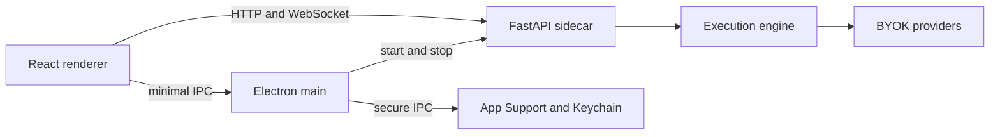

# Nebula for macOS

## Goal

Package Nebula Nodes as a signed, notarized macOS application without rewriting
the React user interface or the FastAPI execution engine. The desktop app stays
local-first and BYOK: the renderer talks only to a loopback backend, while the
backend continues to make provider requests with the user's credentials.

The first release targets macOS 13 (Ventura) and later on Apple Silicon. Intel
support is deferred until the packaged Python-native dependency set has been
validated universally.

## Architecture

Electron is the desktop shell. It is the lowest-risk route because Nebula's
current UI already depends on browser-compatible React, React Flow, WebGL,
Three.js, Spark, and Remotion libraries.

### Process boundaries

- **Renderer:** packaged Vite assets. It receives a loopback API base URL and
  WebSocket base URL from a narrowly-scoped preload bridge.
- **Main process:** selects a free loopback port, starts the Python sidecar,
  waits for its health endpoint, opens the application window, and terminates
  the sidecar during app shutdown.
- **FastAPI sidecar:** retains the existing routes, handlers, graph executor,
  streaming, and output serving. It binds only to `127.0.0.1`.
- **Provider network:** only the sidecar makes outbound BYOK provider calls.

No renderer code may receive an API key or direct filesystem capability.

## Data and credentials

| Data | macOS location | Protection |
|---|---|---|
| Graphs, outputs, logs, cache | `~/Library/Application Support/Nebula Nodes/` | Per-user filesystem permissions |
| API keys | macOS Keychain | Electron `safeStorage`, accessed through main-process IPC |
| Runtime diagnostics | `~/Library/Logs/Nebula Nodes/` | Redacted, no secrets |
| Bundled app resources | `Nebula Nodes.app/Contents/Resources/` | Signed application bundle |

The backend receives a key only for the duration of the request path that needs
it. The migration must import existing local settings once, offer a visible
completion/failure report, and delete no source data automatically.

## Lifecycle

1. Electron starts and creates the App Support directories.
2. It allocates an unused loopback port and launches the packaged Python
   executable with that port and the App Support root.
3. It waits for a bounded `/api/health` probe.
4. It loads the renderer with the injected API and WebSocket bases.
5. On quit or a fatal sidecar exit, Electron stops new requests, reports a
   recoverable error, and terminates the child process.

The app uses a single-instance lock. A second launch focuses the existing
window rather than starting another backend.

## Security requirements

- Bind FastAPI to loopback only and use a per-launch random bearer token between
  Electron and the sidecar.
- Enable a restrictive packaged-app CSP. Keep the existing no-runtime-codegen
  Spark and Lottie build protections.
- Expose only reviewed, argument-validated IPC methods: file open/save,
  Finder reveal, clipboard, app paths, diagnostics export, and secret access.
- Keep `contextIsolation` enabled, disable Node integration in the renderer,
  and do not expose a generic IPC send/invoke bridge.
- Redact tokens, authorization headers, prompts marked private, and local file
  paths where possible from logs and crash reports.

## Packaging and release

The distributable is a signed and notarized DMG. The first release uses a
universal Electron shell only after the sidecar is verified on both target
architectures; otherwise ship an Apple Silicon build with an explicit
architecture label.

The release pipeline must:

1. Build frontend assets and Python sidecar from locked dependencies.
2. Run unit and integration tests.
3. Build the `.app`, codesign nested binaries, and verify signatures.
4. Notarize and staple the DMG.
5. Publish a signed update manifest and artifacts.

Auto-update is opt-in for the initial beta. Updates must never silently replace
user graphs, outputs, or credentials.

## Acceptance gates

- Fresh install launches without a developer environment.
- Upgrade imports legacy local settings without losing source data.
- Generate, stream, cancel, recover, save, load, download, and Finder reveal
  work using the packaged app.
- The backend is unreachable from non-loopback interfaces.
- Keychain values do not appear in settings files, renderer state, logs, or
  diagnostic bundles.
- Quit/relaunch leaves no orphaned sidecar process.
