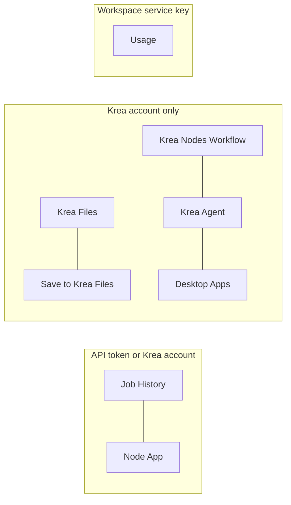

# Krea workspace nodes

These nodes reach the parts of Krea beyond single-model generation. Every one
runs only when you run it. Where Krea offers a feature on one billing path
only, the node says so and stops before sending anything on the other.

| Node | Krea surface | Billing paths | Notes |
|---|---|---|---|
| Krea Job History | `GET /jobs`, `GET /jobs/{id}`, MCP `get_job` | List: API token. One job: both | **Save media** copies completed results into the run. |
| Krea Node App | `GET /node-apps/{id}`, `POST /node-apps/{id}/execute`, MCP `get_node_apps`, `execute_node_app` | Both | Inputs are checked against the app's schema first. Wired images fill the app's image fields in order, wired text fills its first text field, and **Input (JSON)** or the Inputs port set fields by name. The account path runs public and workspace-shared apps only. |
| Krea Files | MCP `list_files`, `read_files` | Account | Text comes in as text, SVG as SVG, other media as files in the run. |
| Save to Krea Files | MCP `create_folders`, `write_files_upload`, `write_files_inline`, `tag_files` | Account | Raw-byte upload as Krea asks (never multipart). Files over 20 MB use Krea's direct grant; a multipart grant is refused. |
| Krea Nodes Workflow | MCP `create_node_workflow`, `read_node_workflow`, `update_node_workflow` | Account | Creating returns a krea.ai link; nothing runs until you open it in Krea. Read and edit take a typed workflow ID, never a wired one. |
| Krea Agent | MCP `send_agent_message`, `wait_for_agent_session` | Account | Bills the workspace and approves its own cost prompts. Krea has no stop for a turn: Nebula's Stop only stops waiting. |
| Krea Desktop Apps | MCP `list_desktop_apps`, `get_desktop_tools`, `call_desktop_tool` | Account | Running a tool changes the open project immediately. The app ID is typed and changes when the app reopens, so a shared recipe cannot reach your project. A wired Krea job fills `jobId` for import tools. |
| Krea Usage | `GET /usage` | Workspace service key (`KREA_USAGE_KEY`) | Enterprise plans only; Krea refuses personal API tokens and browser sessions. Direct-API jobs bill in dollars and are not listed. |

Plans and the free trial live on the Krea connection card in Settings
(MCP `show_plans`, `start_free_trial`) once Krea is connected. **Show Krea
plans** loads them on request. **Start a free Pro trial** appears only when
Krea offers the account a trial; it asks Krea for a checkout link, which you
then open yourself. Links are kept only when they point at krea.ai (plans) or
Stripe checkout (trial). Card details are entered on Krea's or Stripe's page,
never in Nebula, and Nebula never completes a purchase.

## Fetching results

Media Krea points to (job results, Files, Agent deliverables) is downloaded
only from public https hosts, with every redirect re-checked, no credentials
sent and a 1 GB cap. SVGs and other document-like outputs are served with a
sandboxing content-security policy, so a script inside one cannot run.

## Agent access

Nebula's agents may call only read-only Krea discovery tools (see
`docs/KREA-MCP.md`). They use these nodes, run explicitly, for everything
else. Krea Files listings stay off the agent bridge.
