# Soul Cinema — real-image pillar smoke

Eyeball-able proof that the two deterministic Soul Cinema pillars look good on a
**real generated still**. Every image below was produced by calling the backend
`cinema` package functions **directly** — no server, no API calls:

- **Soul HEX (color):** `cinema.color.transfer_to_palette(img, swatches, strength, method)`
- **Film-look post:** `cinema.look.apply_look(img, look_dict)` (named presets in `cinema.look.PRESETS`)

Regenerate with: `cd backend && .venv/bin/python ../docs/soul-cinema-smoke/_generate_smoke.py`

**Input:** `output/chat-uploads/06cdd0273182…a70b1.png` — a cinematic golden-hour
view of ancient Athens (blacksmith figure in the foreground, Athena statue, the
Acropolis, warm forge fires, deep shadows → bright sky). Wide tonal range and
warm/cool balance make it a strong test for every pillar.

Source palette extracted by `extract_palette(img, k=6)` (darkest → lightest):
`#19140b  #33291b  #52412d  #785939  #af8558  #d8b889`

---

## Original

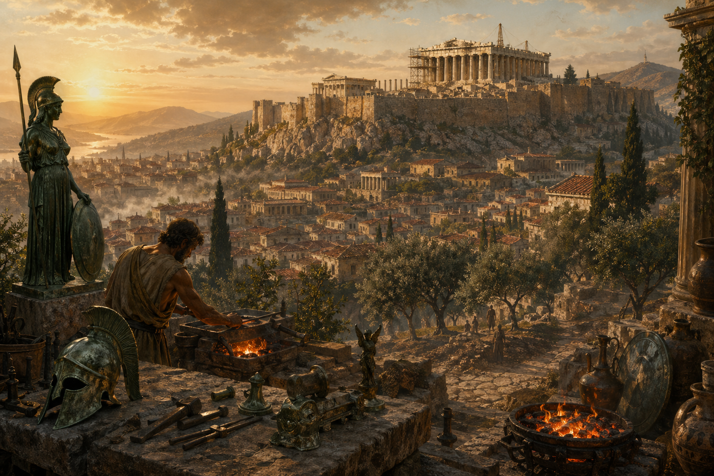

*Untouched source still (re-saved as PNG), 1535×1024.*

---

## Pillar 1 — Soul HEX color transfer (`transfer_to_palette`, lab-transfer, strength 0.7)

Each image pushes the source's colors toward a different 6-swatch target palette.

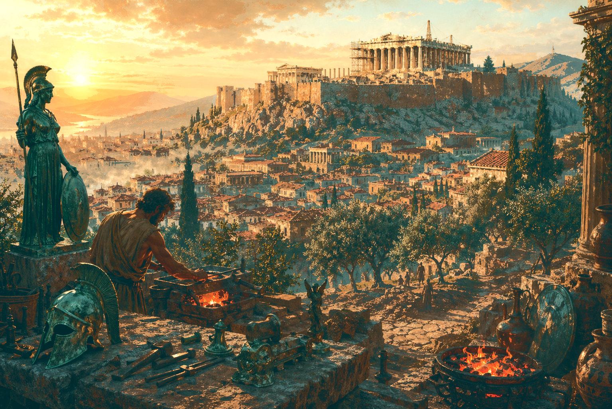

*Warm teal-orange grade — deepens the golden glow, teal-leans the foliage shadows; forge fires stay hot orange.*

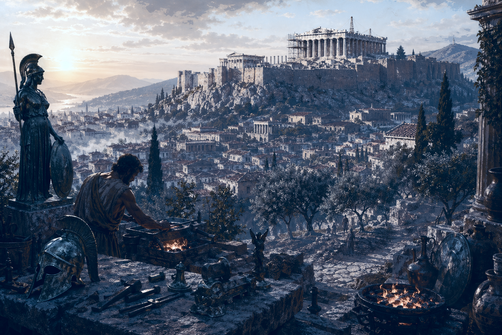

*Cool blue / moonlit grade — the golden hour reads as blue night while the fires remain warm accents (per-pixel nudge-to-nearest at work).*

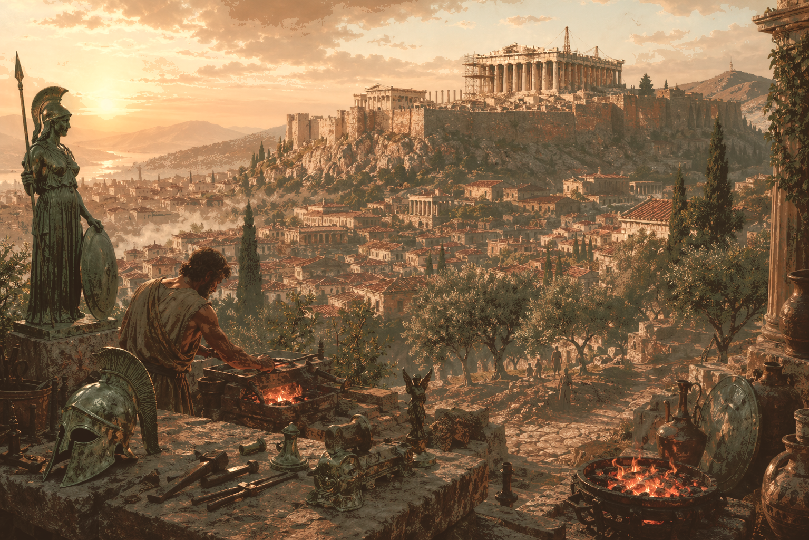

*Muted autumn / dusty-rose grade — softer, desaturated earth tones across the city and olive groves.*

---

## Pillar 2 — Film-look post (`apply_look`, named presets)

Each image applies one curated preset (contrast / saturation / temperature /
teal-orange split / grain / halation / vignette bundled per preset).

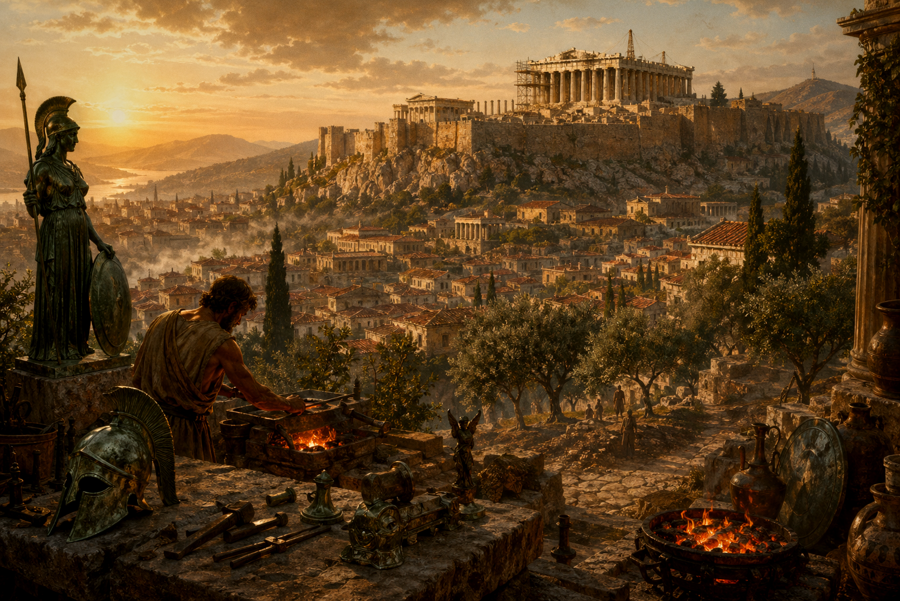

*`kodak-portra` — warm, gentle contrast, soft halation, restrained grain; flattering skin-friendly grade.*

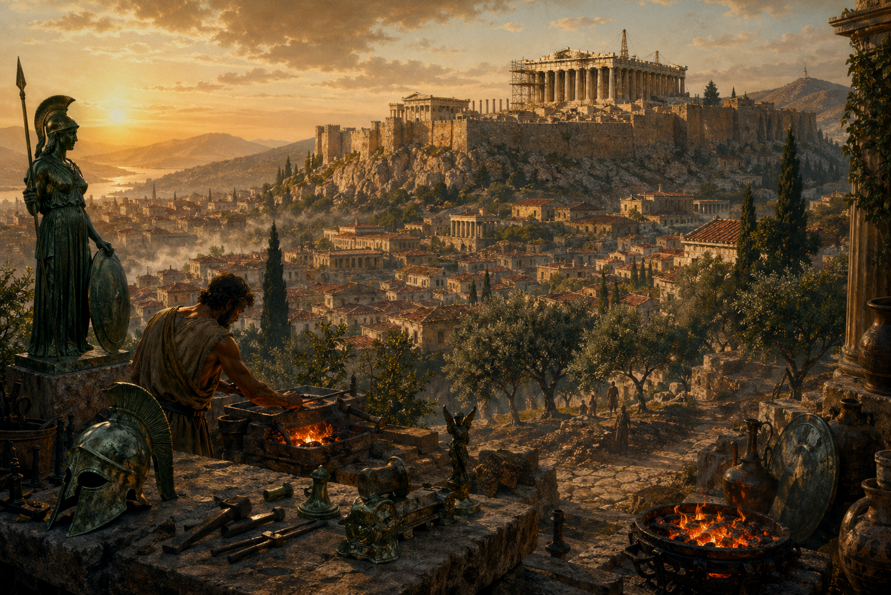

*`fuji-400h` — cooler, slightly higher saturation with a light teal-orange lean; clean editorial look.*

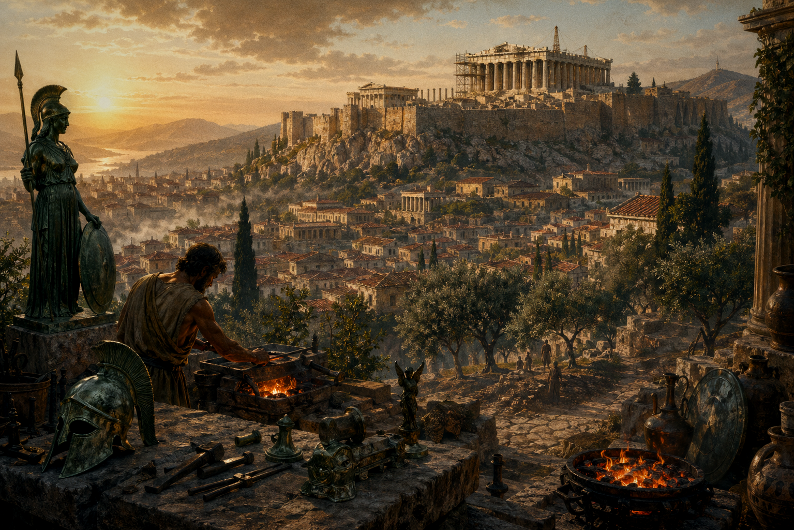

*`cinestill-800t` — strong red halation bloom around the sun and highlights, tungsten-cool cast, heavier grain.*

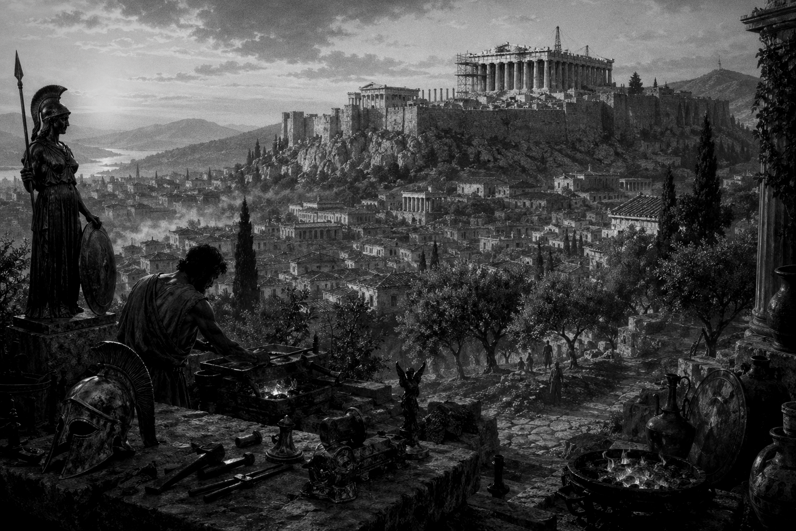

*`bw-tri-x` — high-contrast black-and-white with pronounced grain and a deep vignette.*

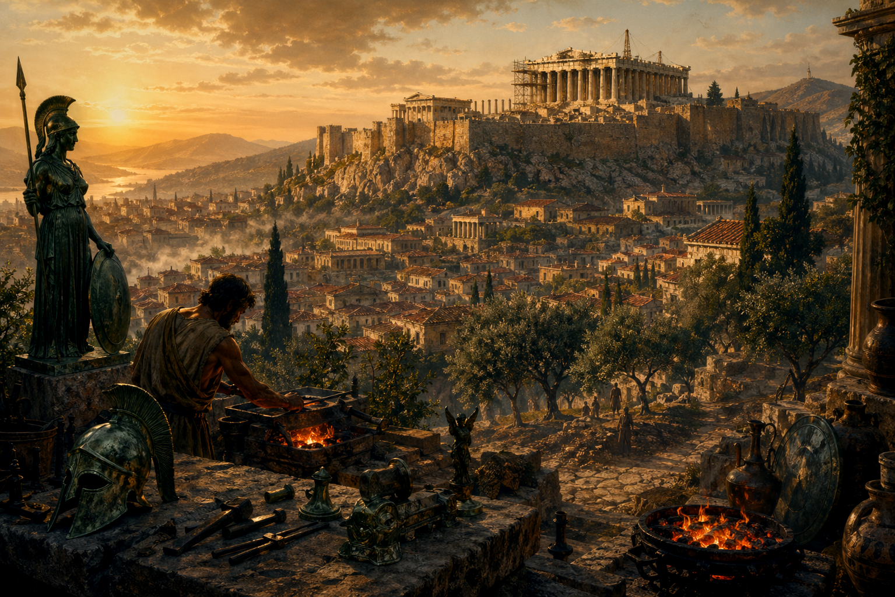

*`teal-orange` — blockbuster shadows-teal / highlights-orange split with mild halation and vignette.*

---

## Full pipeline — color transfer **then** film-look

Both pillars chained, mirroring how `cinema-scene` grades a shot (palette → look).

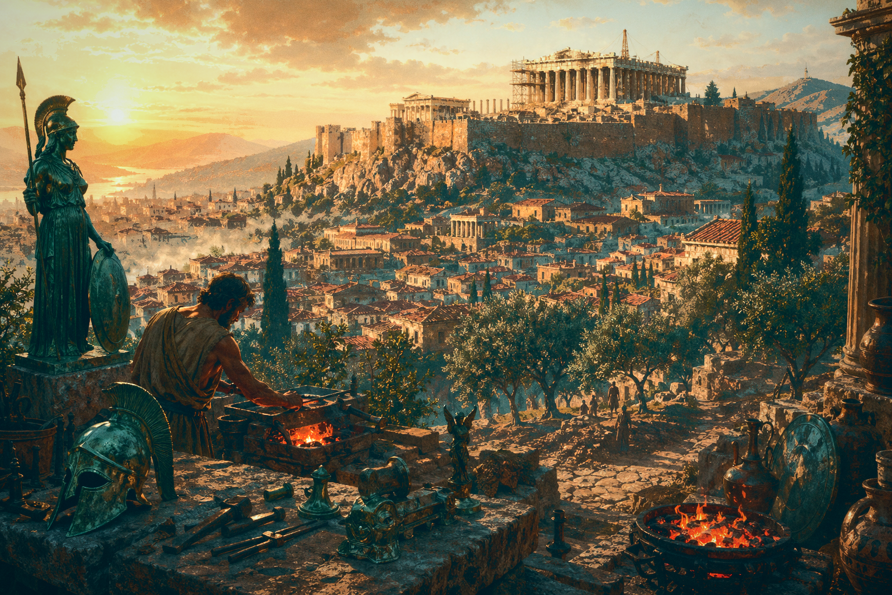

*Warm teal-orange palette (strength 0.6) → `cinestill-800t` — rich saturated golden grade with teal shadows and a red halation bloom.*

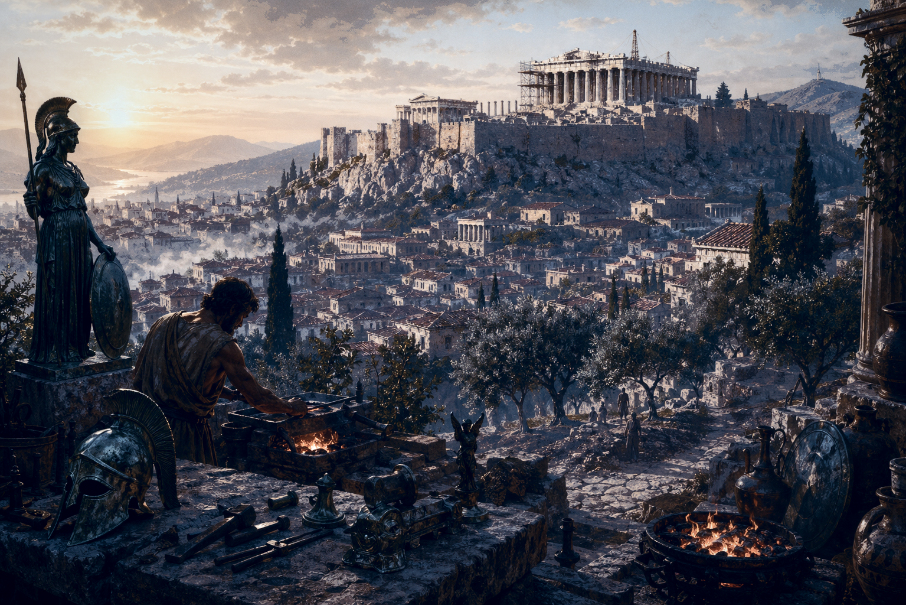

*Cool blue palette (strength 0.6) → `kodak-portra` — moody blue-hour scene softened by portra's warm halation; a deliberate cool/warm contrast pairing.*

---

### Result

All pillar functions ran **cleanly on a real image** — 11 PNGs produced from one
input, every color transfer and every film-look preset distinct and visibly
correct, plus two full-pipeline grades. Deterministic (fixed seeds), no server
required.
